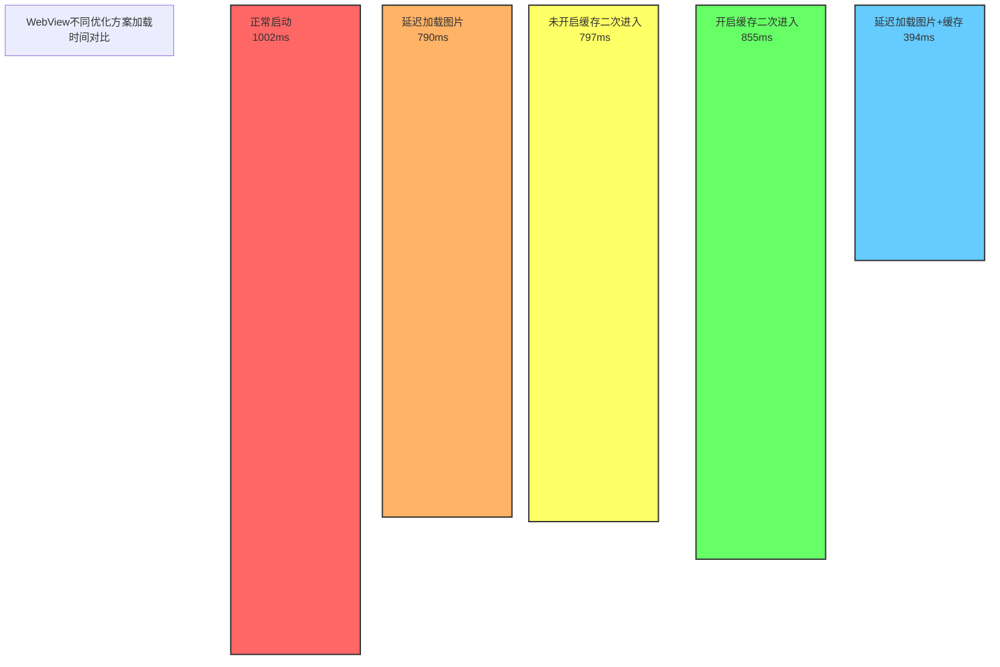
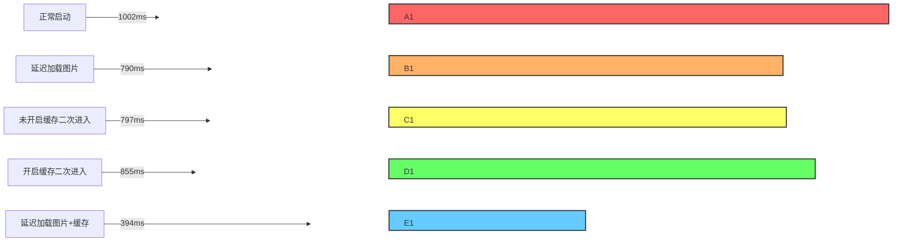
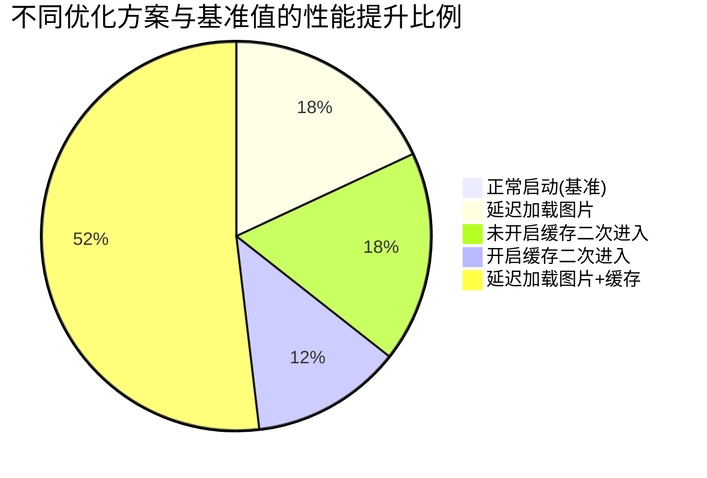

# Android WebView 加速调研报告

## 摘要

本报告针对Android WebView加载性能进行了全面测试与分析，通过对比不同优化策略的效果，为开发团队提供实用的性能优化建议。

## 主要结论

1. **最佳优化方案**：同时开启延迟加载图片和缓存二次进入，可减少约 **60.6%** 的加载时间
2. 单独使用延迟加载图片策略可减少约 **21.1%** 的加载时间
3. 单独使用缓存机制效果不明显，在某些情况下甚至出现性能波动
4. 基础加载时间（无优化）平均为1002ms，而最佳优化方案可将加载时间缩短至394ms

## 建议实施方案

1. **图片延迟加载**：实现图片懒加载机制，优先加载可视区域内容
2. **缓存策略优化**：合理配置WebView缓存，对静态资源进行本地缓存
3. **结合使用**：同时实施以上两种策略，以获得最佳性能提升

## 性能数据可视化

### 平均加载时间对比

| 测试方案 | 平均加载时间(ms) | 总时间(ms) | 减少比例 |
|---------|----------------|-----------|--------|
| 正常启动 | 1002 | 10021 | 基准值 |
| 延迟加载图片 | 790 | 7902 | -21.1% |
| 未开启缓存二次进入 | 797 | 7971 | -20.5% |
| 开启缓存二次进入 | 855 | 8554 | -14.6% |
| 开启延迟加载图片+缓存二次进入 | 394 | 3948 | -60.6% |

### 柱状图对比

### 水平条形图对比

### 饼图-性能提升比例

## 测试数据详情

### 正常启动
- **测试值(ms)**: 1318, 589, 499, 1177, 1557, 1293, 1586, 350, 580, 1072
- **总和**: 10021ms
- **平均值**: 1002ms

### 延迟加载图片
- **测试值(ms)**: 1473, 606, 654, 665, 611, 296, 2041, 154, 276, 1126
- **总和**: 7902ms
- **平均值**: 790ms

### 未开启缓存二次进入
- **测试值(ms)**: 320, 428, 519, 706, 1380, 1487, 1583, 260, 385, 903
- **总和**: 7971ms
- **平均值**: 797ms

### 开启缓存二次进入
- **测试值(ms)**: 430, 441, 853, 588, 1500, 1314, 1678, 424, 560, 766
- **总和**: 8554ms
- **平均值**: 855ms

### 开启延迟加载图片+缓存二次进入
- **测试值(ms)**: 385, 380, 372, 358, 548, 394, 664, 194, 348, 305
- **总和**: 3948ms
- **平均值**: 394ms

## 测试方法说明

本次测试采用相同硬件环境和网络条件，对WebView在不同优化策略下的加载性能进行了10次重复测试，取平均值进行对比分析。测试指标为页面完全加载所需的时间（毫秒）。