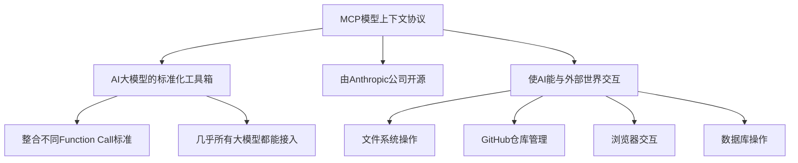
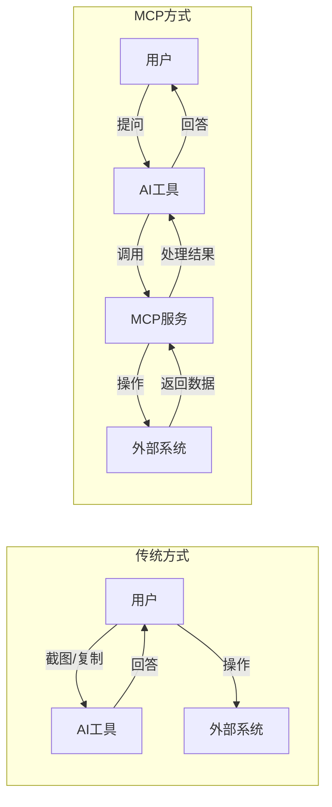
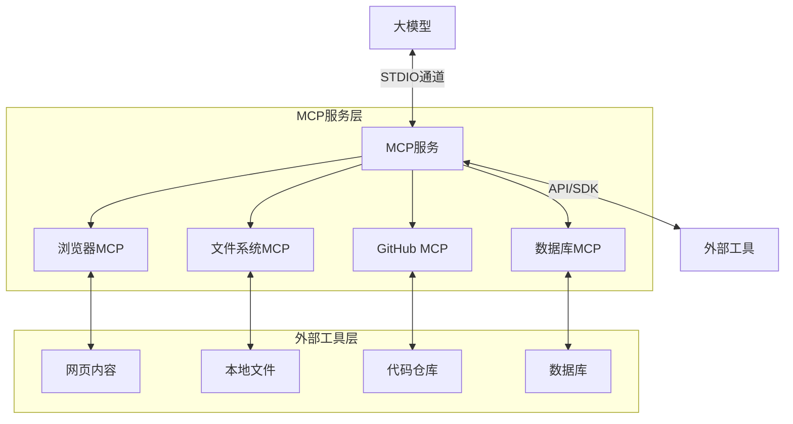
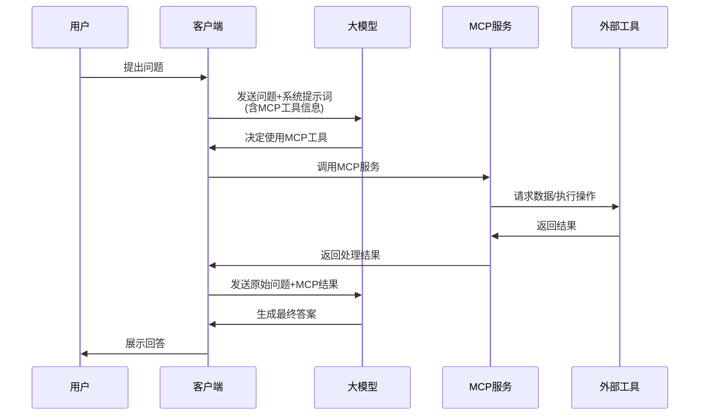
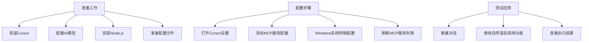
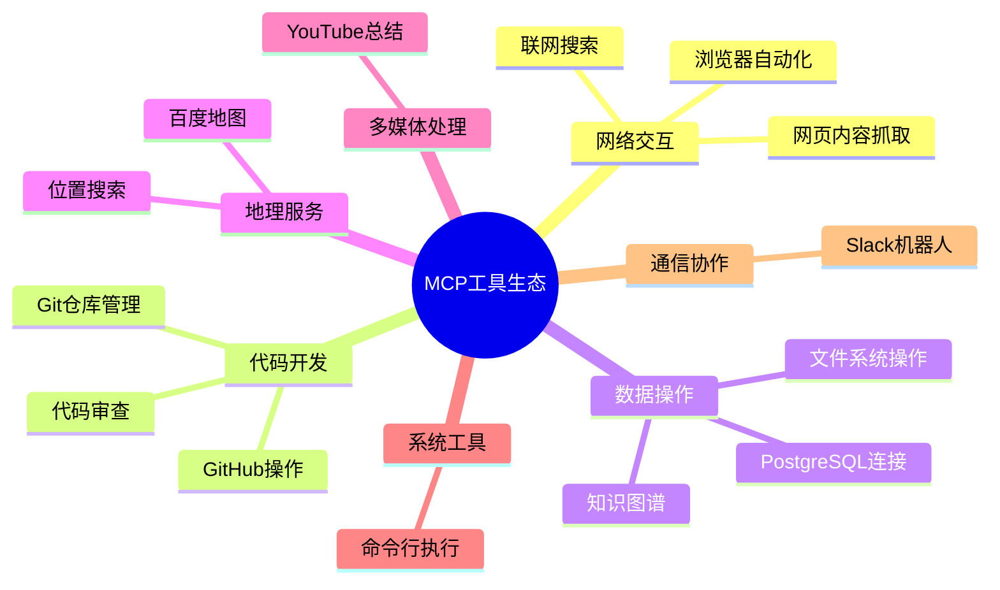
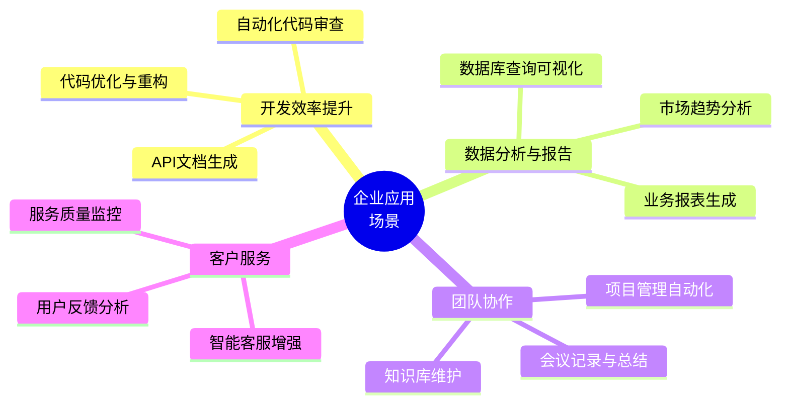
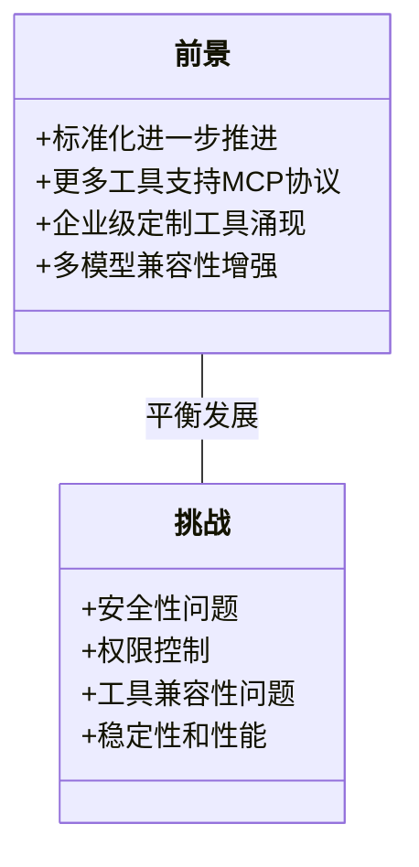
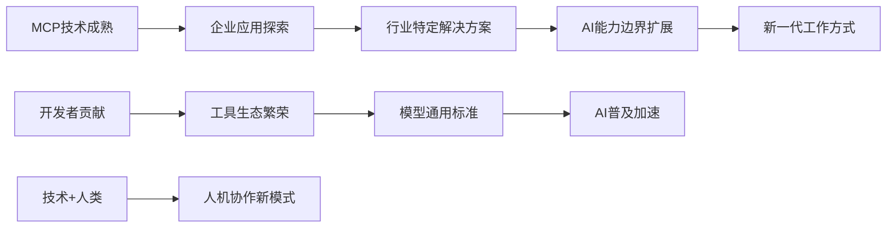

# MCP技术分享：模型上下文协议与企业应用

## 1. MCP是什么？



MCP (Model Context Protocol，模型上下文协议)是Anthropic公司于2024年底开源的一项技术，它本质上是AI大模型的标准化工具箱。通过MCP协议，大模型能够与外部世界进行交互，获取信息并执行具体任务。

在日常工作中，我们经常需要与浏览器、文件系统、数据库、代码仓库等外部工具打交道。传统方式下，我们需要手动截图或复制文本，再粘贴到AI窗口进行对话。而MCP通过标准化协议自动化了这一过程，让AI能够直接访问和操作外部工具。

**传统AI对话 VS MCP对接:**



### MCP的核心特点：

- **标准化工具箱**：整合了之前各家大模型不同的Function Call标准
- **通用性**：几乎所有大模型都可以接入MCP
- **功能丰富**：支持文件系统、GitHub、浏览器、数据库等多种交互

## 2. MCP的技术原理

### MCP的基本架构



MCP服务作为AI与外部工具之间的中间层，代替人类访问并操作外部工具。每个MCP服务（或MCP Server）都专精于一类工作，例如：

- 读写浏览器内容
- 操作本地文件
- 管理GitHub仓库
- 查询数据库等

典型的MCP Server通常是运行在本地的Node.js或Python程序。大模型通过操作系统的标准输入通道（STDIO）调用MCP Server，消息格式类似JSON。MCP Server接收到请求后，通过自身代码或API请求访问外部工具完成任务。

### MCP如何对接大模型？



MCP与大模型的对接流程如下：

1. **系统提示词注入**：MCP信息（可用工具及其调用方式）被直接附加在系统提示词中发送给AI
2. **模型决策**：大模型根据提示词决定使用哪个MCP工具及传递什么参数
3. **工具调用**：客户端根据模型决策调用对应的MCP Server
4. **结果处理**：获取MCP Server返回结果，与原始上下文一起再次传递给大模型
5. **最终输出**：大模型整理信息，生成最终输出给用户

重要的是，**MCP与Function Call是相互独立的**。实验表明，即使不支持Function Call的模型（如DeepSeek-V1）也能使用MCP，因为MCP的相关知识是直接附加到系统提示词中的，模型只需能理解提示词即可使用MCP。

## 3. 在Cursor中使用MCP



### 准备工作

1. **安装Cursor**：下载并安装Cursor编辑器
2. **配置AI模型**：支持OpenRouter（推荐用DeepSeek等免费模型）或其他提供商
3. **安装Node.js**：MCP Server通常需要Node.js运行环境
4. **准备配置文件**：在项目根目录创建`.cursor`文件夹和`mcp.json`配置文件

### MCP配置步骤（最新版Cursor 0.47+）

1. 打开Cursor设置，找到MCP配置
2. 在`.cursor/mcp.json`文件中添加MCP服务配置
3. Windows系统特别注意：需要将NPX改为CMD，并添加`/c`参数
4. 刷新MCP服务列表

### MCP配置示例

以GitHub MCP为例：

```json
{
  "servers": [
    "github": {
      "command": "cmd",
      "arguments": [
        "/c",
        "npx",
        "@anthropic-ai/mcp-github@latest"
      ],
      "env": {
        "GITHUB_TOKEN": "你的GitHub Token"
      }
    }
  ]
}
```

## 4. 推荐的MCP工具



以下是15种实用的MCP工具推荐，所有工具均可在 [smithery.ai](https://smithery.ai) 平台上找到：

### 1️⃣ 网页内容抓取（Server Fetch）
- 功能：让AI获取网页内容并总结
- 使用场景：市场调研、信息收集、竞品分析
- 链接：[smithery.ai/tools/serve-fetch](https://smithery.ai/tools/serve-fetch)

### 2️⃣ 百度地图服务
- 功能：行程规划（含地铁换乘建议）、周边POI搜索
- 使用场景：物流规划、出行助手、位置服务开发
- 链接：[smithery.ai/tools/baidumap](https://smithery.ai/tools/baidumap)

### 3️⃣ 浏览器自动化（Playwright）
- 功能：自动填写表单、点击页面元素
- 使用场景：自动化测试、数据采集、流程自动化
- 链接：[smithery.ai/tools/playwright](https://smithery.ai/tools/playwright)

### 4️⃣ 文件系统操作
- 功能：读写本地文件、创建目录、搜索文件
- 使用场景：本地文档管理、批量文件处理
- 链接：[smithery.ai/tools/filesystem](https://smithery.ai/tools/filesystem)

### 5️⃣ GitHub操作
- 功能：创建/搜索仓库、提交代码、管理PR和Issue
- 使用场景：代码协作、版本管理、开源贡献
- 链接：[smithery.ai/tools/github](https://smithery.ai/tools/github)

### 6️⃣ 联网搜索（Brasearch/GoSearch）
- 功能：让大模型获取实时网络信息
- 使用场景：实时资讯获取、知识更新
- 链接：[smithery.ai/tools/brasearch](https://smithery.ai/tools/brasearch)

### 7️⃣ PostgreSQL连接
- 功能：查询数据库（默认只读权限）
- 使用场景：数据分析、业务报表生成
- 链接：[smithery.ai/tools/postgres](https://smithery.ai/tools/postgres)

### 8️⃣ 命令行执行（Desktop Commander）
- 功能：创建文件、写入内容、执行系统命令
- 使用场景：系统管理、自动化脚本执行
- 链接：[smithery.ai/tools/desktop-commander](https://smithery.ai/tools/desktop-commander)

### 9️⃣ Slack机器人
- 功能：发送消息、创建频道、管理工作区
- 使用场景：团队协作、自动通知、工作流集成
- 链接：[smithery.ai/tools/slack](https://smithery.ai/tools/slack)

### 🔟 YouTube总结
- 功能：获取视频字幕并生成摘要
- 使用场景：视频内容快速了解、学习资料整理
- 链接：[smithery.ai/tools/youtube-summary](https://smithery.ai/tools/youtube-summary)

### 1️⃣1️⃣ 知识图谱（Knowledge Graph）
- 功能：构建和查询知识图谱，建立实体关系
- 使用场景：知识管理、关系推理、智能问答
- 链接：[smithery.ai/tools/knowledge-graph](https://smithery.ai/tools/knowledge-graph)

### 1️⃣2️⃣ 思维链增强（Screen Thinking）
- 功能：将普通模型升级为推理模型
- 使用场景：复杂问题分析、逻辑推理任务
- 链接：[smithery.ai/tools/screen-thinking](https://smithery.ai/tools/screen-thinking)

### 1️⃣3️⃣ Cloudflare集成
- 功能：管理KV存储、R2数据桶、D1数据库
- 使用场景：边缘计算、无服务器应用管理
- 链接：[smithery.ai/tools/cloudflare](https://smithery.ai/tools/cloudflare)

### 1️⃣4️⃣ 浏览器实时分析（Brotli）
- 功能：解析网络请求面板
- 使用场景：网站调试、请求分析、性能优化
- 链接：[smithery.ai/tools/brotli](https://smithery.ai/tools/brotli)

### 1️⃣5️⃣ Git仓库管理
- 功能：创建分支、提交更改、查看历史
- 使用场景：代码版本控制、多人协作开发
- 链接：[smithery.ai/tools/git](https://smithery.ai/tools/git)

### MCP资源获取

- **集中资源库**：[smithery.ai](https://smithery.ai) 网站收录了1800+种MCP工具，涵盖搜索引擎、数据库、爬虫等各种场景，是寻找和使用MCP工具的重要资源。

- **官方仓库**：[GitHub - Awesome MCP](https://github.com/awesome-mcp) 项目提供了众多开源的MCP实现和示例。

- **快速安装**：大多数MCP工具支持通过NPM或PIP一键安装，例如：
  ```bash
  npx @anthropic-ai/mcp-github@latest
  ```

- **社区支持**：关注MCP相关技术社区和论坛，获取最新的工具更新和使用技巧。

## 5. 企业应用场景



### 开发效率提升
- 自动化代码审查与测试
- API文档生成
- 代码优化与重构建议

### 数据分析与报告
- 数据库查询与可视化
- 业务报表自动生成
- 市场趋势分析

### 团队协作
- 项目管理自动化
- 会议记录与总结
- 知识库维护与更新

### 客户服务
- 智能客服系统增强
- 用户反馈分析
- 服务质量监控

## 6. MCP的前景与挑战



### 前景
- 越来越多的工具会支持MCP协议
- 跨平台标准化将进一步推进
- 企业级定制MCP工具将大量涌现

### 挑战
- 安全性问题（如权限控制）
- 工具与模型兼容性问题
- 复杂场景下的稳定性和性能

## 总结

MCP作为AI与外部世界交互的标准化协议，正在改变我们与AI协作的方式。它简化了AI访问外部工具的流程，大大扩展了AI的能力边界，为企业应用提供了全新可能。

随着更多MCP工具的开发和完善，我们将看到AI在更多领域发挥作用，帮助企业提升效率、降低成本、创造价值。立足当下，MCP技术已经足够成熟，可以在企业环境中进行试点应用，探索更多创新场景。

