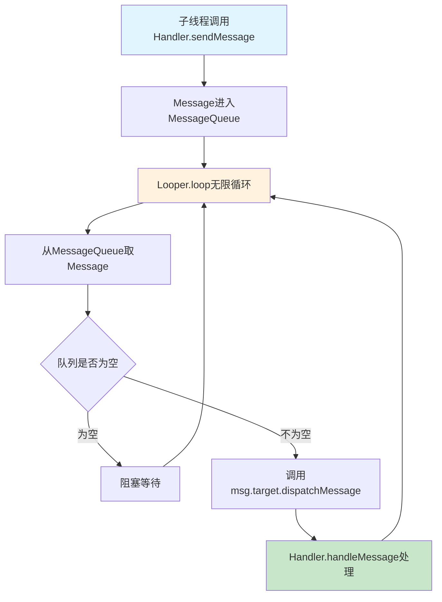
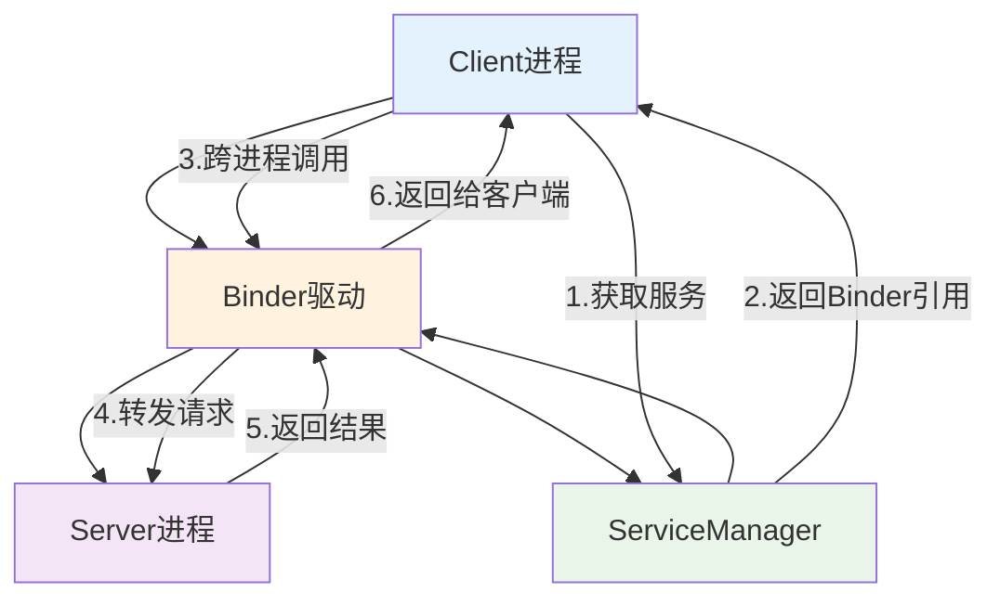

# Android开发技术复习 - Study Day 1

**日期**: 2024年12月19日  
**复习主题**: Android开发技术面试问答

---

## 面试问答记录

### 问题1: 线程间通信
> **面试官**: 你知道线程之间怎么进行通信么

**Android开发工程师**: Android中线程间通信有以下几种主要方式：

**1. Handler机制 (最常用)**
```java
// 主线程中创建Handler
Handler mainHandler = new Handler(Looper.getMainLooper()) {
    @Override
    public void handleMessage(Message msg) {
        // 处理消息
    }
};

// 子线程发送消息
mainHandler.sendMessage(message);
mainHandler.post(runnable);
```

**2. 共享变量 + 同步机制**
```java
// volatile关键字
private volatile boolean isRunning = true;

// synchronized同步块
synchronized(lockObject) {
    // 临界区代码
}
```

**3. 并发工具类**
```java
// CountDownLatch - 等待其他线程完成
CountDownLatch latch = new CountDownLatch(1);

// BlockingQueue - 生产者消费者模式
BlockingQueue<String> queue = new ArrayBlockingQueue<>(10);
```

**4. Kotlin协程 (推荐)**
```kotlin
// 协程间通信
val channel = Channel<String>()
launch { channel.send("data") }
launch { val data = channel.receive() }
```

**核心原理**: Handler机制基于MessageQueue + Looper，实现异步消息传递，是Android主线程与子线程通信的标准方案。

### 问题2: Handler内部机制原理
> **面试官**: 既然你提到了Handler，那你了解Handler的机制么，内部原理简洁清晰的给我讲讲

**Android开发工程师**: Handler机制的核心原理由四个核心组件协作完成：

**核心组件:**
1. **Handler** - 消息发送和处理者
2. **Looper** - 消息循环器，不断从队列取消息  
3. **MessageQueue** - 消息队列，存储待处理消息
4. **Message** - 具体的消息对象

**工作流程:**
```
子线程 → Handler.sendMessage() → MessageQueue.enqueueMessage() 
→ Looper.loop()不断取消息 → Handler.handleMessage()处理
```

**关键代码流程:**
```java
// 1. 发送消息
handler.sendMessage(msg);  // 最终调用enqueueMessage

// 2. 消息入队
MessageQueue.enqueueMessage(msg, uptimeMillis);

// 3. Looper循环取消息
Looper.loop() {
    for(;;) {
        Message msg = queue.next(); // 可能阻塞
        msg.target.dispatchMessage(msg); // target就是Handler
    }
}

// 4. Handler处理消息
dispatchMessage() → handleMessage()
```

**线程绑定原理:**
- Handler创建时绑定当前线程的Looper
- 主线程默认有Looper，子线程需要手动创建
- 消息处理在Looper所在线程执行

### 问题3: Looper死循环是否会阻塞线程
> **面试官**: 我看见Looper取消息是死循环，不会线程阻塞么

**Android开发工程师**: 这是个很好的问题！Looper的死循环**不会阻塞线程**，关键在于底层的阻塞机制：

**1. MessageQueue.next()的智能阻塞**
```java
Message next() {
    for (;;) {
        if (nextPollTimeoutMillis != 0) {
            Binder.flushPendingCommands();
        }
        // 关键：调用native方法进行阻塞
        nativePollOnce(ptr, nextPollTimeoutMillis);
        // 有消息时被唤醒，继续执行
    }
}
```

**2. 底层机制**
- **Linux epoll机制**: 基于文件描述符的事件通知
- **管道通信**: 使用pipe进行线程间通信  
- **无CPU消耗**: 阻塞时线程休眠，不占用CPU

**3. 工作状态转换**
```
无消息 → nativePollOnce阻塞 → 线程休眠(无CPU消耗)
有消息 → native层唤醒 → 继续执行loop → 处理消息
```

**4. 为什么不用wait/notify？**
- Handler需要支持**延时消息**
- 需要**跨进程通信能力**
- epoll比Object.wait()更高效

**核心**: Looper的"死循环"实际上是**事件驱动**的，没有消息时会智能休眠，有消息时被唤醒，这样既保证了响应性又不浪费CPU资源。

### 问题4: 子线程创建Looper注意事项及线程Looper唯一性
> **面试官**: 子线程创建looper有什么注意事项么，还有一个线程会有多个looper么，为什么

**Android开发工程师**: 很好的问题！涉及Looper的线程绑定机制：

**子线程创建Looper注意事项:**

**1. 创建步骤（缺一不可）**
```java
class WorkerThread extends Thread {
    @Override
    public void run() {
        Looper.prepare();        // 1. 必须先准备Looper
        
        Handler handler = new Handler() {
            @Override
            public void handleMessage(Message msg) {
                // 处理消息
            }
        };
        
        Looper.loop();          // 2. 开始消息循环
        // 注意：loop()是阻塞方法，后面的代码不会执行
    }
}
```

**2. 资源释放**
```java
// 在合适时机退出Looper
looper.quit();        // 安全退出
looper.quitSafely();  // 处理完已有消息再退出
```

**一个线程只能有一个Looper:**

**答案**: 一个线程**绝对不会**有多个Looper

**核心原因:**
```java
// Looper.prepare()源码
public static void prepare() {
    prepare(true);
}

private static void prepare(boolean quitAllowed) {
    if (sThreadLocal.get() != null) {
        throw new RuntimeException("Only one Looper may be created per thread");
    }
    sThreadLocal.set(new Looper(quitAllowed));
}
```

**ThreadLocal机制保证唯一性:**
- Looper使用`ThreadLocal<Looper>`存储
- ThreadLocal为每个线程维护独立的变量副本
- 重复调用`prepare()`直接抛异常

**设计原因:**
1. **简化线程模型** - 避免多Looper带来的复杂性
2. **消息处理顺序** - 保证消息按序处理  
3. **资源管理** - 一个MessageQueue对应一个Looper

### 问题5: Handler的特殊知识点
> **面试官**: 关于Handler你还知道哪些特殊的知识点

**Android开发工程师**: 关于Handler还有很多特殊的知识点：

**1. Handler内存泄漏问题**
```java
// 错误写法 - 会导致内存泄漏
public class MainActivity extends Activity {
    private Handler handler = new Handler() {
        @Override
        public void handleMessage(Message msg) {
            // 匿名内部类持有外部Activity引用
        }
    };
}

// 正确写法 - 使用静态内部类+弱引用
static class MyHandler extends Handler {
    private WeakReference<MainActivity> activityRef;
    
    MyHandler(MainActivity activity) {
        activityRef = new WeakReference<>(activity);
    }
    
    @Override
    public void handleMessage(Message msg) {
        MainActivity activity = activityRef.get();
        if (activity != null) {
            // 处理消息
        }
    }
}
```

**2. 同步屏障（Barrier）机制**
```java
// 系统内部使用，插入同步屏障
MessageQueue.postSyncBarrier();

// 同步屏障会阻塞同步消息，只允许异步消息通过
// 用于UI优先级处理，如View绘制
```

**3. IdleHandler - 空闲时处理**
```java
Looper.myQueue().addIdleHandler(new MessageQueue.IdleHandler() {
    @Override
    public boolean queueIdle() {
        // 消息队列空闲时执行
        // 返回true保持监听，false移除监听
        return false;
    }
});
```

**4. Message对象池复用**
```java
// 不要直接new Message
Message msg = new Message(); // 错误

// 使用对象池获取
Message msg = Message.obtain(); // 正确
// 或者
Message msg = handler.obtainMessage();
```

**5. 消息优先级处理**
```java
// 插入到队列头部，优先处理
handler.postAtFrontOfQueue(runnable);

// 异步消息，不受同步屏障影响
Message msg = Message.obtain();
msg.setAsynchronous(true);
```

### 问题6: Handler在卡顿检测中的应用
> **面试官**: 我想进行检测应用卡顿分析，Handler有没有对应的实现方案

**Android开发工程师**: Handler确实有很好的卡顿检测方案！基于Handler机制可以实现精准的卡顿监控：

**1. Handler轮询检测法**
```java
public class ANRWatchDog extends Thread {
    private Handler mainHandler = new Handler(Looper.getMainLooper());
    private volatile long lastTick = 0;
    private volatile boolean reported = false;
    
    @Override
    public void run() {
        while (true) {
            // 向主线程发送心跳包
            mainHandler.post(ticker);
            
            try {
                Thread.sleep(5000); // 5秒检测间隔
            } catch (InterruptedException e) {
                return;
            }
            
            // 检查心跳包是否及时处理
            if (System.currentTimeMillis() - lastTick > 5000 && !reported) {
                reported = true;
                // 发现ANR，记录堆栈信息
                reportANR();
            }
        }
    }
    
    private Runnable ticker = new Runnable() {
        @Override
        public void run() {
            lastTick = System.currentTimeMillis();
            reported = false;
        }
    };
}
```

**2. Looper.Printer机制 (推荐)**
```java
public class BlockDetector {
    private static final String START = ">>>>> Dispatching";
    private static final String END = "<<<<< Finished";
    
    public static void install() {
        Looper.getMainLooper().setMessageLogging(new Printer() {
            private long startTime;
            
            @Override
            public void println(String log) {
                if (log.startsWith(START)) {
                    startTime = System.currentTimeMillis();
                } else if (log.startsWith(END)) {
                    long costTime = System.currentTimeMillis() - startTime;
                    if (costTime > 16) { // 超过16ms认为卡顿
                        // 记录卡顿信息
                        logBlock(costTime, log);
                    }
                }
            }
        });
    }
}
```

**3. Choreographer帧率监控**
```java
public class FPSMonitor {
    private Choreographer choreographer;
    private long lastFrameTime;
    
    public void startMonitor() {
        choreographer = Choreographer.getInstance();
        choreographer.postFrameCallback(frameCallback);
    }
    
    private Choreographer.FrameCallback frameCallback = new Choreographer.FrameCallback() {
        @Override
        public void doFrame(long frameTimeNanos) {
            if (lastFrameTime != 0) {
                long frameCost = (frameTimeNanos - lastFrameTime) / 1000000;
                if (frameCost > 16.6) {
                    // 掉帧了，记录信息
                    logFrameDrop(frameCost);
                }
            }
            lastFrameTime = frameTimeNanos;
            choreographer.postFrameCallback(this);
        }
    };
}
```

**4. BlockCanary原理实现**
```java
public class BlockCanary {
    private BlockDetector blockDetector;
    
    public void install() {
        blockDetector = new BlockDetector();
        Looper.getMainLooper().setMessageLogging(blockDetector);
    }
    
    private class BlockDetector implements Printer {
        private StackSampler stackSampler;
        
        @Override
        public void println(String log) {
            if (log.startsWith(">>>>> Dispatching")) {
                // 开始采样堆栈
                stackSampler.startSample();
            } else if (log.startsWith("<<<<< Finished")) {
                // 停止采样，分析结果
                stackSampler.stopSample();
            }
        }
    }
}
```

**核心原理**: 利用Handler消息处理的时间差来判断主线程是否阻塞，Looper.Printer是最精准的方案。

### 问题7: 子线程更新UI的限制和例外
> **面试官**: 为什么不能在子线程更新UI，确定子线程不能更新UI么

**Android开发工程师**: 这是个经典问题！答案比想象中复杂：

**为什么不能在子线程更新UI？**

**1. UI组件线程不安全**
```java
// View的绘制涉及多个步骤，不是原子操作
public void setText(String text) {
    // 1. 文本变更
    mText = text;
    // 2. 重新测量
    requestLayout();
    // 3. 重新绘制
    invalidate();
    // 如果多线程同时执行，会导致状态不一致
}
```

**2. ViewRootImpl的线程检查机制**
```java
// ViewRootImpl.checkThread()源码
void checkThread() {
    if (mThread != Thread.currentThread()) {
        throw new CalledFromWrongThreadException(
            "Only the original thread that created a view hierarchy can touch its views.");
    }
}
```

**3. 单线程模型的设计原因**
- **性能考虑**: 避免同步锁带来的性能损耗
- **简化开发**: 开发者无需考虑UI的线程安全问题
- **避免死锁**: 多个UI组件相互依赖时容易死锁

**子线程真的不能更新UI吗？**

**答案：不绝对！** 有以下例外情况：

**1. ViewRootImpl创建之前可以**
```java
// Activity.onCreate()阶段，ViewRootImpl还未创建
protected void onCreate(Bundle savedInstanceState) {
    super.onCreate(savedInstanceState);
    setContentView(R.layout.activity_main);
    
    new Thread(() -> {
        // 此时可以更新UI，不会抛异常
        textView.setText("子线程更新");
    }).start();
}
```

**2. SurfaceView支持子线程绘制**
```java
// SurfaceView有独立的绘制线程
SurfaceHolder holder = surfaceView.getHolder();
Canvas canvas = holder.lockCanvas();
// 子线程直接绘制
canvas.drawText("Hello", 100, 100, paint);
holder.unlockCanvasAndPost(canvas);
```

**3. 直接操作Canvas**
```java
// 自定义View中，Canvas绘制不受线程限制
@Override
protected void onDraw(Canvas canvas) {
    // 可以在任意线程调用
    canvas.drawRect(0, 0, 100, 100, paint);
}
```

**检查时机分析:**
```java
// 关键在于ViewRootImpl的创建时机
Activity.onCreate() → setContentView() → Activity.onResume() 
→ WindowManager.addView() → ViewRootImpl创建 → 开始线程检查
```

**核心**: 限制不是绝对的，主要取决于ViewRootImpl是否已创建以及具体的UI组件类型。

### 问题8: 自定义View性能优化注意事项
> **面试官**: 既然问到了UI的问题，那自定义View的时候有没有什么注意事项，结合性能优化方面考虑

**Android开发工程师**: 自定义View性能优化确实有很多关键点！我从几个维度来详细说明：

**1. 测量优化 (onMeasure)**
```java
@Override
protected void onMeasure(int widthMeasureSpec, int heightMeasureSpec) {
    // 避免重复计算，缓存测量结果
    if (mLastWidthMeasureSpec == widthMeasureSpec && 
        mLastHeightMeasureSpec == heightMeasureSpec) {
        setMeasuredDimension(mMeasuredWidth, mMeasuredHeight);
        return;
    }
    
    // 尽量使用EXACTLY模式，避免复杂计算
    int width = MeasureSpec.getSize(widthMeasureSpec);
    int height = MeasureSpec.getSize(heightMeasureSpec);
    
    // 缓存结果
    mLastWidthMeasureSpec = widthMeasureSpec;
    mLastHeightMeasureSpec = heightMeasureSpec;
    mMeasuredWidth = width;
    mMeasuredHeight = height;
    
    setMeasuredDimension(width, height);
}
```

**2. 绘制优化 (onDraw)**
```java
@Override
protected void onDraw(Canvas canvas) {
    // 1. 减少对象创建 - 复用Paint对象
    if (mPaint == null) {
        mPaint = new Paint(Paint.ANTI_ALIAS_FLAG);
        mPaint.setColor(Color.RED);
    }
    
    // 2. 避免在onDraw中进行复杂计算
    // 预先在其他地方计算好路径、矩形等
    canvas.drawPath(mPreCalculatedPath, mPaint);
    
    // 3. 使用clipRect减少绘制区域
    canvas.save();
    canvas.clipRect(mDirtyRect);
    // 只绘制可见区域
    drawVisibleContent(canvas);
    canvas.restore();
}
```

**3. 内存优化策略**
```java
public class OptimizedCustomView extends View {
    // 复用对象，避免GC
    private final Rect mTempRect = new Rect();
    private final Paint mPaint = new Paint();
    private final Path mPath = new Path();
    
    // 使用对象池
    private static final Pools.SynchronizedPool<RectF> sRectPool = 
        new Pools.SynchronizedPool<>(10);
    
    private RectF acquireRect() {
        RectF rect = sRectPool.acquire();
        return rect != null ? rect : new RectF();
    }
    
    private void releaseRect(RectF rect) {
        rect.setEmpty();
        sRectPool.release(rect);
    }
}
```

**4. 避免过度绘制**
```java
@Override
protected void onDraw(Canvas canvas) {
    // 检查是否真的需要重绘
    if (!mNeedRedraw) {
        return;
    }
    
    // 使用Canvas.quickReject剔除不可见元素
    for (DrawableItem item : mItems) {
        if (!canvas.quickReject(item.bounds, Canvas.EdgeType.BW)) {
            item.draw(canvas);
        }
    }
    
    mNeedRedraw = false;
}

// 精确控制重绘区域
public void invalidateItem(DrawableItem item) {
    invalidate(item.bounds); // 只重绘特定区域
}
```

**5. 触摸事件优化**
```java
@Override
public boolean onTouchEvent(MotionEvent event) {
    switch (event.getAction()) {
        case MotionEvent.ACTION_DOWN:
            // 避免在触摸事件中进行重计算
            if (mHitTestCache == null) {
                buildHitTestCache();
            }
            return mHitTestCache.contains(event.getX(), event.getY());
    }
    return super.onTouchEvent(event);
}
```

**6. 动画性能优化**
```java
public class AnimatedCustomView extends View {
    private ValueAnimator mAnimator;
    
    public void startAnimation() {
        mAnimator = ValueAnimator.ofFloat(0, 1);
        mAnimator.setDuration(300);
        mAnimator.addUpdateListener(animation -> {
            // 只更新变化的部分
            float progress = (Float) animation.getAnimatedValue();
            updateAnimatedPart(progress);
            
            // 精确重绘，不要调用invalidate()
            invalidate(mAnimatedRect);
        });
        mAnimator.start();
    }
}
```

**核心原则**: 减少对象创建、缓存计算结果、精确控制重绘区域、避免在关键方法中进行复杂操作。

### 问题9: 触摸事件冲突的解决方案
> **面试官**: 那你肯定遇到过触摸事件冲突问题了，你是怎么解决的

**Android开发工程师**: 触摸事件冲突确实是Android开发中的经典难题！我遇到过很多场景，主要有两种解决思路：

**事件分发机制回顾:**
```java
// 事件分发的三个核心方法
public boolean dispatchTouchEvent(MotionEvent ev)     // 分发事件
public boolean onInterceptTouchEvent(MotionEvent ev)  // 拦截事件(ViewGroup才有)
public boolean onTouchEvent(MotionEvent ev)           // 处理事件
```

**解决方案一：外部拦截法 (推荐)**

**原理**: 父容器根据需要决定是否拦截事件

```java
public class CustomViewPager extends ViewGroup {
    private int mLastXIntercept;
    private int mLastYIntercept;
    
    @Override
    public boolean onInterceptTouchEvent(MotionEvent event) {
        boolean intercepted = false;
        int x = (int) event.getX();
        int y = (int) event.getY();
        
        switch (event.getAction()) {
            case MotionEvent.ACTION_DOWN:
                intercepted = false; // DOWN事件不能拦截
                break;
                
            case MotionEvent.ACTION_MOVE:
                int deltaX = x - mLastXIntercept;
                int deltaY = y - mLastYIntercept;
                
                // 根据滑动方向判断是否拦截
                if (Math.abs(deltaX) > Math.abs(deltaY)) {
                    // 水平滑动，父容器拦截
                    intercepted = true;
                } else {
                    // 垂直滑动，交给子View处理
                    intercepted = false;
                }
                break;
                
            case MotionEvent.ACTION_UP:
                intercepted = false; // UP事件不拦截
                break;
        }
        
        mLastXIntercept = x;
        mLastYIntercept = y;
        return intercepted;
    }
}
```

**解决方案二：内部拦截法**

**原理**: 子View根据需要请求父容器不要拦截

```java
public class CustomListView extends ListView {
    private int mLastX;
    private int mLastY;
    
    @Override
    public boolean dispatchTouchEvent(MotionEvent event) {
        int x = (int) event.getX();
        int y = (int) event.getY();
        
        switch (event.getAction()) {
            case MotionEvent.ACTION_DOWN:
                // 请求父容器不要拦截
                getParent().requestDisallowInterceptTouchEvent(true);
                break;
                
            case MotionEvent.ACTION_MOVE:
                int deltaX = x - mLastX;
                int deltaY = y - mLastY;
                
                if (Math.abs(deltaX) > Math.abs(deltaY)) {
                    // 水平滑动，让父容器处理
                    getParent().requestDisallowInterceptTouchEvent(false);
                }
                break;
        }
        
        mLastX = x;
        mLastY = y;
        return super.dispatchTouchEvent(event);
    }
}
```

**实际项目案例：仿微信聊天列表滑动删除**
```java
public class SwipeDeleteLayout extends ViewGroup {
    @Override
    public boolean onInterceptTouchEvent(MotionEvent ev) {
        switch (ev.getAction()) {
            case MotionEvent.ACTION_MOVE:
                float deltaX = Math.abs(ev.getX() - mDownX);
                float deltaY = Math.abs(ev.getY() - mDownY);
                
                // 水平滑动距离大于垂直距离且超过阈值，拦截事件
                if (deltaX > mTouchSlop && deltaX > deltaY) {
                    return true;
                }
                break;
        }
        return false;
    }
}
```

**核心思路**: 优先使用外部拦截法，根据滑动方向或边界条件判断事件归属，关键是要理解事件分发的流程。

### 问题10: Binder机制和AIDL进程间通信
> **面试官**: 你了解进程间通信机制么，可以从Binder和AIDL展开讲讲

**Android开发工程师**: 进程间通信是Android系统架构的核心！让我从底层原理到实际应用详细讲解：

**为什么需要进程间通信？**
- **Android沙箱机制**: 每个应用运行在独立进程中
- **系统服务架构**: AMS、WMS等运行在system_server进程
- **数据共享需求**: 进程间内存隔离，需要特殊机制通信

**Binder核心原理:**

**1. Binder架构模型**
```java
// Binder通信涉及四个核心组件
Client  →  Binder驱动  →  Server
           ↑     ↓
        ServiceManager
```

**2. Binder的优势**
- **性能高**: 只需一次数据拷贝（传统IPC需要两次）
- **安全性**: 内核自动添加PID/UID身份标识
- **易用性**: 面向对象的编程接口

**3. Binder工作流程**
```java
// 1. 服务注册
Server → ServiceManager.addService("service_name", binder_object)

// 2. 服务获取  
Client → ServiceManager.getService("service_name") → IBinder

// 3. 跨进程调用
Client → IBinder.transact() → Binder驱动 → Server.onTransact()
```

**AIDL实际应用:**

**1. AIDL接口定义**
```java
// IBookManager.aidl
interface IBookManager {
    List<Book> getBookList();
    void addBook(in Book book);
    void registerListener(IBookManagerListener listener);
}
```

**2. 服务端实现**
```java
private final IBookManager.Stub mBinder = new IBookManager.Stub() {
    @Override
    public List<Book> getBookList() throws RemoteException {
        return mBookList;
    }
    
    @Override
    public void addBook(Book book) throws RemoteException {
        mBookList.add(book);
        // 通知监听者
        notifyBookAdded(book);
    }
};
```

**3. 客户端调用**
```java
private ServiceConnection mConnection = new ServiceConnection() {
    @Override
    public void onServiceConnected(ComponentName name, IBinder service) {
        // 获取服务代理对象
        mBookManager = IBookManager.Stub.asInterface(service);
        
        // 跨进程调用
        List<Book> books = mBookManager.getBookList();
    }
};
```

**高级特性:**
- **死亡监听**: IBinder.DeathRecipient监听服务端进程状态
- **权限验证**: checkCallingPermission()验证调用者权限
- **线程安全**: 服务端方法运行在Binder线程池
- **性能优化**: 批量操作、oneway异步调用

**核心**: Binder是Android IPC的基石，AIDL是面向开发者的高级封装，理解其原理对系统开发至关重要。

### 问题11: Android Lifecycle架构组件
> **面试官**: 你使用过Android Lifecycle相关的库么，它有什么好处

**Android开发工程师**: Android Lifecycle库确实是一个非常优秀的架构组件！我在项目中大量使用，它解决了很多传统开发中的痛点：

**传统方式的问题:**
```java
// 传统方式 - 容易遗漏或错误调用
public class TraditionalActivity extends AppCompatActivity {
    private LocationManager locationManager;
    
    @Override
    protected void onStart() {
        super.onStart();
        locationManager.start(); // 容易忘记
    }
    
    @Override
    protected void onStop() {
        super.onStop();
        locationManager.stop(); // 容易忘记
    }
}
```

**Lifecycle的核心优势:**

**1. 生命周期感知 (Lifecycle-Aware)**
```java
public class LocationManager implements LifecycleObserver {
    
    @OnLifecycleEvent(Lifecycle.Event.ON_START)
    public void start() {
        // 自动在onStart时调用
        Log.d(TAG, "开始定位");
    }
    
    @OnLifecycleEvent(Lifecycle.Event.ON_STOP)
    public void stop() {
        // 自动在onStop时调用
        Log.d(TAG, "停止定位");
    }
}

// Activity中只需要简单注册
public class ModernActivity extends AppCompatActivity {
    @Override
    protected void onCreate(Bundle savedInstanceState) {
        super.onCreate(savedInstanceState);
        
        LocationManager locationManager = new LocationManager();
        getLifecycle().addObserver(locationManager); // 一行代码搞定
    }
}
```

**2. 配合LiveData使用**
```java
// LiveData自动感知生命周期，无需手动取消观察
viewModel.getUser().observe(this, user -> {
    updateUI(user);
});
```

**3. ProcessLifecycleOwner - 应用级生命周期**
```java
public class ApplicationObserver implements LifecycleObserver {
    @OnLifecycleEvent(Lifecycle.Event.ON_START)
    public void onAppForegrounded() {
        Log.d(TAG, "应用进入前台");
        // 恢复网络连接、刷新数据等
    }
    
    @OnLifecycleEvent(Lifecycle.Event.ON_STOP)
    public void onAppBackgrounded() {
        Log.d(TAG, "应用进入后台");
        // 暂停不必要的操作、保存状态等
    }
}
```

**核心优势:**
- **自动化管理**: 无需手动在各个生命周期方法中调用
- **代码解耦**: 业务逻辑与UI组件分离
- **防止内存泄漏**: 自动清理资源和取消订阅
- **提高可测试性**: 组件可以独立测试
- **减少崩溃**: 避免在错误的生命周期状态下操作

### 问题12: LiveData的优势和使用注意事项
> **面试官**: 那你给我讲讲LiveData吧，它有什么优势，使用的时候有什么注意的事项点么

**Android开发工程师**: LiveData是Android架构组件中的明星！它的优势和注意事项如下：

**LiveData核心优势:**

**1. 自动生命周期管理**
```java
// LiveData方式 - 自动管理
viewModel.getUserData().observe(this, user -> {
    updateUI(user); // 自动感知生命周期，无需手动取消
});
```

**2. 防止内存泄漏**
```java
// LiveData只在活跃状态(STARTED/RESUMED)时通知观察者
// Activity销毁时自动移除观察者，防止内存泄漏
```

**3. 避免空指针异常**
```java
liveData.observe(this, user -> {
    // 只在Activity活跃时执行，避免销毁后的空指针
    textView.setText(user.getName());
});
```

**4. 数据一致性保证**
```java
// 配置变更(屏幕旋转)时自动恢复最新数据
public LiveData<User> getUser() {
    return userLiveData; // 配置变更后仍保持数据
}
```

**重要注意事项:**

**1. setValue vs postValue**
```java
// 主线程使用setValue
dataLiveData.setValue("new data");

// 子线程必须使用postValue
new Thread(() -> {
    dataLiveData.postValue("new data");
}).start();
```

**2. 避免观察者中直接更新LiveData**
```java
// 错误 - 可能无限循环
viewModel.getData().observe(this, data -> {
    viewModel.updateData(processData(data)); // 危险！
});
```

**3. 单次事件处理**
```java
// 使用Event包装器处理一次性事件
public class Event<T> {
    private T content;
    private boolean hasBeenHandled = false;
    
    public T getContentIfNotHandled() {
        if (hasBeenHandled) {
            return null;
        } else {
            hasBeenHandled = true;
            return content;
        }
    }
}
```

**4. observeForever需手动取消**
```java
// 使用observeForever必须手动removeObserver
liveData.observeForever(observer);
// 记得调用
liveData.removeObserver(observer);
```

**核心**: LiveData通过生命周期感知实现了数据驱动UI的安全更新，是MVVM架构的重要支撑。

### 问题13: Bitmap内存占用和Glide性能优化
> **面试官**: Android中的Bitmap内存占用计算方式，放在不同的res目录下有什么不同么，还有使用三方的Glide加载图片的时候有没有什么性能优化的点可以考虑

**Android开发工程师**: 这是一个非常实用的性能优化问题！涉及图片内存管理的核心知识点：

**Bitmap内存占用计算:**

**基础公式:**
```java
内存占用 = 图片宽度 × 图片高度 × 每像素字节数

// 像素格式字节数
ALPHA_8      // 1字节/像素
RGB_565      // 2字节/像素  
ARGB_8888    // 4字节/像素 (最常用)
```

**不同res目录的影响:**
```java
// 系统会根据设备密度自动缩放
实际内存 = (原始宽度 × 设备密度 / 目录密度) × 
         (原始高度 × 设备密度 / 目录密度) × 每像素字节数

// 示例：480dpi设备加载100x100图片
// drawable-mdpi (160dpi): 300x300 ≈ 351KB
// drawable-xxhdpi (480dpi): 100x100 ≈ 39KB
```

**密度对应关系:**
```java
ldpi(120) < mdpi(160) < hdpi(240) < xhdpi(320) < xxhdpi(480) < xxxhdpi(640)
```

**Glide性能优化要点:**

**1. 合理设置尺寸**
```java
Glide.with(context)
    .load(imageUrl)
    .override(200, 200)  // 避免加载超大图片
    .centerCrop()
    .into(imageView);
```

**2. 选择合适格式**
```java
Glide.with(context)
    .load(imageUrl)
    .format(DecodeFormat.PREFER_RGB_565)  // 不需要透明度时使用
    .into(imageView);
```

**3. 缓存策略优化**
```java
Glide.with(context)
    .load(imageUrl)
    .diskCacheStrategy(DiskCacheStrategy.ALL)  // 缓存策略
    .skipMemoryCache(false)                    // 内存缓存
    .into(imageView);
```

**4. 列表优化**
```java
// RecyclerView中的最佳实践
@Override
public void onBindViewHolder(ViewHolder holder, int position) {
    Glide.with(context).clear(holder.imageView);  // 清除复用
    
    Glide.with(context)
        .load(url)
        .override(200, 200)
        .placeholder(R.drawable.loading)
        .into(holder.imageView);
}

@Override
public void onViewRecycled(ViewHolder holder) {
    Glide.with(context).clear(holder.imageView);  // 释放内存
}
```

**5. 内存压力处理**
```java
@Override
public void onTrimMemory(int level) {
    if (level >= TRIM_MEMORY_BACKGROUND) {
        Glide.get(this).clearMemory();  // 清理内存缓存
    }
}
```

**核心要点**: 图片内存占用与设备密度和资源目录密度比值相关，Glide优化重点在尺寸控制、格式选择和缓存管理。

### 问题14: RecyclerView缓存机制原理
> **面试官**: 你既然提到了列表，那Android中的RecyclerView你肯定用过了，它的性能优化的很好，内部是怎么实现的缓存机制，不用讲太多，简单清晰的让我能懂就行

**Android开发工程师**: RecyclerView的缓存机制确实设计得很巧妙！它有**四级缓存机制**：

**缓存层级（按优先级）:**
```java
1. Scrap缓存      // 临时缓存，layout过程中使用
2. Cache缓存      // 一级缓存，默认大小为2
3. ViewCacheExtension  // 自定义缓存(很少用)
4. RecycledViewPool    // 回收池，默认每种类型缓存5个
```

**核心区别:**

**Scrap缓存 - 屏幕内临时缓存**
```java
// 特点：layout过程中临时存放，保持完整状态
// 使用：直接返回，无需重新绑定数据
```

**Cache缓存 - 一级缓存**
```java
// 特点：保持ViewHolder的position信息，默认大小2个
// 适用：快速回滚场景，如向下滑一点又回顶部
// 使用：position匹配直接使用，无需绑定数据
```

**RecycledViewPool - 终极回收池**
```java
// 特点：按ViewType分类存储，默认每种类型5个
// 只保存ViewHolder结构，不保存数据
// 使用：需要重新绑定数据
```

**查找流程:**
```java
// ViewHolder获取优先级
1. Scrap缓存   → 直接使用
2. Cache缓存   → 直接使用  
3. 自定义缓存  → 直接使用
4. Pool缓存    → 重新绑定数据
5. 创建新的    → 重新绑定数据
```

**性能优化:**
```java
// 增加Cache缓存大小
recyclerView.setItemViewCacheSize(20);

// 共享RecycledViewPool
RecyclerView.RecycledViewPool sharedPool = new RecyclerView.RecycledViewPool();
recyclerView1.setRecycledViewPool(sharedPool);
```

**核心优势**: 分层缓存针对不同场景，Cache保持position快速复用，Pool保持结构按类型管理，最大化性能同时控制内存。

---

## 今日重点技术点

### 1. 线程间通信机制
- Handler + Looper + MessageQueue 原理
- 同步机制: synchronized, volatile
- 并发工具类的使用场景
- Kotlin协程的优势

### 2. Handler机制深入理解
- Handler四大核心组件协作原理
- 消息队列的入队出队机制
- Looper的无限循环和阻塞机制
- 线程绑定和消息分发原理

### 3. Looper阻塞机制原理
- epoll机制和管道通信的底层实现
- nativePollOnce的智能阻塞策略
- 事件驱动模型vs忙等待的区别
- 延时消息和跨进程通信的支持

### 4. 子线程Looper创建和唯一性
- 子线程创建Looper的标准流程：prepare() → loop()
- Looper资源管理：quit() vs quitSafely()
- ThreadLocal机制保证线程Looper唯一性
- 一对一绑定关系的设计原理

### 5. Handler进阶特性
- Handler内存泄漏的根本原因和解决方案
- 同步屏障机制在UI渲染中的作用
- IdleHandler的使用场景和原理
- Message对象池的复用机制
- 消息优先级和异步消息处理

### 6. Handler在性能监控中的应用
- Handler轮询检测ANR的心跳包机制
- Looper.Printer精准监控消息处理时间
- Choreographer基于VSync的帧率监控
- BlockCanary的卡顿检测原理和实现

### 7. 子线程UI更新机制深入
- UI组件线程不安全的本质原因
- ViewRootImpl线程检查的实现机制
- 子线程更新UI的例外情况分析
- Activity生命周期与ViewRootImpl创建时机

### 8. 自定义View性能优化
- onMeasure测量缓存和优化策略
- onDraw绘制中的对象复用和区域控制
- 内存优化：对象池和临时对象管理
- 过度绘制的避免和精确重绘控制
- 触摸事件和动画的性能优化实践

### 9. 触摸事件冲突解决方案
- 事件分发机制的三大核心方法
- 外部拦截法：父容器主动拦截策略
- 内部拦截法：子View请求不拦截机制
- 实际项目中的冲突场景和解决方案

### 10. Binder机制和进程间通信
- Android沙箱机制和IPC需求分析
- Binder架构：Client-ServiceManager-Server-Driver
- Binder相比传统IPC的优势：性能、安全、易用
- AIDL的定义、实现和调用完整流程
- 进程死亡监听、权限验证等高级特性

### 11. Android Lifecycle架构组件
- 传统生命周期管理的痛点和问题
- LifecycleObserver的自动化生命周期感知
- 与LiveData、ViewModel的完美配合
- ProcessLifecycleOwner应用级生命周期监听
- 代码解耦、防内存泄漏等核心优势

### 12. LiveData数据观察机制
- 自动生命周期管理和内存泄漏防护
- setValue/postValue的线程使用区别
- Transformations数据转换和MediatorLiveData组合
- 单次事件处理和observeForever注意事项
- 与MVVM架构的完美契合

### 13. Bitmap内存管理和图片加载优化
- Bitmap内存占用计算公式和像素格式影响
- 不同res密度目录对内存占用的影响机制
- Glide尺寸控制、格式选择、缓存策略优化
- RecyclerView中图片加载的最佳实践
- 内存压力下的图片资源管理策略

### 14. RecyclerView四级缓存机制
- Scrap临时缓存：layout过程的屏幕内缓存
- Cache一级缓存：保持position信息的快速回滚
- RecycledViewPool回收池：按ViewType分类的结构缓存
- 缓存查找优先级和性能优化策略

---

## 流程图记录

### Handler机制工作流程图



### Binder通信架构图



--- 