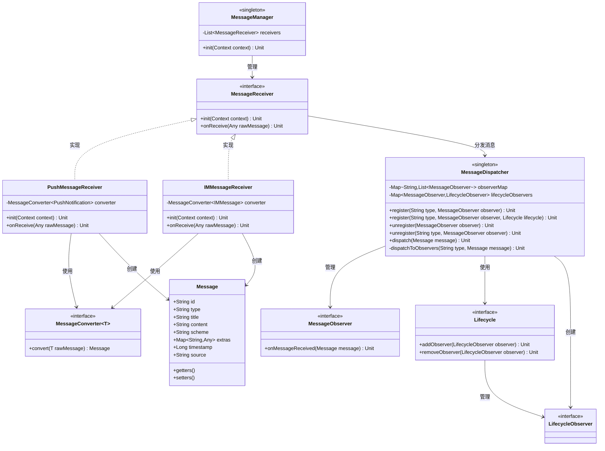
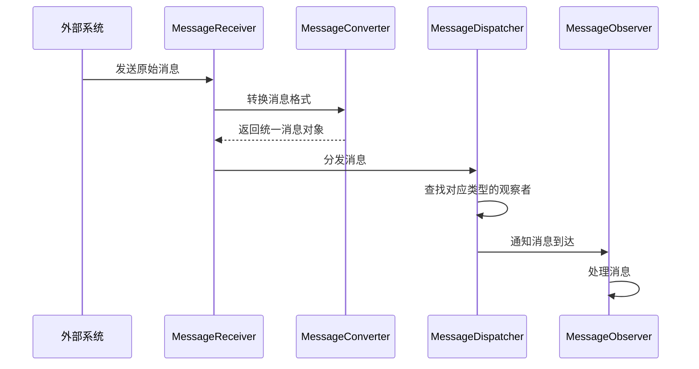
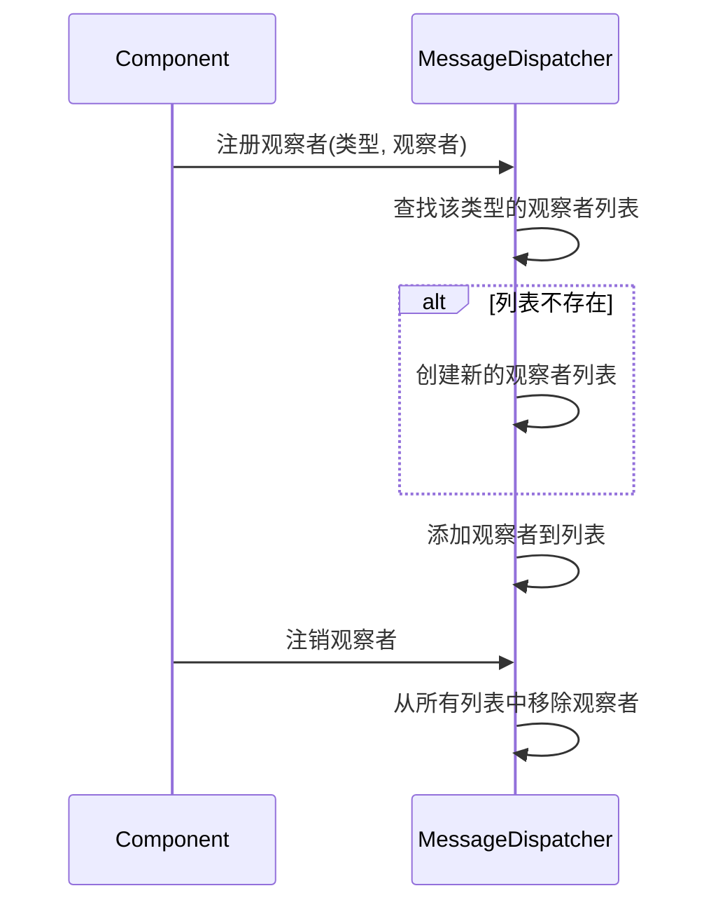
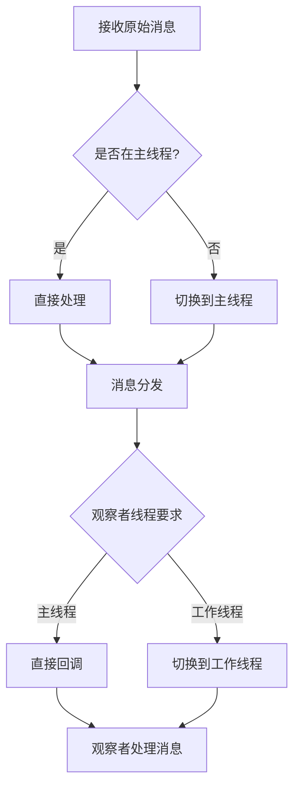
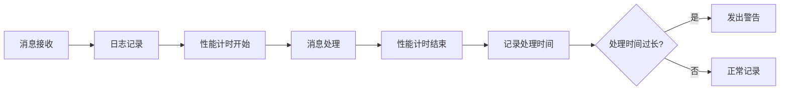

# 移动应用消息处理架构设计方案

## 1. 概述

设计一套高扩展性的消息处理架构，用于接收来自多种渠道的消息（如推送通知、IM等），并提供统一的分发机制，允许应用内各模块进行监听和处理。

## 2. 架构设计

### 2.1 总体架构

采用观察者模式结合策略模式的设计，主要包含以下核心组件：

- **消息接收器**：负责从各种渠道接收原始消息
- **消息转换器**：将不同来源的消息转换为统一格式
- **消息分发中心**：核心组件，负责消息的分发和观察者管理
- **消息观察者**：注册到分发中心的各个监听组件

### 2.2 类图



### 2.3 数据模型

```kotlin
// 统一消息模型
@Parcelize
data class Message(
    val id: String,                   // 消息唯一标识
    val type: String,                 // 消息类型
    val title: String,                // 消息标题
    val content: String,              // 消息内容
    val scheme: String,               // 跳转链接
    val timestamp: Long = System.currentTimeMillis(), // 时间戳
    @TypeParceler<Map<String, Any>, MapParceler>
    val extras: Map<String, Any> = mapOf(), // 扩展字段
) : Parcelable {
    // 使用Kotlin的命名参数和默认值特性，无需Builder模式
    // 示例: Message(id = "123", type = "notification", title = "标题", ...)
}

/**
 * 用于处理Map<String, Any>类型的自定义Parceler
 * 注意：这里简化处理，实际使用时需要考虑更复杂的类型处理
 */
object MapParceler : Parceler<Map<String, Any>> {
    override fun create(parcel: Parcel): Map<String, Any> {
        val size = parcel.readInt()
        val map = mutableMapOf<String, Any>()
        
        repeat(size) {
            val key = parcel.readString() ?: ""
            val type = parcel.readString() ?: ""
            
            val value: Any = when (type) {
                "String" -> parcel.readString() ?: ""
                "Int" -> parcel.readInt()
                "Long" -> parcel.readLong()
                "Boolean" -> parcel.readInt() == 1
                "Float" -> parcel.readFloat()
                "Double" -> parcel.readDouble()
                else -> parcel.readString() ?: ""
            }
            
            map[key] = value
        }
        
        return map
    }
    
    override fun Message.write(parcel: Parcel, flags: Int) {
        parcel.writeInt(extras.size)
        
        extras.forEach { (key, value) ->
            parcel.writeString(key)
            
            when (value) {
                is String -> {
                    parcel.writeString("String")
                    parcel.writeString(value)
                }
                is Int -> {
                    parcel.writeString("Int")
                    parcel.writeInt(value)
                }
                is Long -> {
                    parcel.writeString("Long")
                    parcel.writeLong(value)
                }
                is Boolean -> {
                    parcel.writeString("Boolean")
                    parcel.writeInt(if (value) 1 else 0)
                }
                is Float -> {
                    parcel.writeString("Float")
                    parcel.writeFloat(value)
                }
                is Double -> {
                    parcel.writeString("Double")
                    parcel.writeDouble(value)
                }
                else -> {
                    parcel.writeString("String")
                    parcel.writeString(value.toString())
                }
            }
        }
    }
}
```

### 2.4 核心组件

#### 消息分发中心

```kotlin
object MessageDispatcher {
    private val observerMap = ConcurrentHashMap<String, MutableList<MessageObserver>>()
    private val lifecycleObservers = ConcurrentHashMap<MessageObserver, LifecycleObserver>()
    
    // 注册观察者，可指定消息类型
    fun register(type: String?, observer: MessageObserver) {
        val messageType = if (type.isNullOrEmpty()) "*" else type
        
        val observers = observerMap.getOrPut(messageType) { 
            CopyOnWriteArrayList<MessageObserver>() 
        }
        
        if (!observers.contains(observer)) {
            observers.add(observer)
        }
    }
    
    // 带生命周期感知的注册，会在Lifecycle.Event.ON_DESTROY时自动注销
    fun register(type: String?, observer: MessageObserver, lifecycle: Lifecycle) {
        register(type, observer)
        
        val lifecycleObserver = object : LifecycleEventObserver {
            override fun onStateChanged(source: LifecycleOwner, event: Lifecycle.Event) {
                if (event == Lifecycle.Event.ON_DESTROY) {
                    unregister(observer)
                    lifecycle.removeObserver(this)
                    lifecycleObservers.remove(observer)
                }
            }
        }
        
        lifecycle.addObserver(lifecycleObserver)
        lifecycleObservers[observer] = lifecycleObserver
    }
    
    // 注销观察者
    fun unregister(observer: MessageObserver) {
        observerMap.values.forEach { observers ->
            observers.remove(observer)
        }
        
        // 移除生命周期观察者
        lifecycleObservers[observer]?.let { lifecycleObserver ->
            lifecycleObservers.remove(observer)
        }
    }
    
    // 注销特定类型的观察者
    fun unregister(type: String, observer: MessageObserver) {
        observerMap[type]?.remove(observer)
    }
    
    // 分发消息
    fun dispatch(message: Message) {
        // 分发给特定类型的观察者
        dispatchToObservers(message.type, message)
        // 分发给通配符观察者
        dispatchToObservers("*", message)
    }
    
    private fun dispatchToObservers(type: String, message: Message) {
        observerMap[type]?.forEach { observer ->
            observer.onMessageReceived(message)
        }
    }
}
```

#### 消息观察者接口

```kotlin
interface MessageObserver {
    fun onMessageReceived(message: Message)
}
```

#### 消息接收器接口

```kotlin
interface MessageReceiver {
    fun init(context: Context)
    fun onReceive(rawMessage: Any)
}
```

#### 消息转换器接口

```kotlin
interface MessageConverter<T> {
    fun convert(rawMessage: T): Message
}
```

### 2.5 消息接收实现

#### 推送消息接收器

```kotlin
class PushMessageReceiver(
    private val converter: MessageConverter<PushNotification>
) : MessageReceiver {
    
    override fun init(context: Context) {
        // 初始化推送SDK
    }
    
    override fun onReceive(rawMessage: Any) {
        if (rawMessage is PushNotification) {
            val message = converter.convert(rawMessage)
            MessageDispatcher.getInstance().dispatch(message)
        }
    }
}
```

#### IM消息接收器

```kotlin
class IMMessageReceiver(
    private val converter: MessageConverter<IMMessage>
) : MessageReceiver {
    
    override fun init(context: Context) {
        // 初始化IM SDK
    }
    
    override fun onReceive(rawMessage: Any) {
        if (rawMessage is IMMessage) {
            val message = converter.convert(rawMessage)
            MessageDispatcher.getInstance().dispatch(message)
        }
    }
}
```

## 3. 流程图

### 3.1 消息处理流程



### 3.2 观察者注册流程



## 4. 使用示例

### 4.1 初始化消息系统

```kotlin
object MessageManager {
    private val receivers = ArrayList<MessageReceiver>()
    
    fun init(context: Context) {
        // 初始化各接收器
        val pushReceiver = PushMessageReceiver(PushMessageConverter())
        pushReceiver.init(context)
        receivers.add(pushReceiver)
        
        val imReceiver = IMMessageReceiver(IMMessageConverter())
        imReceiver.init(context)
        receivers.add(imReceiver)
    }
}

// 在Application中初始化
class MyApplication : Application() {
    override fun onCreate() {
        super.onCreate()
        
        // 初始化消息系统
        MessageManager.init(this)
    }
}
```

### 4.2 注册观察者

```kotlin
// 在Activity或Fragment中
class NotificationActivity : AppCompatActivity(), MessageObserver {
    
    override fun onCreate(savedInstanceState: Bundle?) {
        super.onCreate(savedInstanceState)
        setContentView(R.layout.activity_notification)
        
        // 使用Lifecycle感知的注册方式，无需手动注销
        MessageDispatcher.register("notification", this, lifecycle)
        
        // 还可以在ViewModel中使用
        // viewModel.messages.observe(this) { ... }
    }
    
    // 不再需要在onDestroy中手动注销
    // 由Lifecycle自动处理
    
    override fun onMessageReceived(message: Message) {
        // 处理收到的消息
        updateUI(message)
    }
    
    private fun updateUI(message: Message) {
        // 更新UI
    }
}
```

## 5. 扩展性考虑

1. **消息过滤**：可添加过滤器链，对消息进行预处理或筛选
2. **优先级机制**：为观察者添加优先级，控制消息处理顺序
3. **消息存储**：添加本地存储组件，实现消息持久化
4. **消息状态**：跟踪消息状态（已读/未读等）
5. **跨进程分发**：使用AIDL或ContentProvider实现跨进程消息分发
6. **延迟分发**：支持定时或延迟消息分发

## 6. 线程模型

1. 分发中心工作在主线程，确保UI操作安全性
2. 提供异步分发选项，避免阻塞主线程
3. 观察者可指定执行线程（主线程/工作线程）



## 7. 安全性考虑

1. 对敏感消息内容进行加密
2. 实现消息验证机制，防止伪造消息
3. 对接收到的消息进行数据合法性校验

## 8. 监控与调试

1. 实现日志记录器，跟踪消息生命周期
2. 添加性能监控点，监测消息处理延迟
3. 提供调试模式，便于排查问题



## 9. 结论

本方案设计了一套高度可扩展的消息处理架构，通过观察者模式和策略模式的结合，实现了从不同渠道接收消息并统一分发的功能。架构具有良好的扩展性，支持各种消息类型和参数的扩展，同时保持了系统的解耦和灵活性。 