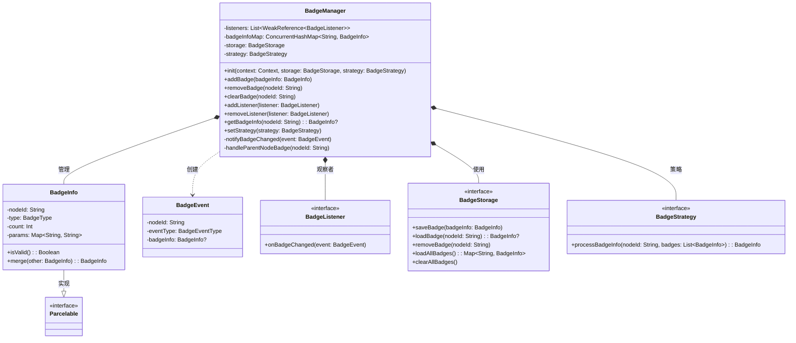
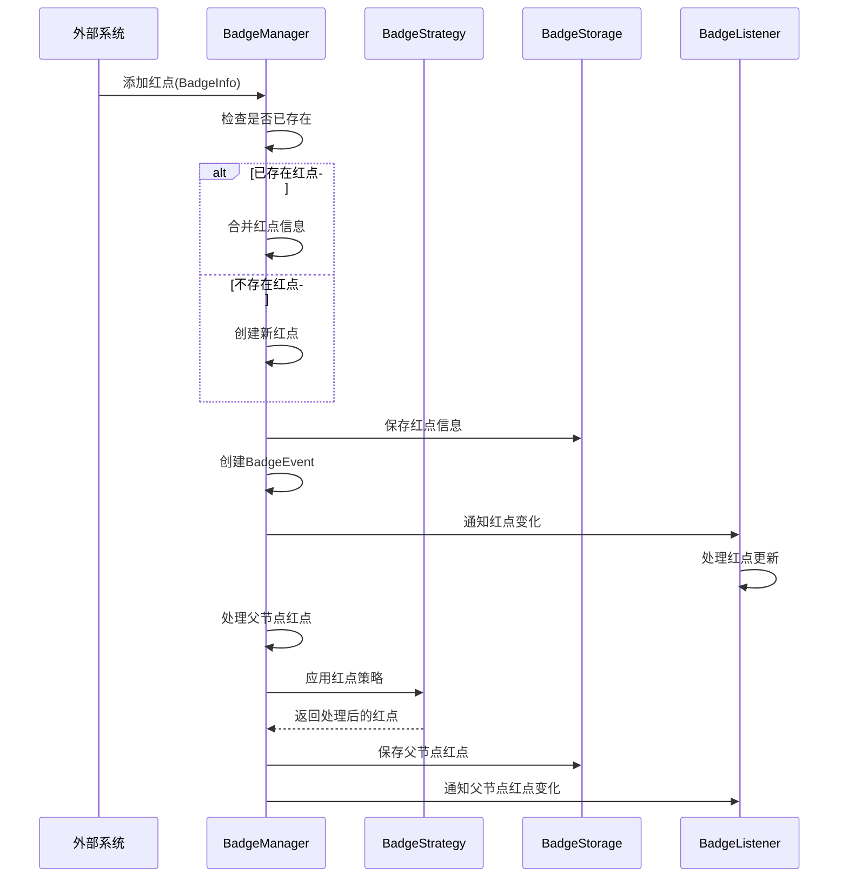
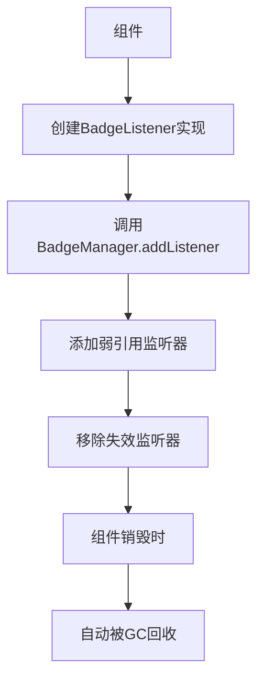

# Android/iOS 应用红点系统设计方案

## 1. 概述

设计一套高扩展性的红点系统，用于处理移动应用中的未读提醒功能，支持多种红点类型和数量显示，能够响应外部事件（如推送通知、IM消息等）并提供统一的监听机制。

## 2. 架构设计

### 2.1 总体架构

采用观察者模式结合单例模式的设计，主要包含以下核心组件：

- **红点管理器(BadgeManager)**：核心单例类，负责红点的统一管理
- **红点实体(BadgeInfo)**：表示红点的基本信息
- **红点事件(BadgeEvent)**：表示红点状态变化的事件
- **红点监听器(BadgeListener)**：监听红点变化的接口
- **红点存储(BadgeStorage)**：负责红点状态的持久化存储
- **红点策略(BadgeStrategy)**：定义不同的红点显示策略

### 2.2 类图



### 2.3 数据模型

#### BadgeType (红点类型)

```kotlin
/**
 * 红点类型枚举
 */
enum class BadgeType {
    DOT,        // 普通圆点红点
    NUMBER,     // 带数字的红点
    NEW_TAG,    // "新"标签
    CUSTOM;     // 自定义类型
}
```

#### BadgeInfo (红点信息)

```kotlin
/**
 * 红点信息实体类
 * 
 * 包含红点的各种属性，并支持Android序列化
 * 
 * @property nodeId 红点节点唯一标识，可用点分隔符表示层级关系（如"消息.未读"）
 * @property type 红点类型，默认为普通圆点
 * @property count 红点数量，0表示无红点
 * @property params 扩展参数，可用于存储额外信息
 */
@Parcelize
data class BadgeInfo(
    val nodeId: String,                   // 红点节点ID
    val type: BadgeType = BadgeType.DOT,  // 红点类型
    val count: Int = 0,                   // 红点数量
    val params: Map<String, String> = emptyMap() // 扩展参数
) : Parcelable {
    
    /**
     * 检查红点是否有效（数量大于0）
     * 
     * @return 如果红点有效返回true，否则返回false
     */
    fun isValid(): Boolean = count > 0
    
    /**
     * 合并两个红点信息
     * 如果节点ID不同，则不进行合并，直接返回当前实例
     * 
     * @param other 要合并的另一个红点信息
     * @return 合并后的新红点信息
     */
    fun merge(other: BadgeInfo): BadgeInfo {
        // 如果节点ID不同，不能合并
        if (nodeId != other.nodeId) return this
        
        // 创建新的BadgeInfo实例，合并count和params
        return copy(
            count = count + other.count,
            params = params + other.params
        )
    }
}
```

#### BadgeEventType (红点事件类型)

```kotlin
/**
 * 红点事件类型枚举
 */
enum class BadgeEventType {
    ADDED,      // 红点添加
    UPDATED,    // 红点更新
    REMOVED,    // 红点移除
    CLEARED     // 红点清除
}
```

#### BadgeEvent (红点事件)

```kotlin
/**
 * 红点事件类
 * 
 * 表示红点状态变化的事件
 * 
 * @property nodeId 发生变化的节点ID
 * @property eventType 事件类型
 * @property badgeInfo 相关的红点信息，可能为null
 */
data class BadgeEvent(
    val nodeId: String,
    val eventType: BadgeEventType,
    val badgeInfo: BadgeInfo?
)
```

#### BadgeStrategy (红点策略)

```kotlin
/**
 * 红点策略接口
 * 
 * 用于定义不同的红点计数和显示策略
 */
interface BadgeStrategy {
    /**
     * 处理多个红点信息，生成最终的红点显示信息
     * 
     * @param nodeId 节点ID
     * @param badges 相关的红点信息列表
     * @return 处理后的红点信息
     */
    fun processBadgeInfo(nodeId: String, badges: List<BadgeInfo>): BadgeInfo
}

/**
 * 计数累加策略（默认）
 * 
 * 将所有子节点的红点数量累加显示
 */
class SumBadgeStrategy : BadgeStrategy {
    override fun processBadgeInfo(nodeId: String, badges: List<BadgeInfo>): BadgeInfo {
        // 计算所有红点数量之和
        val totalCount = badges.sumOf { it.count }
        return BadgeInfo(nodeId, BadgeType.NUMBER, totalCount)
    }
}

/**
 * 最大值策略
 * 
 * 只显示所有子节点中的最大红点数
 */
class MaxBadgeStrategy : BadgeStrategy {
    override fun processBadgeInfo(nodeId: String, badges: List<BadgeInfo>): BadgeInfo {
        // 获取最大红点数量
        val maxCount = badges.maxOfOrNull { it.count } ?: 0
        return BadgeInfo(nodeId, BadgeType.NUMBER, maxCount)
    }
}

/**
 * 布尔策略
 * 
 * 只显示有无红点，不关心具体数量
 */
class BooleanBadgeStrategy : BadgeStrategy {
    override fun processBadgeInfo(nodeId: String, badges: List<BadgeInfo>): BadgeInfo {
        // 检查是否有任何有效红点
        val hasValidBadge = badges.any { it.isValid() }
        return BadgeInfo(nodeId, BadgeType.DOT, if (hasValidBadge) 1 else 0)
    }
}
```

### 2.4 核心组件

#### 红点监听器 (BadgeListener)

```kotlin
/**
 * 红点监听器接口
 * 
 * 用于监听红点状态变化
 */
interface BadgeListener {
    /**
     * 当红点状态变化时调用
     * 
     * @param event 红点变化事件
     */
    fun onBadgeChanged(event: BadgeEvent)
}
```

#### 红点存储 (BadgeStorage)

```kotlin
/**
 * 红点存储接口
 * 
 * 定义红点信息持久化的操作
 */
interface BadgeStorage {
    /**
     * 保存红点信息
     * 
     * @param badgeInfo 要保存的红点信息
     */
    fun saveBadge(badgeInfo: BadgeInfo)
    
    /**
     * 加载指定节点的红点信息
     * 
     * @param nodeId 节点ID
     * @return 红点信息，如果不存在则返回null
     */
    fun loadBadge(nodeId: String): BadgeInfo?
    
    /**
     * 移除指定节点的红点信息
     * 
     * @param nodeId 要移除的节点ID
     */
    fun removeBadge(nodeId: String)
    
    /**
     * 加载所有红点信息
     * 
     * @return 所有红点信息的映射表，key为节点ID
     */
    fun loadAllBadges(): Map<String, BadgeInfo>
    
    /**
     * 清除所有红点信息
     */
    fun clearAllBadges()
}

/**
 * 红点存储的SharedPreferences实现
 * 
 * 使用SharedPreferences保存红点信息
 * 
 * @property sharedPreferences SharedPreferences实例
 */
class SharedPrefBadgeStorage(context: Context) : BadgeStorage {
    private val sharedPreferences = context.getSharedPreferences("badge_prefs", Context.MODE_PRIVATE)
    
    override fun saveBadge(badgeInfo: BadgeInfo) {
        // 使用Gson将BadgeInfo对象序列化为JSON字符串
        val json = Gson().toJson(badgeInfo)
        sharedPreferences.edit().putString(badgeInfo.nodeId, json).apply()
    }
    
    override fun loadBadge(nodeId: String): BadgeInfo? {
        // 从SharedPreferences中读取JSON字符串
        val json = sharedPreferences.getString(nodeId, null) ?: return null
        // 将JSON反序列化为BadgeInfo对象
        return try {
            Gson().fromJson(json, BadgeInfo::class.java)
        } catch (e: Exception) {
            null // 解析失败返回null
        }
    }
    
    override fun removeBadge(nodeId: String) {
        // 从SharedPreferences中移除指定key
        sharedPreferences.edit().remove(nodeId).apply()
    }
    
    override fun loadAllBadges(): Map<String, BadgeInfo> {
        val result = mutableMapOf<String, BadgeInfo>()
        // 遍历SharedPreferences中的所有条目
        sharedPreferences.all.forEach { (key, value) ->
            if (value is String) {
                try {
                    // 尝试将每个JSON字符串解析为BadgeInfo
                    val badgeInfo = Gson().fromJson(value, BadgeInfo::class.java)
                    result[key] = badgeInfo
                } catch (e: Exception) {
                    // 忽略解析错误
                }
            }
        }
        return result
    }
    
    override fun clearAllBadges() {
        // 清空所有SharedPreferences数据
        sharedPreferences.edit().clear().apply()
    }
}
```

#### 红点管理器 (BadgeManager)

```kotlin
/**
 * 红点管理器
 * 
 * 负责红点的统一管理，包括添加、删除、清除红点以及分发红点事件
 * 采用单例模式确保全局唯一实例
 * 集成性能优化和线程安全特性
 */
object BadgeManager {
    // 使用WeakReference管理监听器，避免内存泄漏
    private val listeners = CopyOnWriteArrayList<WeakReference<BadgeListener>>()
    
    // 使用线程安全的ConcurrentHashMap存储红点信息
    private val badgeInfoMap = ConcurrentHashMap<String, BadgeInfo>()
    
    // 负责红点持久化的存储组件
    private lateinit var storage: BadgeStorage
    
    // 红点处理策略
    private var strategy: BadgeStrategy = SumBadgeStrategy()
    
    /**
     * 初始化红点管理器
     * 
     * @param context 应用上下文
     * @param storage 红点存储实现，默认使用SharedPreferences实现
     * @param strategy 红点处理策略，默认使用累加策略
     */
    @Synchronized
    fun init(
        context: Context, 
        storage: BadgeStorage = SharedPrefBadgeStorage(context),
        strategy: BadgeStrategy = SumBadgeStrategy()
    ) {
        this.storage = storage
        this.strategy = strategy
        // 从持久化存储中加载所有红点状态
        badgeInfoMap.putAll(storage.loadAllBadges())
    }
    
    /**
     * 设置红点处理策略
     * 
     * @param strategy 要使用的红点策略
     */
    fun setStrategy(strategy: BadgeStrategy) {
        this.strategy = strategy
    }
    
    /**
     * 添加或更新红点
     * 
     * 如果节点已存在红点，则合并红点信息；否则创建新红点
     * 
     * @param badgeInfo 要添加的红点信息
     */
    @Synchronized
    fun addBadge(badgeInfo: BadgeInfo) {
        val nodeId = badgeInfo.nodeId
        val existing = badgeInfoMap[nodeId]
        
        // 合并红点信息或使用新红点
        val newBadgeInfo = existing?.merge(badgeInfo) ?: badgeInfo
        badgeInfoMap[nodeId] = newBadgeInfo
        
        // 持久化存储红点信息
        storage.saveBadge(newBadgeInfo)
        
        // 确定事件类型并通知监听器
        val eventType = if (existing == null) BadgeEventType.ADDED else BadgeEventType.UPDATED
        notifyBadgeChanged(BadgeEvent(nodeId, eventType, newBadgeInfo))
        
        // 处理父节点的红点传递（如消息.未读 -> 消息）
        handleParentNodeBadge(nodeId)
    }
    
    /**
     * 移除指定节点的红点
     * 
     * @param nodeId 要移除红点的节点ID
     */
    @Synchronized
    fun removeBadge(nodeId: String) {
        if (badgeInfoMap.containsKey(nodeId)) {
            val badgeInfo = badgeInfoMap.remove(nodeId)
            
            // 从持久化存储中移除
            storage.removeBadge(nodeId)
            
            // 通知监听器红点被移除
            notifyBadgeChanged(BadgeEvent(nodeId, BadgeEventType.REMOVED, badgeInfo))
            
            // 处理父节点的红点传递
            handleParentNodeBadge(nodeId)
        }
    }
    
    /**
     * 清除指定节点的红点
     * 与removeBadge不同，这表示用户已查看，使用CLEARED事件类型
     * 
     * @param nodeId 要清除红点的节点ID
     */
    @Synchronized
    fun clearBadge(nodeId: String) {
        if (badgeInfoMap.containsKey(nodeId)) {
            val badgeInfo = badgeInfoMap.remove(nodeId)
            
            // 从持久化存储中移除
            storage.removeBadge(nodeId)
            
            // 通知监听器红点被清除
            notifyBadgeChanged(BadgeEvent(nodeId, BadgeEventType.CLEARED, badgeInfo))
            
            // 处理父节点的红点传递
            handleParentNodeBadge(nodeId)
        }
    }
    
    /**
     * 批量添加红点
     * 批量操作可以减少通知次数，提高性能
     * 
     * @param badgeInfoList 要添加的红点信息列表
     */
    @Synchronized
    fun addBadges(badgeInfoList: List<BadgeInfo>) {
        // 记录所有更新的节点ID
        val updatedNodeIds = mutableSetOf<String>()
        
        // 批量处理所有红点
        for (badgeInfo in badgeInfoList) {
            val nodeId = badgeInfo.nodeId
            val existing = badgeInfoMap[nodeId]
            
            val newBadgeInfo = existing?.merge(badgeInfo) ?: badgeInfo
            badgeInfoMap[nodeId] = newBadgeInfo
            storage.saveBadge(newBadgeInfo)
            
            updatedNodeIds.add(nodeId)
            // 添加所有父节点到更新列表
            var parentId = nodeId
            while (parentId.contains(".")) {
                parentId = parentId.substringBeforeLast(".")
                updatedNodeIds.add(parentId)
            }
        }
        
        // 处理所有更新节点的父子关系
        updatedNodeIds.forEach { nodeId ->
            if (nodeId.contains(".")) {
                handleParentNodeBadge(nodeId)
            }
        }
        
        // 批量通知，减少回调次数
        badgeInfoMap.forEach { (nodeId, badgeInfo) ->
            if (updatedNodeIds.contains(nodeId)) {
                notifyBadgeChanged(BadgeEvent(nodeId, BadgeEventType.UPDATED, badgeInfo))
            }
        }
    }
    
    /**
     * 添加红点变化监听器
     * 
     * @param listener 要添加的监听器
     */
    fun addListener(listener: BadgeListener) {
        // 清理已失效的弱引用
        removeInvalidListeners()
        
        // 避免重复添加
        if (listeners.none { it.get() === listener }) {
            listeners.add(WeakReference(listener))
        }
    }
    
    /**
     * 移除红点变化监听器
     * 
     * @param listener 要移除的监听器
     */
    fun removeListener(listener: BadgeListener) {
        // 移除匹配的监听器
        listeners.removeIf { it.get() === listener }
        // 顺便清理已失效的弱引用
        removeInvalidListeners()
    }
    
    /**
     * 清理已失效的弱引用监听器
     */
    private fun removeInvalidListeners() {
        listeners.removeIf { it.get() == null }
    }
    
    /**
     * 获取指定节点的红点信息
     * 
     * @param nodeId 节点ID
     * @return 红点信息，如果节点没有红点则返回null
     */
    fun getBadgeInfo(nodeId: String): BadgeInfo? {
        return badgeInfoMap[nodeId]
    }
    
    /**
     * 通知所有监听器红点状态变化
     * 
     * @param event 红点变化事件
     */
    private fun notifyBadgeChanged(event: BadgeEvent) {
        // 清理已失效的弱引用
        removeInvalidListeners()
        
        // 遍历所有监听器并通知事件
        listeners.forEach { weakRef -> 
            weakRef.get()?.onBadgeChanged(event)
        }
    }
    
    /**
     * 处理父节点的红点状态
     * 当子节点红点状态变化时，使用当前策略更新父节点的红点状态
     * 
     * @param nodeId 发生变化的节点ID
     */
    private fun handleParentNodeBadge(nodeId: String) {
        // 检查节点是否有父节点（通过点分隔符判断）
        if (nodeId.contains(".")) {
            // 获取父节点ID
            val parentId = nodeId.substringBeforeLast(".")
            
            // 查找所有属于该父节点的子节点的红点信息
            val childrenBadges = badgeInfoMap.filterKeys { 
                it.startsWith("$parentId.") && it != parentId 
            }.values.toList()
            
            // 使用当前策略处理子节点红点
            if (childrenBadges.isNotEmpty()) {
                // 应用红点策略生成父节点红点
                val parentBadge = strategy.processBadgeInfo(parentId, childrenBadges)
                
                if (parentBadge.isValid()) {
                    // 更新父节点红点状态
                    badgeInfoMap[parentId] = parentBadge
                    storage.saveBadge(parentBadge)
                    notifyBadgeChanged(BadgeEvent(parentId, BadgeEventType.UPDATED, parentBadge))
                } else if (badgeInfoMap.containsKey(parentId)) {
                    // 如果父节点之前有红点但现在应该清除
                    clearBadge(parentId)
                }
                
                // 递归处理更上层的父节点
                handleParentNodeBadge(parentId)
            } else if (badgeInfoMap.containsKey(parentId)) {
                // 如果所有子节点都没有有效红点，则清除父节点的红点
                clearBadge(parentId)
            }
        }
    }
}
```

## 3. 流程图

### 3.1 红点添加流程



### 3.2 监听器注册流程



## 4. 使用示例

### 4.1 初始化红点系统

```kotlin
// 在Application中初始化
class MyApplication : Application() {
    override fun onCreate() {
        super.onCreate()
        
        // 默认初始化（使用SharedPreferences存储和累加策略）
        BadgeManager.init(this)
        
        // 或者使用自定义配置
        // val storage = CustomBadgeStorage()
        // val strategy = BooleanBadgeStrategy()
        // BadgeManager.init(this, storage, strategy)
    }
}
```

### 4.2 添加红点

```kotlin
// 添加一个带数字的红点
val badgeInfo = BadgeInfo(
    nodeId = "message.unread",
    type = BadgeType.NUMBER,
    count = 5,
    params = mapOf("category" to "chat")
)
BadgeManager.addBadge(badgeInfo)

// 或者批量添加红点（性能优化）
val badgeList = listOf(
    BadgeInfo("message.unread", BadgeType.NUMBER, 3),
    BadgeInfo("notification.system", BadgeType.DOT, 1)
)
BadgeManager.addBadges(badgeList)
```

### 4.3 监听红点变化

```kotlin
class MessageFragment : Fragment(), BadgeListener {
    
    override fun onViewCreated(view: View, savedInstanceState: Bundle?) {
        super.onViewCreated(view, savedInstanceState)
        BadgeManager.addListener(this)
        
        // 初始化UI状态
        updateBadgeUI(BadgeManager.getBadgeInfo("message.unread"))
    }
    
    override fun onDestroyView() {
        BadgeManager.removeListener(this)
        super.onDestroyView()
    }
    
    override fun onBadgeChanged(event: BadgeEvent) {
        if (event.nodeId == "message.unread") {
            updateBadgeUI(event.badgeInfo)
        }
    }
    
    private fun updateBadgeUI(badgeInfo: BadgeInfo?) {
        badgeInfo?.let {
            if (it.isValid()) {
                binding.badgeView.visibility = View.VISIBLE
                if (it.type == BadgeType.NUMBER && it.count > 0) {
                    binding.badgeView.setText(it.count.toString())
                } else {
                    binding.badgeView.setText("")
                }
            } else {
                binding.badgeView.visibility = View.GONE
            }
        } ?: run {
            binding.badgeView.visibility = View.GONE
        }
    }
}
```

### 4.4 清除红点

```kotlin
// 用户查看了消息列表，清除未读红点
BadgeManager.clearBadge("message.unread")
```

### 4.5 切换红点策略

```kotlin
// 对于新闻列表，只关心有无未读，不关心具体数量
BadgeManager.setStrategy(BooleanBadgeStrategy())

// 对于聊天消息，显示所有未读消息的总数
BadgeManager.setStrategy(SumBadgeStrategy())

// 对于版本更新，只显示最新的版本号
BadgeManager.setStrategy(MaxBadgeStrategy())
```

## 5. 扩展性设计

### 5.1 层级红点结构

通过定义节点ID的命名规则（如使用点分隔符），可以建立红点的层级结构：

```
消息
├── 系统消息
├── 聊天消息
│   ├── 好友消息
│   └── 群组消息
└── 通知消息
```

当子节点有红点时，父节点自动根据当前策略显示红点。

### 5.2 自定义红点类型

通过扩展`BadgeType`或使用`CUSTOM`类型结合`params`参数，可以支持更多红点展示形式：

```kotlin
// 在BadgeInfo中使用CUSTOM类型和params参数
val customBadge = BadgeInfo(
    nodeId = "feature.new",
    type = BadgeType.CUSTOM,
    count = 1,
    params = mapOf(
        "color" to "#FF0000",
        "animation" to "pulse",
        "shape" to "star"
    )
)

// UI层根据自定义参数展示红点
private fun showCustomBadge(badgeInfo: BadgeInfo) {
    if (badgeInfo.type == BadgeType.CUSTOM) {
        val color = Color.parseColor(badgeInfo.params["color"] ?: "#FF0000")
        val animation = badgeInfo.params["animation"]
        val shape = badgeInfo.params["shape"]
        
        // 根据参数自定义红点显示
        customBadgeView.setColor(color)
        if (animation == "pulse") {
            startPulseAnimation(customBadgeView)
        }
        if (shape == "star") {
            customBadgeView.setStarShape()
        }
    }
}
```

## 6. 测试示例

### 6.1 单元测试

```kotlin
@Test
fun testBadgeInfoMerge() {
    // 准备测试数据
    val badge1 = BadgeInfo("test", BadgeType.NUMBER, 3)
    val badge2 = BadgeInfo("test", BadgeType.NUMBER, 2)
    
    // 执行测试方法
    val merged = badge1.merge(badge2)
    
    // 验证结果
    assertEquals(5, merged.count)
    assertEquals("test", merged.nodeId)
    assertEquals(BadgeType.NUMBER, merged.type)
}

@Test
fun testBadgeStrategies() {
    // 准备测试数据
    val badges = listOf(
        BadgeInfo("child1", BadgeType.NUMBER, 3),
        BadgeInfo("child2", BadgeType.NUMBER, 5)
    )
    
    // 测试累加策略
    val sumStrategy = SumBadgeStrategy()
    val sumResult = sumStrategy.processBadgeInfo("parent", badges)
    assertEquals(8, sumResult.count)
    
    // 测试最大值策略
    val maxStrategy = MaxBadgeStrategy()
    val maxResult = maxStrategy.processBadgeInfo("parent", badges)
    assertEquals(5, maxResult.count)
    
    // 测试布尔策略
    val boolStrategy = BooleanBadgeStrategy()
    val boolResult = boolStrategy.processBadgeInfo("parent", badges)
    assertEquals(1, boolResult.count)
    assertEquals(BadgeType.DOT, boolResult.type)
}
```

### 6.2 集成测试

```kotlin
@Test
fun testParentChildBadgeRelationship() {
    // 初始化管理器
    val context = ApplicationProvider.getApplicationContext<Context>()
    val mockStorage = MockBadgeStorage()
    BadgeManager.init(context, mockStorage)
    
    // 添加子节点红点
    BadgeManager.addBadge(BadgeInfo("parent.child1", BadgeType.NUMBER, 3))
    
    // 验证父节点红点是否正确创建
    val parentBadge = BadgeManager.getBadgeInfo("parent")
    assertNotNull(parentBadge)
    assertEquals(3, parentBadge?.count)
    
    // 添加另一个子节点红点
    BadgeManager.addBadge(BadgeInfo("parent.child2", BadgeType.NUMBER, 2))
    
    // 验证父节点红点是否正确更新
    val updatedParentBadge = BadgeManager.getBadgeInfo("parent")
    assertEquals(5, updatedParentBadge?.count)
    
    // 清除所有子节点红点
    BadgeManager.clearBadge("parent.child1")
    BadgeManager.clearBadge("parent.child2")
    
    // 验证父节点红点是否被清除
    val finalParentBadge = BadgeManager.getBadgeInfo("parent")
    assertNull(finalParentBadge)
}
```

## 7. 总结

本方案设计了一个灵活、可扩展的红点系统，具备以下特点：

1. **功能完整**：支持添加、删除、清除红点，以及红点事件监听
2. **高性能**：
   - 使用弱引用管理监听器，避免内存泄漏
   - 线程安全的数据结构，适合多线程环境
   - 批量操作API，减少频繁通知和IO操作
3. **高扩展性**：
   - 支持多种红点类型和自定义参数
   - 可替换的红点策略，满足不同业务需求
   - 可扩展的存储实现，支持不同的持久化方案
4. **易于使用**：简洁的API设计，易于集成和定制

该方案适用于各种复杂的业务场景，能够满足不同类型的红点显示需求，并具有良好的扩展性和性能表现。