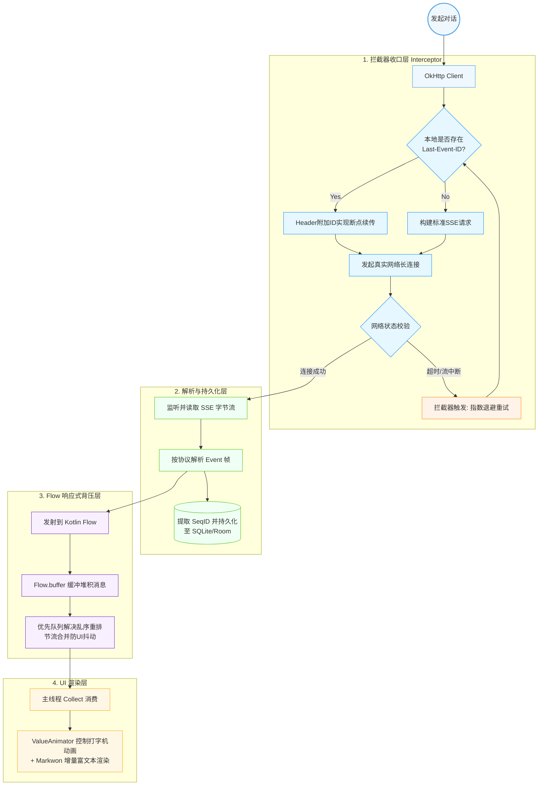
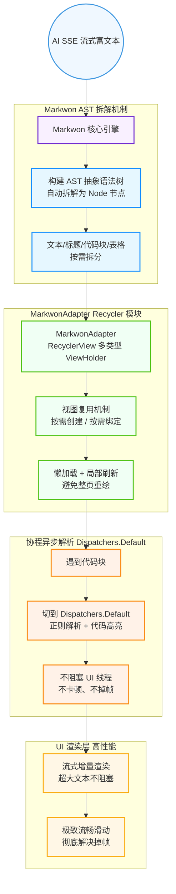

# 如何编写有效的提示词让AI生成更符合需求的内容

## 基本原则

1. **明确具体** - 避免模糊的语言，尽可能具体说明你的需求
2. **提供上下文** - 给AI足够的背景信息
3. **分步骤指导** - 将复杂任务分解为清晰的步骤
4. **说明目标受众** - 明确内容面向谁
5. **指定格式和风格** - 明确你希望的输出形式

## 实用技巧

### 1. 使用角色设定
```
假设你是一位[专业角色]，具有[相关经验/技能]。请帮我[具体任务]。
```

### 2. 提供输出模板
```
请按照以下格式回答：
- 第一部分：[内容要求]
- 第二部分：[内容要求]
- 结论：[内容要求]
```

### 3. 明确约束条件
```
请在回答时遵循以下原则：
1. 使用简单易懂的语言
2. 不超过500字
3. 提供3-5个具体例子
4. 避免使用专业术语
```

### 4. 引导思考过程
```
在回答前，请先分析[具体问题]的关键因素，然后提供你的建议。
```

### 5. 设定评估标准
```
请确保你的回答满足以下标准：
- 准确性：信息必须准确无误
- 实用性：建议必须可以实际操作
- 完整性：涵盖问题的各个方面
```

## 实际示例

**弱提示词**：
"帮我写一篇关于环保的文章"

**强提示词**：
"假设你是一位环境科学专家，为高中生撰写一篇800字的科普文章，主题是'日常生活中的环保行动'。请包含以下几点：1)三个最有效的个人环保习惯及其科学原理；2)这些习惯对减少碳足迹的量化影响；3)容易实施的具体建议。使用通俗易懂的语言，适当加入数据支持，并以鼓励行动的积极语调结尾。"

## 进阶技巧

1. **使用示例**：提供你期望的输出示例
2. **迭代改进**：先获取初步答案，然后要求AI基于具体方向进行修改
3. **指定AI不该做什么**：明确说明你不想看到的内容
4. **设置"专家级别"**：指明你需要何种深度的回答
5. **使用特定术语**：在专业领域使用行业术语提高精确度

# 提示词模板集合

## 1. 角色扮演模板
```
请你作为[专业角色]，拥有[X年经验/专业背景]。
任务：[具体描述任务]
目标受众：[受众描述]
输出要求：[格式要求/字数限制/风格要求]
额外说明：[特殊要求/禁止事项]
```

## 2. 内容创作模板
```
主题：[具体主题]
类型：[文章/故事/脚本/广告词等]
风格：[正式/幽默/严肃/温暖等]
字数：[具体字数]
结构：
- 第一部分：[内容要求]
- 第二部分：[内容要求]
- 第三部分：[内容要求]
关键点：[必须包含的要点，3-5个]
禁止：[不要出现的内容或表达]
```

## 3. 问题解析模板
```
我需要解决以下问题：[问题描述]
背景信息：[相关背景]
请按照以下步骤分析：
1. 问题的核心是什么
2. 可能的解决方案（至少3个）
3. 每个方案的优缺点
4. 最佳方案推荐及实施步骤
```

## 4. 专业咨询模板
```
领域：[专业领域]
咨询问题：[具体问题]
我的情况：[个人情况描述]
我已知道：[已有的相关知识]
我需要了解：[希望获得的具体信息]
回答深度：[初级/中级/高级]
```

## 5. 产品评估模板
```
产品类型：[产品描述]
评估目的：[使用场景/购买考虑等]
重点关注：[性能/价格/耐用性等具体方面]
比较对象：[其他类似产品]
评估格式：
- 优点（至少X点）
- 缺点（至少X点）
- 总体评分（1-10）
- 适合人群
- 最终建议
```

## 6. 学习辅导模板
```
学科：[具体学科]
主题：[具体知识点]
难度：[初级/中级/高级]
请提供：
1. 核心概念解释（200字以内，通俗易懂）
2. 关键原理/公式/理论（附简单示例）
3. 实际应用场景（3个具体例子）
4. 常见误区（至少2个）
5. 掌握要点（5个简短要点）
```

## 7. 创意启发模板
```
项目：[创意项目]
目标：[希望达到的效果]
已有元素：[已确定的元素/想法]
风格倾向：[喜欢的风格/参考]
创意要求：
- 提供至少5个不同方向的创意
- 每个创意包含核心理念和简短执行方案
- 突出创新点和差异化优势
```

## 8. 反馈改进模板
```
原始内容：[粘贴原始内容]
目标：[改进目标]
问题：[已知的问题点]
改进要求：
1. 指出不足之处（具体到段落/句子）
2. 提供修改建议（具体改写示例）
3. 总体改进方向
语调：[委婉/直接/专业]
```

## 9. 决策辅助模板
```
决策情境：[情境描述]
可选方案：
A. [方案描述]
B. [方案描述]
C. [方案描述]
考量因素：[重要考量点，如时间/成本/风险等]
个人偏好：[个人价值观/限制条件]
请提供：
- 每个方案的利弊分析
- 基于考量因素的评分（1-10分）
- 决策建议及理由
- 执行首选方案的注意事项
```

## 10. 多角度分析模板
```
主题：[具体主题/问题]
请从以下角度分析：
1. [角度A，如经济角度]的观点和依据
2. [角度B，如社会角度]的观点和依据
3. [角度C，如伦理角度]的观点和依据
4. [角度D，如技术角度]的观点和依据
每个角度分析200字左右，最后提供一个平衡的综合观点。
``` 



### 对应的类图 (Class Diagram)

