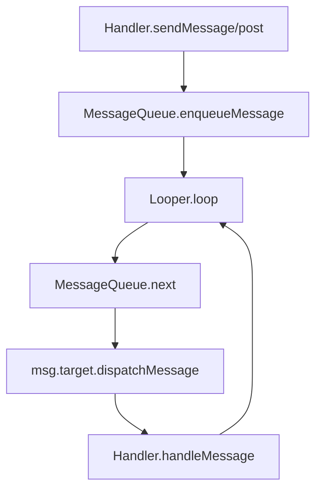
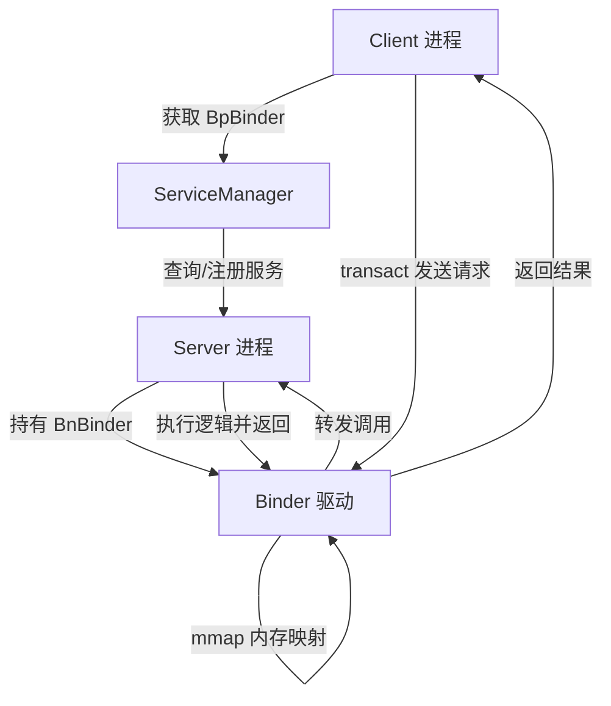
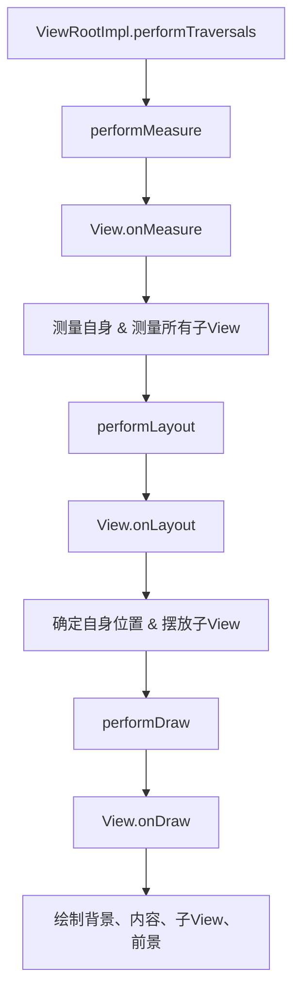
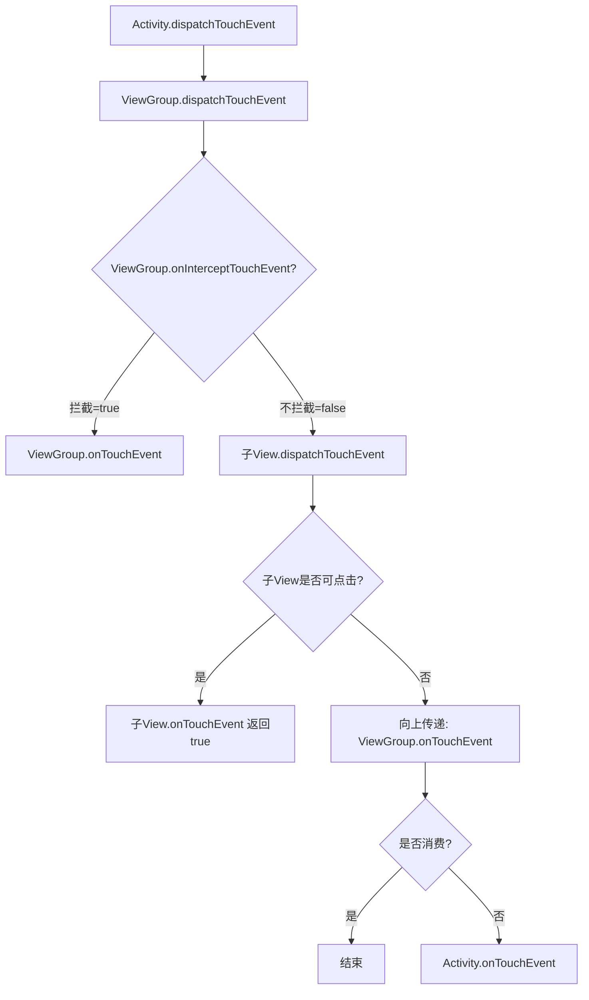
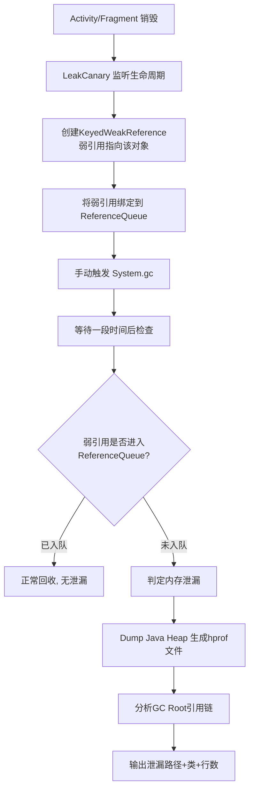
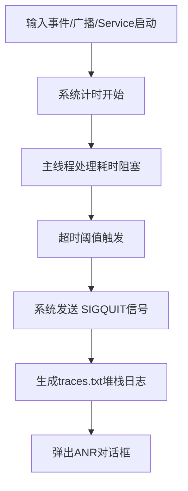

# 高级Android开发面试冲刺通关指南

## P0 核心项目深挖（必考）

### 非技术类话术准备

- **1-2分钟自我介绍**：
  我有9年 `Android` 经验，深耕 AI 应用和大规模直播社交业务。曾主导过问小白、花椒直播等复杂项目，核心能力在于复杂架构设计与极致性能优化。我曾将冷启动压至 1.2s，整体崩溃率降至 0.07%。希望能加入贵公司，挑战大体量和高并发场景的架构工作。

### 核心项目亮点提取

#### Android 的SSE 流式输出你是怎么设计的

> **总结**：基于 `OkHttp` 集成**自定义重试 / 续传 / 缓存拦截器**实现 `SSE` 长连接流式请求，通过 `SSE` 回调解析数据并发射至 `Kotlin Flow`，上层基于 `Flow` 实现打字机动画渲染，完成 Android 端稳定的 `SSE` 流式输出全流程。

**分析**：
1. **初始化配置层**：`SSE` 管理类初始化 `OkHttpClient`，添加重试、续传、缓存自定义拦截器，配置 `SSE` 长连接、心跳保活参数，构建 `EventSource` 工厂完成 `SSE` 协议适配。
2. **网络请求层**：发起 `SSE` 流式请求，`OkHttp` 拦截器链按序执行重试（异常 / 5xx 状态码重试）、续传（携带 `Last-Event-ID` 断点续接）、缓存（元数据离线兜底）逻辑，建立服务端单向流式通信通道。
3. **数据解析层**：`SSE` 生命周期回调监听连接、消息、异常事件，解码原始流式字节流，剥离 `SSE` 协议字段提取有效文本数据。
4. **Flow 中转层**：将解析后的有效数据异步发射至 `Kotlin SharedFlow`，实现数据分发、背压管控，彻底解耦网络层与 UI 层。
5. **UI 渲染层**：Android UI 组件收集 `Flow` 数据流，基于 `Flow` 的异步特性实现打字机动画，控制文字逐帧渲染速度，绑定生命周期自动释放连接与流资源。

#### 大规模 Markdown 富文本渲染，如何避免性能损耗？

> **总结**：基于 `Markwon` 构建 `AST` 并将文本拆分，通过 `RecyclerView` 进行分发和绘制，使用协程异步处理代码块高亮解析。

**分析**：
1. 接收 `Markdown`，构建抽象语法树（`AST`），将其拆分为文本、代码块、表格等独立节点。
2. 结合 `RecyclerView`，利用不同级别的 `ViewHolder` 适配各 `AST` 节点，实现按需绘制、复用与可见区懒加载。
3. 将代码块正则匹配与语法解析放入协程 `Dispatchers.Default` 中异步处理，避免滑动时阻塞主线程。代码块需要**正则匹配、语法高亮、格式解析**，是 `Markdown` 中最耗性能的操作。

#### RecyclerView 动态列表的深度优化方案？

> **总结**：围绕**复用、刷新、布局、缓存、异步**五大核心做优化，让列表滑动零卡顿、内存低占用。

**分析**：
1. **基础复用优化**：开启 `ViewHolder` 完整复用，固定控件 `ID`，避免重复查找控件，从源头减少创建销毁。
2. **精准刷新优化**：用 `DiffUtil` 局部刷新数据，替代全局刷新，只更新变化的条目。
3. **布局渲染优化**：固定列表项高度，禁用过度绘制，优化嵌套滑动逻辑。
4. **缓存策略优化**：调整缓存池大小，开启预加载，提前渲染屏幕外条目。
5. **异步处理优化**：图片加载、文本解析（`Markdown`）等耗时操作全异步，不阻塞主线程。

#### React Native 页面秒开与预加载痛点，及新老架构通信区别？

> **总结**：通过引擎预热和缓存池实现秒开；新架构放弃了基于 `JSON` 的异步 `Bridge`，采用 `JSI` 实现 `C++` 与 `JS` 的同步内存共享。

**分析**：
- **秒开优化**：启动 `IdleHandler` 在子线程静默预初始化 `RN` 引擎；构建 `ReactRootView` 缓存池复用（上限2个）；结合 `Native` 层数据预拉取，抹平页面首帧时间。
- **预加载痛点**：跨页事件容易串扰，需通过传入唯一 `pageId` 清洗隔离广播事件；并对失效页及时通过生命周期强制 `unmount` 清除内存。
- **架构演进**：新架构抛弃 `Bridge` 的序列化通信，引入 **JSI** 暴露原生对象实现同步共享。渲染层接入 **Fabric**，JS 解析换用 **Hermes** 预编译引擎，并使用 CodePush 下发 Diff 增量包实现热更新。

#### 动态布局引擎思路，如何根除反射导致的性能低下？

> **总结**：业务配置和 `UI` 渲染彻底解耦，通过 `APT` 预编译及工厂类替代运行时反射，保证加载性能。

**分析**：
- **总体架构**：通过服务端下发 `JSON` 定义不同房间的 `UI` 样式和层级约束，客户端解析并递归生成 `View` 树，动态绑定对应的业务逻辑。
- **去反射优化**：初期用 `Class.forName().newInstance()` 反射耗时极高。后续自定义 `@UIComponent` 注解，编译期依靠 `APT` 扫描生成包含庞大 `switch-case` 和硬编码视图 `new` 的 `ViewFactory`，实现运行时 `O(1)` 的纯原生实例化效率。

#### 大体量应用的崩溃率压降至 0.07%？

> **总结**：通过**源头预防、实时监控、线上兜底、热修快速止血、持续清零 `Top` 崩溃**五步闭环，把崩溃率稳定控制在 0.07% 以内。

**分析**：
1. **源头预防**：
   - **空安全**：Kotlin 全面替代 Java 防范 NPE。
   - **字节码插桩**：针对系统层 `Crash`（如 7.0 系统的 Toast `BadTokenException`），通过 `ASM` 字节码插桩进行无侵入的 `Try-Catch` 处理。
   - **OOM 防治**：严控超大图（`inSampleSize` 按需采样）、基于 `Glide` 内存池以及 `Bitmap` 复用；排查单例强持有引发的泄漏，全局部署 `LeakCanary`。
2. **实时监控**：
   - 结合 `APM` 将崩溃和链路 `TraceID` 挂钩并强制开启灰度监控阈值熔断机制。
3. **线上兜底**：
   - 在 `UncaughtExceptionHandler` 中拦截非致命 `UI` 与系统组件级异常，阻止进程退栈。
4. **热修快速止血**：
   - 针对线上突发 `Crash`，通过 `Tinker` 或 `HotFix` 框架快速下发补丁，无需用户更新 `App`。
5. **持续清零 `Top` 崩溃**：
   - 建立 `Top` 崩溃周报机制，对高频 `Crash` 进行专项治理，持续优化，力求将崩溃率稳定控制在 0.07% 以内。

#### 冷启动降低至 1.2s，异步启动方案如何设计？

> **总结**：基于任务抽象与有向无环图 (`DAG`) 并发调度。

**分析**：
- 将复杂繁多的 `SDK` 初始化抽离为单独的 `Task` 并标注前后置依赖关系。启动引擎基于拓扑排序自动解析无环逻辑并分组，采用线程池与 `CountDownLatch` 并发解阻。
- 绝不抢占首屏资源，非刚需分析类 `SDK` 移入 `Looper.myQueue().addIdleHandler()` 供主线程空闲时消费。

**Q2：礼物播放控件如何设计，如何保证高性能？**
> **总结**：统一封装兼容多格式的礼物播放控件，通过控件复用、资源预缓存、异步加载、同屏限流实现高性能，完美支持 `GIF`、`webp`、`mp4`、`lottie`。

**分析**：
**统一格式设计**：抽象通用播放接口，分别封装 `Lottie`、`GIF`、`WebP`、`MP4` 渲染引擎，一套控件兼容所有格式。
**控件复用**：创建礼物控件复用池，避免频繁创建 / 销毁视图，减少内存抖动。
**资源预缓存**：热门礼物做内存 + 磁盘缓存，提前预加载资源，播放零延迟。
**异步处理**：资源下载、解码、解析全放在后台，不阻塞主线程。
**性能限流**：限制同屏最大播放数量，低性能机型自动降级（降帧、关闭动效）。
**自动回收**：页面销毁时释放所有播放器和资源，防止内存泄漏。

---

## P1 提分线（八股文）

### Android Framework

#### Handler 机制

> **总结**：`Handler` 负责发送 / 处理消息，`Message` 承载数据，`MessageQueue` 按序存储，`Looper` 无限循环取消息，实现线程间通信。

**分析**：
- `Handler`：发送消息（`sendMessage/post`）、处理消息（`handleMessage`）
- `Message`：消息载体（`what、arg1、arg2、obj`）
- `MessageQueue`：消息队列，单向链表，按 `when` 排序
- `Looper`：消息循环，持有 `MessageQueue`，无限循环取消息分发



**同步屏障（Sync Barrier）机制**

- 一种特殊消息，`target=null`，作用是挡住普通同步消息，只让异步消息通过
- 目的：保证UI 刷新、绘制等高优先级任务优先执行

**IdleHandler（空闲处理）机制**

- 注册到 `MessageQueue`，在主线程空闲时执行
- 适合执行非紧急任务，如图片加载、数据预加载等

**关键注意事项**

- **内存泄漏**
  - `Handler` 持有外部类引用（如 `Activity`），消息未处理完导致 `Activity` 无法回收
  - 解决：静态内部类 + 弱引用 `WeakReference`；`onDestroy` 移除消息 `removeCallbacksAndMessages`
- **子线程不能直接 new Handler**
  - 子线程默认无 `Looper`，需手动 `Looper.prepare() + Looper.loop()`
- **Looper.loop () 是死循环为什么不会卡死 APP？**
  - 底层用 `epoll` 阻塞等待，无消息时休眠，不占 `CPU`
  - 有消息时被唤醒，属于事件驱动模型
- **一个线程几个 Looper/MessageQueue？**
  - 1 个线程 = 1 个 `Looper` = 1 个 `MessageQueue`
  - `ThreadLocal` 保证每个线程有独立的 `Looper`
  - 可以有多个 `Handler` 共用同一个 `Looper`
- **Message 如何复用？**
  - 使用 `Message.obtain()` 而非 `new Message()`，利用池化复用，避免频繁 `GC`

#### Binder 机制

> **总结**：`Binder` 是 `Android` 基于 `mmap` (内存映射，一次拷贝)实现的 `IPC` 跨进程通信方案，相比传统 `IPC` 更高效、安全、稳定，是系统核心通信底座。

**分析**：
- `Client`：调用方（如 `APP` 进程）
- `Server`：服务提供方（如系统服务、`AIDL` 服务）
- `ServiceManager`：服务注册表，管理所有 `Binder` 服务
- `Binder` 驱动：内核模块，负责数据传输、映射、线程管理

|方式|拷贝次数|效率|安全性|实现复杂度|
|-----|-----|-----|-----|-----|
|Binder|1 次|高|高（带 UID/PID）|中|
|管道 / 消息队列|2 次|低|低|高|
|Socket|2 次|低|低|高|
|共享内存|0 次|最高|极低|极高|

**重点**
- 一次拷贝原理
  - 内核通过 `mmap` 开辟一块共享缓冲区
  - 数据直接从发送方缓存拷贝到共享区
  - 接收方直接访问共享区，无需第二次拷贝
- Binder 线程池
  - Binder 驱动默认管理 15 个工作线程
  - 自动处理并发，无需手动创建线程



#### App 的启动流程

> **总结**：系统进程 `Zygote` 孵化 `App` 进程 → 启动 `Application` → 启动入口 `Activity` → 界面渲染完成。

**分析**：
1. 点击桌面图标
    - `Launcher` 发送 `Intent` 给 `AMS（ActivityManagerService）`。
2. `AMS` 检查进程是否存在
    - 不存在：请求 `Zygote` 孵化新进程
    - 存在：直接启动目标 `Activity`
3. `Zygote` `fork` 出 `App` 进程
    - 执行 `ActivityThread.main()`，`App` 主线程启动。
4. 创建 `Application`
    - 调用 `attach()`
    - 执行 `onCreate()`
5. 创建并启动入口 `Activity`
    - 构造 `Activity` 对象
    - `attach()` → `onCreate()` → `onStart()` → `onResume()`
6. 界面渲染 & 显示执行
    - `performTraversals()` 完成 `measure/layout/draw`，`App` 可见。

#### Activity 的启动方式和应用场景

| 启动模式 (LaunchMode) | 特点 | 适用场景 |
|---|---|---|
| **standard** (默认) | 每次启动都会创建一个新的 `Activity` 实例入栈。 | 绝大多数普通的页面交互。 |
| **singleTop** (栈顶复用) | 如果新 `Activity` 已经在任务栈的**栈顶**，就不会创建新实例，而是触发 `onNewIntent()`；否则创建新实例。 | 推送通知点击跳转、搜索结果界面等。 |
| **singleTask** (栈内复用) | 只要任务栈中存在该 `Activity` 的实例，就会将其上方的所有 `Activity` 弹出（Clear Top），并将其实例调到栈顶触发 `onNewIntent()`。 | App 的主界面（如 `MainActivity`）。 |
| **singleInstance** (单实例) | 全局单例，系统会为它**单独分配一个任务栈**，并且该栈中只允许存在这一个实例。 | 来电接听界面、闹钟提醒界面等独立交互的系统级功能。 |

#### View 的绘制流程

> **总结**：`onMeasure` → `onLayout` → `onDraw`，自上而下遍历、递归绘制。

**分析**：
1. `measure`（测量）
    - 目的：算出自己的宽高 `measuredWidth/measuredHeight`
    - 关键：`MeasureSpec`（模式 + 尺寸）
        - `UNSPECIFIED`：想多大就多大
        - `EXACTLY`：精确值 /`match_parent`
        - `AT_MOST`：`wrap_content`，不超过父容器限制
    - `ViewGroup` 会递归调用子 `View` 的 `measure`
2. `layout`（布局）
    - 目的：确定自己和子 View 在屏幕上的位置
    - 关键：`layout(l,t,r,b)` 确定四个顶点坐标
    - `ViewGroup` 遍历子 View，调用子 View 的 `layout`
3. `draw`（绘制）
    - 绘制顺序（固定）：
        - 绘制背景
        - 绘制自己内容（`onDraw`）
        - 绘制子 `View`（`dispatchDraw`）
        - 绘制前景、滚动条



**requestLayout / invalidate / postInvalidate**

- `requestLayout`：触发 `measure + layout`
- `invalidate`：主线程触发 `onDraw`
- `postInvalidate`：子线程触发重绘

**onCreate/onStart/onResume 里能获取到 View 宽高吗？**

**不能**。因为 `View` 的测量和绘制流程是在 `onResume` 之后才真正开始的，生命周期回调与测量操作非同步执行。

**解决获取宽高为 0 的方案：**
1. **`view.post { val width = view.width }`**（最常用，将任务在消息树执行完毕后抛出）。
2. 在 `ViewTreeObserver.addOnGlobalLayoutListener` 回调中获取。
3. 重写 `Activity` 的 `onWindowFocusChanged(hasFocus: Boolean)`，为 `true` 时即可获取。

**View.post() 和 Handler.post() 的区别？**
`View.post()` 和 `Handler.post()` 底层都是**主线程 `Handler` 发送消息**。区别在于：`View.post()` 会先判断 `View` 是否附着到窗口，如果还没绘制就绪，就先缓存任务，等到 `performTraversals` 执行前再运行，能保证拿到 `View` 真实宽高；而 `Handler.post()` 是直接发送，执行时机更早，容易出现宽高为 0 的情况。

#### 事件分发机制

> **总结**：事件分发 = 3 个方法 + 自上而下传递 + 自下而上消费核心方法：

- `dispatchTouchEvent`
    - 负责事件分发，决定是否往下传递或自己处理。
- `onInterceptTouchEvent`
    - `return true`：拦截，事件交给自己 `onTouchEvent`
    - `return false`：不拦截，继续传给子 `View`
- `onTouchEvent`
    - `return true`：消费
    - `return false`：不消费，向上传递



**滑动冲突处理**
- 外部拦截法（推荐，父容器控制）
    - 在父容器 `onInterceptTouchEvent` 中：
        - `DOWN` 事件一律 `return false`（不拦截，保证子 `View` 能收到）
        - `MOVE` 时判断方向
        - 符合父滑动 → `return true`（自己拦）
        - 符合子滑动 → `return false`（给子）
- 内部拦截法（子控件控制）
    - 子 `View` 在 `dispatchTouchEvent` 中调用：
    - `getParent().requestDisallowInterceptTouchEvent(true/false)`
    - 父容器必须在 `DOWN` 事件不拦截，否则子控制失效

### 性能优化体系剖析

#### 内存泄露的根本原因

> **总结**：长生命周期对象 持有 短生命周期对象的强引用，导致短生命周期对象本该被回收时无法被 `GC` 回收，长期驻留在堆内存中。

**分析**
- 引用关系不合理
    - 长生命周期对象（单例、静态变量、永久线程、Handler 消息）持有短生命周期对象（`Activity`、`Fragment`、`View`、`Context`）的强引用
- 资源未正常释放
    - 注册的广播、服务、监听器、IO 流、`WebView` 等，没有反注册 / 释放 / 解绑，导致对象被系统持有无法释放。

**内存泄漏本质（底层）**
- 可达性分析：`GC Root` 到该对象仍有强引用可达路径
- 本该 “不可达” 的对象，变成了 “长期可达”
- 结果：对象无法标记回收 → 堆内存占用越来越大 → OOM


#### LeakCanary 内存泄漏排查的底层工作原理是什么？

> **总结**：监听对象生命周期 → 弱引用监控 → 触发 `GC` → 查看引用链 → 生成泄漏报告，核心是利用弱引用 + 引用队列判断对象是否真正回收。

**分析**：
- 弱引用 + `ReferenceQueue`
    - `LeakCanary` 用 `KeyedWeakReference` 包装 `Activity/Fragment`
    - 如果对象被 `GC` 回收，弱引用会被放入 `ReferenceQueue`
    - 没入队 = 有强引用持有 = 泄漏
- 主动触发 GC
    - 不会被动等系统 `GC`，而是主动调用 `GC` 确保回收机会
    - 避免因没 `GC` 导致误判
- 分析 `Heap` 快照
    - 泄漏后 `dump` 内存快照 `hprof`
    - 解析 `GC Root` → 泄漏对象的整条引用链
    - 定位到具体类、方法、变量



#### ANR是如何产生的，如何监听ANR？

> **总结**：主线程被阻塞、耗时操作超时，系统无法及时响应输入 / 服务 / 广播，触发 ANR；监听核心是监控主线程消息执行耗时 + 系统信号。

**主线程（UI 线程）出现耗时操作**
- 输入事件（按键、触摸）5s 内没处理完
- 广播接收器（Receiver）前台 10s / 后台 60s没执行完
- 服务（Service）前台 20s / 后台 200s没执行完
- ContentProvider 超时未执行

**监听ANR**
> 利用 `Handler/Looper` 机制、或者三方库 `BlockCanary`（底层也是基于 `Handler/Looper`）

```kotlin
// 核心原理：Looper.loop() 每次分发消息前后记录时间
Looper.getMainLooper().setMessageLogging(object : Printer {
    override fun println(s: String) {
        if (s.startsWith(">>>>> Dispatching to Handler")) {
            // 消息开始处理
            startTime = SystemClock.uptimeMillis()
        } else if (s.startsWith("<<<<< Finished to Handler")) {
            // 消息处理结束
            val cost = SystemClock.uptimeMillis() - startTime
            if (cost > THRESHOLD) {
                // 发生耗时/接近ANR，可上报堆栈
                val stack = getMainThreadStack()
                // 上报服务器 or 日志
            }
        }
    }
})
```



#### App 包体大小优化？

> **总结**：分为**编译优化、资源压缩、so库优化、代码优化、动态下发**五大类。

**分析**：
- **编译优化**：开启 `shrinkResources` 资源剔除；开启 `R8` 混淆擦除无用调用链及无效字节码。
- **资源压缩**：大图/复杂图使用 `WebP`，简单图标/纯色图使用 `VectorDrawable` 矢量图，剥除各分辨率下的杂余图包，保留 `xxhdpi` 统筹适配便足矣。
- **so库优化**：采用 Google Play 的 App Bundle 方案，将 so 库按架构拆分；`abiFilters` 斩去冷门旧硬件支持，仅包涵 `arm64-v8a` 及 `armeabi-v7a`。
- **代码优化**：合理依赖三方库，避免引入巨型库；用 `Lint` 扫描无用资源；用 `./gradlew :app:dependencies` 查看依赖树，剔除重复库。
- **动态下发**：通过插件化方案，将功能模块化；音视频、大图、so库等大体积资源按需动态下发。

#### So 库动态下发的话有什么坑？

> **总结**：so 库动态下发主要有**兼容性、安全性、性能、更新机制**四大类坑。

**分析**：
- **兼容性**：`ABI` 架构匹配问题，必须精准下发对应架构；
- **依赖关系**：`SO` 依赖关系复杂，需要手动按顺序加载，系统不会自动查找；
- **权限限制**：`Android 7.0` 以上禁止从公共路径加载，只能放私有目录；
- **重复加载**：多线程并发加载会导致崩溃，必须加锁和缓存；
- **完整性校验**：文件完整性校验必须做，否则会出现难定位的崩溃。

#### 海外 App 如何适配、多渠道、马甲包怎么做？

> **总结**：海外 App 核心是合规本地化 + 高效分发 + 风险隔离，下面按 “适配→多渠道→马甲包” 给出可落地方案，兼顾 Google Play 规则与工程效率。

**分析**：
- **语言与资源适配**：多语言资源按 `values-<语言代码>-r<地区>`；文本与布局适配 RTL（从右到左）；区域敏感数据（货币、日期、时间）使用 `Locale` 格式化。
- **网络与性能适配**：弱网优化（超时、重试、缓存、压缩）；服务器部署 CDN 节点，就近回源；
- **多渠道分发**：`Gradle ProductFlavors` 动态生成渠道包；
- **马甲包**：模块化拆分，核心业务与渠道逻辑分离，不同渠道使用不同配置，避免关联；代码隔离，用 `productFlavors`+ 独立目录，每个马甲一个 `flavor`；资源差异化，不同渠道使用不同资源，避免关联；

### Kotlin 核心特性

#### 协程本质与及挂起 (suspend) 的内部机制？

> **总结**：`Kotlin` 协程是基于**状态机 + 挂起 / 恢复回调机制**实现的**用户态轻量级线程**，可以用**同步的方式写出异步代码**，`suspend` 是编译期标记，真正实现无栈挂起 / 恢复靠`Continuation` 回调 + 状态机切换，完全由 `Kotlin` 编译器和协程库实现，不依赖操作系统线程。

**分析**：
1. **`suspend`**：不是运行时修饰，是编译期标记
2. **`Continuation`**：执行上下文 + 恢复回调
3. **Kotlin 编译器遇到 suspend 函数时**，不会直接编译成普通函数，而是把函数体拆分成多个代码片段，用状态机 + 标签标记每个挂起点，通过 Continuation 传递状态，实现无栈挂起。

|维度|协程|线程|
|---|---|---|
|实现层|用户态（编译器 + 库实现）|内核态|
|切换成本|极低（仅状态机切换 + 回调）|极高（内核上下文切换、栈保存）|
|挂起方式|无栈挂起（状态机保存现场）|有栈挂起（保存完整栈帧）|
|调度器|可复用线程池（Dispatchers）|内核调度，抢占式|
|数量|单线程可跑百万级协程|受系统线程数上限限制|

#### 协程是如何处理异常的？

> **总结**：`Kotlin` 协程的异常处理，完全是基于**结构化并发 + 异常传播 + 异常处理器**这套机制，和普通 `try/catch` 长得像但行为差别很大，而且和 `suspend`、状态机、`Continuation` 是深度绑定的。

**分析**：
1. `Kotlin` 协程异常通过 `Continuation.resumeWith(Result.failure(ex))` 在状态机之间传递；
2. 异常按结构化并发**父子关系向上传播**，不是按调用栈；
3. `launch` 异常自动向上炸，`async` 异常 `await` 才炸；
4. 统一兜底用 `CoroutineExceptionHandler`；
5. 不想一子崩全崩，用 `SupervisorJob`。

**Q3：协程怎么取消？**
> **总结**：`Kotlin` 协程的取消机制，本质是**协作式取消**，不是操作系统那种强制中断，完全是靠**状态检查 + 异常抛出 + 结构化并发**配合实现的。

**分析**：
- 协程取消是协作式，不是强制杀死。
- `job.cancel()` 只是标记状态 + 抛 `CancellationException`。
- 真正取消发生在取消点（`suspend` 标准函数、`isActive`、`ensureActive`、`yield`）。
- 异常通过 `Continuation.resumeWith(failure)` 进入状态机，中断后续 label。
- 结构化并发：父取消 → 所有子递归取消，子协程取消不影响父协程。
- `CancellationException` 是正常退出，不触发崩溃；其他异常才会连坐全家。

#### 启动协程 `launch`、 `async` 还有 `withContext` 都有啥区别？

> **总结**：`launch`、 `async` 和 `withContext` 都是 `Kotlin` 协程的启动方式，但它们在**返回值、异常处理、线程切换**等方面有很大区别。

**分析**：
- `launch`：不关心返回值，只执行任务，异常向上炸。
- `async`：需要返回值，异常存起来，await 时才炸。
- `withContext`：切换线程并等待结果，同步风格写异步，异常直接抛。

#### inline、noinline 与 crossinline 区别？

> **总结**：`inline`、`noinline`、`crossinline` 是 `Kotlin` 内联函数（`inline`）配套的三个参数修饰符，是为了解决「高阶函数 + Lambda」在编译、性能、返回行为上的问题。

**分析**：
- `inline`：编译时把函数体复制到调用处，减少 Lambda 对象创建，支持非局部返回（crossinline 禁止它）。
- `noinline`：对某个 Lambda 参数禁用内联，让它保持正常函数对象，可以作为参数传递、赋值、返回。
- `crossinline`：允许 Lambda 内联，但禁止非局部返回，避免内联后逻辑乱跳、编译报错。

#### data class？它有什么特点？

> **总结**：`data class` 是 `Kotlin` 专门用于存储数据的类，它会自动生成 `equals()`、`hashCode()`、`toString()`、`copy()` 等方法，非常适合用于传输数据。

**追问：data class 可以继承吗？**
> `data class` 可以继承，但不能继承其他 `data class`。

#### sealed class（密封类）是什么？适用场景？

> **总结**：子类固定、有限、可枚举的类，本质是加强版枚举（可带数据、泛型）；配合 `when` 表达式无需写 `else` 分支；适合页面状态（成功/失败/加载中）、网络请求结果、事件类型定义。

**追问：sealed class 和 enum 的区别？**
> `enum` 每个实例不可带自定义数据，子类固定且不可扩展；`sealed class` 子类可带数据、泛型，子类可是任意类型（`data class`、`object` 等），但子类必须和密封类在同一文件。

#### Flow 是什么？核心特性？

> **总结**：`Flow` 是 `Kotlin` 协程的响应式流，用于处理异步数据流，支持背压、取消、异常处理等特性。

**追问：Flow 和 Channel 的区别？**
> `Flow` 是冷流，数据按需生成；`Channel` 是热流，数据实时生成。

**追问：Flow vs LiveData vs RxJava 区别？**

|类型|核心特性|适用场景|
|---|---|---|
|LiveData|生命周期感知、有粘性，只能主线程观测，功能简单|简单 UI 状态展示|
|RxJava|功能极强、操作符丰富，体积重、学习成本高，无内置生命周期，需手动 dispose|复杂异步场景、多数据源组合|
|Flow|协程原生、轻量，支持背压和线程切换，可转 StateFlow/SharedFlow 替代 LiveData|现代 Android 异步首选，ViewModel 与 UI 通信|

**追问：StateFlow 和 SharedFlow 的核心区别？各自适用场景？**
|类型|核心特性|适用场景|
|---|---|---|
|StateFlow|有默认值、有粘性（新订阅者收最新值），只保留最新一个状态，本质是可观察的状态变量|ViewModel 向 UI 发送页面状态|
|SharedFlow|无默认值，可配置缓存个数，支持多播|事件总线、一次性事件（Toast、页面跳转）|

#### Kotlin 泛型中 in 和 out 的含义？如何记忆？

|类型变|含义（角色）|核心特点|记忆口诀|
|---|---|---|---|
|out（协变）|生产者|只能出不能进（如 List<out T>），支持子类赋值给父类（Dog → Animal）|out=输出=生产者|
|in（逆变）|消费者|只能进不能出（如 Comparable<in T>），支持父类赋值给子类（Animal → Dog）|in=输入=消费者|

**追问：和 Java 的泛型有什么区别？**
|特性|Java 泛型|Kotlin 泛型|
|---|---|---|
|类型擦除|有|有|
|reified|不支持|支持|
|in/out|不支持|支持|

### Java 虚拟机、并发机制与内存管理

#### JVM 内存模型

> **总结**：JVM 内存模型分为**线程私有的程序计数器、虚拟机栈、本地方法栈、线程共享的堆、方法区**。

**分析**：
- **程序计数器**
    - 记录当前线程执行字节码行号
- **虚拟机栈**
    - 每个方法执行会创建一个栈帧
- **本地方法栈**
    - 为 native 方法 服务
- **堆**
    - 存储对象实例、数组
- **方法区**
    - 类信息（Class 对象）
    - 常量、静态变量
    - 即时编译器编译后的代码

#### JVM 垃圾回收机制（GC）

> **总结**：JVM 垃圾回收机制（GC）分为**标记清除、复制、标记整理、分代回收**。

**对象是否存活**
- 引用计数法
    - 优点：简单高效
    - 缺点：无法解决循环引用
- 可达性分析
    - 以 GC Roots 为起点，向下搜索引用链
    - 能搜到 → 存活；搜不到 → 可回收

**GC Roots**
- 虚拟机栈中引用的对象（局部变量）
- 本地方法栈引用的对象
- 类静态属性引用的对象
- 常量引用的对象
- 同步锁（synchronized）持有的对象

**4 种引用类型**
- 强引用：User user = User()，只要引用在就绝不回收
- 软引用：内存不足时才回收（适合缓存）
- 弱引用：下次 GC 必回收
- 虚引用：完全不影响生命周期，仅用来接收回收通知

**垃圾回收算法**
- 标记 - 清除算法
    - 先标记可回收对象，再统一清除
    - 缺点：产生内存碎片
- 复制算法
    - 内存分两块，只使用一块
    - 存活对象复制到另一块，清空当前块
    - 优点：无碎片
    - 缺点：浪费空间
    - 用于新生代
- 标记 - 整理算法
    - 标记后，让存活对象向一端移动，清理边界外内存
    - 优点：无碎片，空间利用率高
    - 用于老年代
- 分代收集算法（JVM 实际使用）
    - 新生代：对象存活时间短 → 复制算法
    - 老年代：对象存活时间长 → 标记 - 整理

#### volatile、synchronized 原理？

> **总结**：JMM 是一套规范，用来屏蔽硬件 / 操作系统差异，保证多线程下内存可见性、原子性、有序性；核心围绕 volatile、synchronized、final、Happens-Before 展开。

**并发三大特性（核心）**
- 原子性
    - 一个操作不可中断，要么全执行完，要么不执行
- 可见性
    - 一个线程修改了共享变量，其他线程能立刻看到
- 有序性
    - 程序执行顺序按照代码顺序，禁止指令重排

**volatile**
- 保证可见性
    - 线程修改后立即刷新回主内存，其他线程立即可见
- 禁止指令重排（内存屏障）
    - 遵循 as-if-serial 语义
- 不保证原子性
    - 例如 i++ 依然线程不安全

**synchronized**
- 保证原子性
    - 加锁代码块不可中断
- 保证可见性
    - 解锁前会把变量刷回主内存
- 保证有序性
    - 加锁后同一时刻只有一个线程执行
- 锁升级
    - 偏向锁 → 轻量级锁 → 重量级锁

#### Java 线程池

> **总结**：复用线程、避免频繁创建销毁开销，控制并发数，通过 ThreadPoolExecutor 实现任务调度。

**分析**
- 降低资源消耗：复用线程，避免频繁创建 / 销毁
- 提高响应速度：任务来直接执行，不用新建线程
- 控制并发数：防止大量线程抢占资源导致卡顿或 OOM
- 统一管理：可监控、配置、拒绝策略

**线程池核心 7 大参数**

|参数|含义|作用|
|---|---|---|
|corePoolSize|核心线程数|正常运行时常驻线程数|
|maximumPoolSize|最大线程数|线程池允许的最大线程数|
|keepAliveTime|线程空闲时间|空闲线程存活时间|
|unit|时间单位|keepAliveTime 的时间单位|
|workQueue|任务队列|存储待执行任务的阻塞队列|
|threadFactory|线程工厂|创建新线程的工厂|
|handler|拒绝策略|任务队列已满时的处理策略|

**执行流程**
1. 任务进来 → 核心线程未满 → 创建核心线程执行
2. 核心线程满 → 放入任务队列排队
3. 队列满 → 创建非核心线程执行
4. 总线程达到 max → 执行拒绝策略

**常用线程池**
|线程池|特点|风险|
|---|---|---|
|`newCachedThreadPool`|无核心线程，`max` 无限|大量创建线程 OOM|
|`newFixedThreadPool`|固定线程数|队列无限 OOM|
|`newSingleThreadExecutor`|单线程|队列无限 OOM|
|`newScheduledThreadPool`|定时任务|不适合移动端|

**execute 和 submit 区别**
- `execute`：执行 `Runnable`，无返回值
- `submit`：返回 `Future`，可获取结果 / 异常

#### HashMap 核心原理

> **总结**：数组 + 链表 + 红黑树 实现的哈希表，通过哈希算法寻址，解决冲突用链地址法，JDK8 优化为树化提升查询效率。

**核心流程**
1. 计算 `key` 的 `hashCode`，再做扰动计算得到 `hash`
2. 通过 `(n-1) & hash` 计算数组下标（取模）
3. 找到对应位置：
    - 空：直接插入
    - 有元素：
        - `key` 相同 → 覆盖
        - `key` 不同 → 挂到链表 / 红黑树(链表长度 ≥ 8 且 数组容量 ≥ 64)

**扩容机制**
- **初始容量**：默认 16，必须是 2 的幂
- **加载因子**：默认 0.75
- **扩容阈值**：容量 * 加载因子
- **扩容**：扩容为原来 2 倍，重新 `hash` 分配位置

**HashMap 线程安全吗？**
- 不安全，多线程扩容时可能形成环形链表，导致死循环
- 线程安全用：`ConcurrentHashMap`（推荐）


### 架构设计与开源框架

#### 如何看待从 MVVM 向 MVI 的架构跃迁？

> **总结**：MVVM：双向数据流，状态分散，灵活但容易乱。MVI：单向数据流，状态唯一，严谨但代码稍多。

**分析**：
- **数据流方向**：`MVVM` 中 `View ↔ ViewModel`；`MVI` 中 `Intent → Model → State → View`。
- **状态管理**：`MVVM` 中状态分散在各个 `ViewModel` 中，容易出现状态不一致；`MVI` 中状态唯一，只有一个 `State` 对象包含所有界面状态。
- **可预测性**：`MVVM` 状态不可预测，`MVI` 所有修改都来自用户 `Intent`（动作），数据变化可追溯、可复现。
- **复杂程度**：`MVVM` 简单、轻量、上手快，`MVI` 模板代码多，但架构更稳。

#### Activity 重建 / 旋转时，ViewModel 为什么不会丢？

> **总结**：`ViewModel` 不跟 `Activity` 生命周期走，而是由系统的 `ViewModelStore` 持有，旋转重建时自动复用，数据不重建、不丢失。

**分析**：
- 有一个「ViewModelStore」容器：每个 `Activity / Fragment` 内部都有一个 `ViewModelStore` —— 就是一个 `Map`，用来存 `ViewModel`。
- 旋转时，系统会临时保存 `ViewModelStore`：`Activity` 销毁前：
系统调用 `onSaveInstanceState()`
同时把 `ViewModelStore` 交给 `ComponentActivity` 保管
- 新 `Activity` 重建时，会从 `ViewModelStore` 中恢复 `ViewModel`：系统把之前的 `ViewModelStore` 还给新 `Activity`，你再 `ViewModelProvider[this].get(XXXViewModel::class.java)` 拿到的还是同一个对象。

#### OkHttp 核心架构和拦截器？

> **总结**：`OkHttp` 是责任链模式的典范，所有网络请求都通过5 个系统拦截器依次处理，最终完成请求与响应。

**分析**
- `OkHttp` 核心设计模式：责任链模式。
- 拦截链是单向进去、原路返回。
- 连接复用靠 `ConnectionPool`。
- 并发控制靠 `Dispatcher`。
- 桥接拦截器负责补全请求头、Gzip 处理。
- 真正发请求的是 `CallServerInterceptor`。

**核心架构**
- `OkHttpClient`：全局配置入口：超时、拦截器、连接池、缓存、代理等。
- `Dispatcher` 分发器：控制并发：最大请求数、同域名最大请求数，管理异步队列。
- `ConnectionPool` 连接池：复用 Socket 连接，减少握手开销，默认 5 个空闲连接，保活 5 分钟。
- `Interceptor` 拦截链：核心灵魂，请求 → 一层层处理 → 响应原路返回。

**拦截器责任链**
> 执行顺序：自定义应用拦截器 → 重试重定向拦截器 → 桥接拦截器 → 缓存拦截器 → 连接拦截器 → 网络拦截器 → 服务端

#### ARouter 实现原理？

> **总结**：编译时 APT 生成路由表 + 运行时 Warehouse 加载 + 责任链拦截 + 反射 / 动态代理跳转，彻底解耦组件。

**分析**：
- **核心设计**：APT + 责任链 + 反射 / 动态代理
- **路由表生成时机**：编译期，非运行时反射
- **Warehouse 作用**：全局存储路由 / 服务 / 拦截器，懒加载 Group
- **Postcard**：路由信息载体，贯穿整个流程
- **拦截器**：全局责任链，可中断路由
- **服务发现**：基于 IProvider，跨模块无依赖调用
- **性能优势**：编译期预处理，运行时仅查表 + 少量反射

**核心架构**
1. **注解层（标记）**
    - `@Route(path="/xxx/xxx")`：标记 Activity、Fragment、服务
    - `@Autowired`：自动注入参数
    - `@Interceptor`：全局路由拦截器
2. **编译时层（APT 生成）**
    - `RouteProcessor`：扫描 `@Route`，生成路由表
    - `InterceptorProcessor`：处理拦截器
    - `AutowiredProcessor`：生成参数注入代码
3. **运行时层（执行）**
    - `LogisticsCenter`：加载路由表、初始化仓库
    - `Warehouse`：全局路由 / 服务 / 拦截器仓库
    - `_ARouter`：核心调度（build/navigation）
    - `Postcard`：路由信息载体（路径、参数、目标类）
    - `InterceptorChain`：拦截器责任链

#### Jetpack Compose 相比传统 View 的优势？

> **总结**：声明式 `UI` + 更少代码 + 更强性能 + 更好的 `Kotlin` 生态 + 彻底告别 `XML`，开发效率与可维护性大幅提升。

**分析**：
- **声明式 UI**：直接描述 `UI 状态`，系统负责渲染，无需手动操作 `View` 树。
- **更少代码**：用 `Kotlin` 语言特性，用更少的代码实现复杂的 `UI` 布局。
- **实时预览**：`@Preview`，实时预览 `UI` 效果。
- **状态管理更简单、更安全**：`State`、`MutableState`、`SnapshotStateList` 等状态管理 `API`，让状态管理更简单、更安全。
- **性能优化更智能**：`Recomposition` 智能重组，只重组变化的部分，性能更高。
- **跨平台潜力**：`Compose Multiplatform`，一套代码同时运行在 `Android`、`iOS`、`Desktop`、`Web` 等平台。

### 必备设计模式

#### 设计原则

- **单一职责**：一个类只干一件事
- **开闭原则**：扩展开放，修改关闭
- **里氏替换**：子类能替换父类
- **接口隔离**：接口小而专
- **依赖倒置**：依赖抽象，不依赖具体
- **最少知识**：低耦合，少依赖别人

#### 单例模式

> **总结**：全局只创建一个实例，保证全局唯一。

**常见写法**：
- **饿汉式**：类加载就初始化
- **懒汉式**：第一次使用才创建
- **双重校验锁（DCL）**：线程安全 + 懒加载
- **静态内部类**：最优 `Android` 写法

```kotlin
class Singleton private constructor() {
    companion object {
        val instance: Singleton by lazy(LazyThreadSafetyMode.SYNCHRONIZED) {
            Singleton()
        }
    }
}
```

#### 工厂模式

> **总结**：封装对象创建过程，不暴露 new，统一由工厂生产。调用方不关心怎么创建，统一创建逻辑，便于维护。

**常见写法**：
- **简单工厂**：一个工厂类根据参数创建不同对象
- **工厂方法**：每个类有自己的工厂
- **抽象工厂**：创建相关对象的工厂

```kotlin
interface Shape { fun draw() }

class Circle : Shape { override fun draw() = println("圆") }
class Rect : Shape { override fun draw() = println("矩形") }

object ShapeFactory {
    fun createShape(type: String): Shape = when (type) {
        "circle" -> Circle()
        "rect" -> Rect()
        else -> throw IllegalArgumentException()
    }
}

// 使用
val shape = ShapeFactory.createShape("circle")
```

#### 观察者模式

> **总结**：定义一组观察者，当被观察者状态改变时，自动通知所有观察者。

**核心**：
- 观察者接口
- 被观察者接口
- 注册/注销观察者
- 通知观察者

```kotlin
// 观察者接口
interface Observer {
    fun update(message: String)
}

// 被观察者接口
interface Subject {
    fun registerObserver(observer: Observer)
    fun unregisterObserver(observer: Observer)
    fun notifyObservers(message: String)
}

// 具体观察者
class ConcreteObserver(private val name: String) : Observer {
    override fun update(message: String) {
        println("$name 收到消息: $message")
    }
}

// 具体被观察者
class ConcreteSubject : Subject {
    private val observers = mutableListOf<Observer>()

    override fun registerObserver(observer: Observer) {
        observers.add(observer)
    }

    override fun unregisterObserver(observer: Observer) {
        observers.remove(observer)
    }

    override fun notifyObservers(message: String) {
        observers.forEach { it.update(message) }
    }
}

// 使用
val subject = ConcreteSubject()
val observer1 = ConcreteObserver("观察者1")
val observer2 = ConcreteObserver("观察者2")

subject.registerObserver(observer1)
subject.registerObserver(observer2)

subject.notifyObservers("Hello, observers!")
```

#### 适配器模式

> **总结**：将一个类的接口转换成客户端期望的另一个接口，让原本不兼容的接口可以一起工作。

**核心**：
- 目标接口
- 被适配者
- 适配器（实现目标接口，内部持有被适配者）

```kotlin
// 目标接口
interface Target {
    fun request()
}

// 被适配者
class Adaptee {
    fun specificRequest() = println("被适配者的特殊请求")
}

// 适配器（类适配器）
class Adapter : Target {
    private val adaptee = Adaptee()

    override fun request() {
        println("适配器转换请求...")
        adaptee.specificRequest()  // 调用被适配者方法
    }
}

// 使用
val target: Target = Adapter()
target.request()
```

#### 策略模式

> **总结**：定义一组算法，封装每个算法，让它们可互相替换。调用方不关心算法实现，只关心算法接口。

**核心**：
- 行为抽象成接口
- 不同实现 = 不同策略
- 运行时动态切换

```kotlin
// 策略接口
interface SortStrategy {
    fun sort(list: MutableList<Int>)
}

// 具体策略
class BubbleSort : SortStrategy {
    override fun sort(list: MutableList<Int>) = list.sort()
}

class QuickSort : SortStrategy {
    override fun sort(list: MutableList<Int>) = list.sort()
}

// 上下文
class Sorter(private val strategy: SortStrategy) {
    fun sort(list: MutableList<Int>) = strategy.sort(list)
}

// 使用
val sorter = Sorter(QuickSort())
sorter.sort(mutableListOf(3,1,2))
```

#### 建造者模式

> **总结**：将复杂对象分解成多个简单对象，再将简单对象组合成复杂对象。调用方不关心对象创建过程，只关心对象接口。

**核心**：
- 分离构建与表示
- 链式调用 `.xxx().yyy().build()`
- 适合参数多、可选配置多的对象

```kotlin
class User private constructor(
    val name: String?,
    val age: Int?,
    val phone: String?
) {
    class Builder {
        var name: String? = null
        var age: Int? = null
        var phone: String? = null

        fun name(name: String) = apply { this.name = name }
        fun age(age: Int) = apply { this.age = age }
        fun phone(phone: String) = apply { this.phone = phone }

        fun build() = User(name, age, phone)
    }
}

// 使用
val user = User.Builder()
    .name("Zhang")
    .age(20)
    .build()
```

#### 责任链模式

> **总结**：将请求沿着链条传递，每个节点处理请求后，可以选择传递给下一个节点或直接处理。

**核心**：
- 每个处理器持有下一个处理器引用
- 链式传递，不关心谁最终处理
- 解耦发送者与接收者

```kotlin
interface Interceptor {
    fun intercept(chain: Chain): String

    class Chain(private val interceptors: List<Interceptor>, private val index: Int = 0) {
        fun proceed(): String {
            val interceptor = interceptors[index]
            val next = Chain(interceptors, index + 1)
            return interceptor.intercept(next)
        }
    }
}

// 具体拦截器
class LogInterceptor : Interceptor {
    override fun intercept(chain: Interceptor.Chain): String {
        println("日志")
        return chain.proceed()
    }
}

class HeaderInterceptor : Interceptor {
    override fun intercept(chain: Interceptor.Chain): String {
        println("加Header")
        return chain.proceed()
    }
}

// 使用
val interceptors = listOf(LogInterceptor(), HeaderInterceptor())
val chain = Interceptor.Chain(interceptors)
chain.proceed()
```

---

## P2 算法速成考点梳理

### 两数之和（必考 TOP1）

**思路**：用 `HashMap` 存「值 -> 下标」，遍历一遍，看当前值需要的差值是否在 `map` 里。

```kotlin
fun twoSum(nums: IntArray, target: Int): IntArray {
    val map = HashMap<Int, Int>()
    for ((i, num) in nums.withIndex()) {
        val diff = target - num
        if (map.contains(diff)) {
            return intArrayOf(map[diff]!!, i)
        }
        map[num] = i
    }
    return intArrayOf()
}
```

### 反转链表（链表必考）

**思路**：三个指针迭代反转。

```kotlin
fun reverseList(head: ListNode?): ListNode? {
    var pre: ListNode? = null
    var cur = head
    while (cur != null) {
        val temp = cur.next
        cur.next = pre
        pre = cur
        cur = temp
    }
    return pre
}
```

### 有效的括号（栈必考）

**思路**：左括号入栈，遇到右括号就看栈顶是不是匹配，不匹配直接 false。

```kotlin
fun isValid(s: String): Boolean {
    val stack = mutableListOf<Char>()
    for (c in s) {
        when (c) {
            '(' -> stack.add(')')
            '[' -> stack.add(']')
            '{' -> stack.add('}')
            else -> {
                if (stack.isEmpty() || stack.removeLast() != c)
                    return false
            }
        }
    }
    return stack.isEmpty()
}
```

### 环形链表（快慢指针必考）

**思路**：快指针走两步、慢指针走一步，相遇则有环，快指针到 `null` 则无环。

```kotlin
fun hasCycle(head: ListNode?): Boolean {
    var slow = head
    var fast = head
    while (fast?.next != null) {
        slow = slow?.next
        fast = fast.next?.next
        if (slow === fast) return true
    }
    return false
}
```

### 只出现一次的数字（位运算必考）

**思路**：异或性质，相同数异或为 0，0 异或任何数 = 它本身。

```kotlin
fun singleNumber(nums: IntArray): Int {
    var res = 0
    nums.forEach { res = res xor it }
    return res
}
```

### 合并两个有序链表

**思路**：新建虚拟头结点，双指针分别遍历两个链表，谁小就接谁，最后把剩余部分接上。

```kotlin
fun mergeTwoLists(l1: ListNode?, l2: ListNode?): ListNode? {
    val dummy = ListNode(0)
    var cur = dummy
    var a = l1
    var b = l2

    while (a != null && b != null) {
        if (a.`val` < b.`val`) {
            cur.next = a
            a = a.next
        } else {
            cur.next = b
            b = b.next
        }
        cur = cur.next!!
    }

    cur.next = a ?: b
    return dummy.next
}
```

### 爬楼梯（斐波那契）

**思路**：递推公式 `f(n)=f(n-1)+f(n-2)`，用迭代，别递归（会超时 / 栈溢出）。

```kotlin
fun climbStairs(n: Int): Int {
    if (n <= 2) return n
    var a = 1
    var b = 2
    for (i in 3..n) {
        val c = a + b
        a = b
        b = c
    }
    return b
}
```

### 回文串 / 回文链表

**思路**：左指针从头、右指针从尾，两两比较，不一样直接 `false`。

```kotlin
fun isPalindrome(s: String): Boolean {
    var l = 0
    var r = s.length - 1
    while (l < r) {
        if (s[l] != s[r]) return false
        l++
        r--
    }
    return true
}
```

### 最大子数组和（贪心 DP）

**思路**：前面的和为负就丢掉，从当前数重新开始，记录过程最大值。

```kotlin
fun maxSubArray(nums: IntArray): Int {
    var curSum = nums[0]
    var maxSum = nums[0]
    for (i in 1 until nums.size) {
        curSum = maxOf(nums[i], curSum + nums[i])
        maxSum = maxOf(maxSum, curSum)
    }
    return maxSum
}
```
