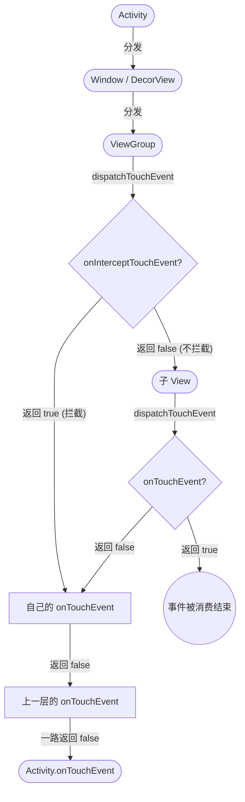
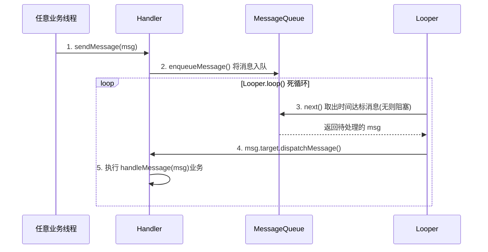
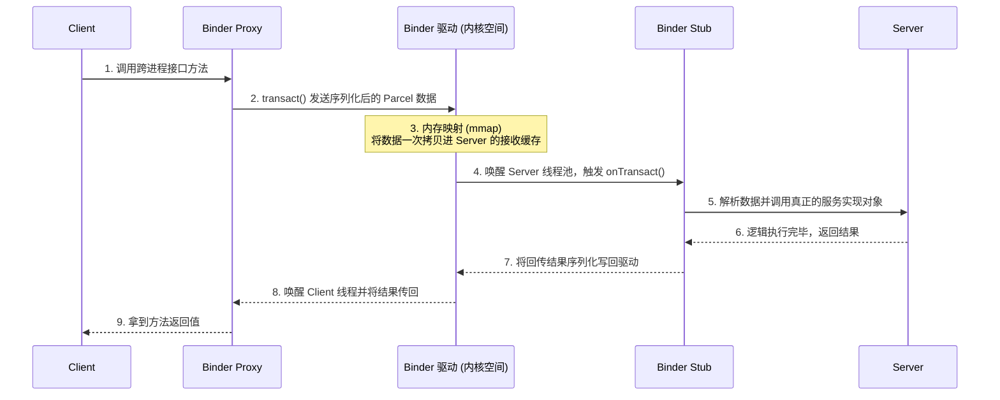
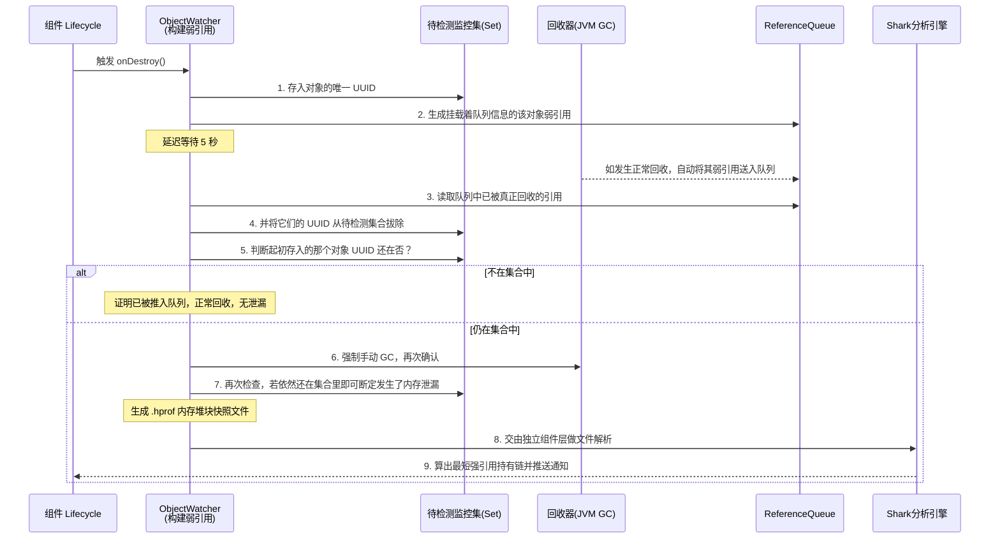

# Android面试题-Android

> 本文参照了高频面试题库，总结了 `Android` 四大组件通信、UI 绘制分发、消息机制 (`Handler`)、进程间通信 (`Binder`) 以及常见的架构和性能优化问题，以精简的要点和表格对比辅助理解。

## Android 中 Activity、Fragment 通信机制

### Activity 之间通信

| 通信方式 | 特点与适用场景 |
|---|---|
| **Intent / Bundle** | 最基础的方式。适合传递基本数据类型和实现了 `Serializable` 或 `Parcelable` 的对象，但不适合传递超大数据（大小有限制，一般不超过 `1MB`）。 |
| **EventBus / LiveData** | 基于发布-订阅模式，实现组件间的高度解耦。适合一对多的事件通知。 |
| **全局单例 / Application** | 通过共享内存通信，速度最快。适用于全局状态共享，但需注意及时清理，防止内存泄漏。 |
| **持久化存储** | 如 `SharedPreferences`、`DataStore`、`Room` 数据库、文件读写等。适合跨进程或需要持久化保存的数据通信。 |

### Fragment 之间通信

| 通信方式 | 特点与适用场景 |
|---|---|
| **ViewModel** | **官方推荐方案**。通过 `activityViewModels()` 创建依赖于宿主 `Activity` 生命周期的共享 `ViewModel`，实现真正的数据解耦与双向绑定同步。 |
| **宿主 Activity 接口回调** | 传统的通信方式。A Fragment 调用宿主 Activity 的接口，Activity 再调用 B Fragment 的方法，耦合度相对较高。 |
| **Fragment Result API** | Google 推出的用于替代 `onActivityResult` 的方案。通过 `setFragmentResult` 与 `setFragmentResultListener` 实现跨 Fragment 的数据回传，生命周期安全。 |

### Fragment 与 Activity 通信

- **Activity 调用 Fragment**：通过 `getSupportFragmentManager().findFragmentById/Tag()` 获取实例后直接调用方法。
- **Fragment 调用 Activity**：在 `onAttach()` 获取 `Context`，强转为接口形式进行回调；或使用共享 `ViewModel`。

## Activity 的启动方式和应用场景

| 启动模式 (LaunchMode) | 特点 | 适用场景 |
|---|---|---|
| **standard** (默认) | 每次启动都会创建一个新的 `Activity` 实例入栈。 | 绝大多数普通的页面交互。 |
| **singleTop** (栈顶复用) | 如果新 `Activity` 已经在任务栈的**栈顶**，就不会创建新实例，而是触发 `onNewIntent()`；否则创建新实例。 | 推送通知点击跳转、搜索结果界面等。 |
| **singleTask** (栈内复用) | 只要任务栈中存在该 `Activity` 的实例，就会将其上方的所有 `Activity` 弹出（Clear Top），并将其实例调到栈顶触发 `onNewIntent()`。 | App 的主界面（如 `MainActivity`）。 |
| **singleInstance** (单实例) | 全局单例，系统会为它**单独分配一个任务栈**，并且该栈中只允许存在这一个实例。 | 来电接听界面、闹钟提醒界面等独立交互的系统级功能。 |

## View 的绘制流程

### View 绘制完整流程

`View` 的绘制流程由 `ViewRootImpl` 的 `performTraversals()` 发起，按顺序执行以下三大阶段：

1. **Measure (测量)**：调用 `measure()` 和 `onMeasure()`，使用 `MeasureSpec`（包含模式和尺寸）自顶向下确定整个 `View` 树中每个结点的测量宽高。
2. **Layout (布局)**：调用 `layout()` 和 `onLayout()`，父容器根据子 `View` 的测量宽高，结合自身的规则，确定所有子 `View` 在自身坐标系中的位置（四个顶点的坐标）。
3. **Draw (绘制)**：调用 `draw()` 和 `onDraw()`，负责把 `View` 绘制到屏幕上，包含绘制背景、内容、子 `View` 及装饰（类似滚动条）。

### onCreate/onStart/onResume 里能获取到 View 宽高吗？

**不能**。因为 `View` 的测量和绘制流程是在 `onResume` 之后才真正开始的，生命周期回调与测量操作非同步执行。

**解决获取宽高为 0 的方案：**
1. **`view.post { val width = view.width }`**（最常用，将任务在消息树执行完毕后抛出）。
2. 在 `ViewTreeObserver.addOnGlobalLayoutListener` 回调中获取。
3. 重写 `Activity` 的 `onWindowFocusChanged(hasFocus: Boolean)`，为 `true` 时即可获取。

### 屏幕刷新机制，双缓冲/三缓冲是什么？

- **屏幕刷新机制 (Choreographer)**：系统底层每相隔 `16.6ms` (针对 `60Hz` 屏幕) 发出一个 **VSync 信号**。`Choreographer` 接收到信号后调度下一帧的 `UI` 渲染工作（Measure -> Layout -> Draw）。
- **双缓冲 (Double Buffering)**：包含一个用于给 CPU/GPU 计算渲染下一帧数据的 **Back Buffer（后台缓冲区）**，和一个用于屏幕显示的 **Front Buffer（前台缓冲区）**。`VSync` 信号到来时，交换两个 `Buffer`，防止出现画面撕裂。
- **三缓冲 (Triple Buffering)**：当 CPU/GPU 处理过慢导致错过了上一次 `VSync`（产生掉帧 `Jank`）后，如果有第三个缓冲区，CPU 就不必处于空闲等待状态，而是能立刻开始渲染更下一帧的数据，从而减少持续卡顿现象。

## View 的事件分发机制

### 事件分发完整流程

事件分发基于责任链模式，涉及到三个极其核心的方法：

| 方法 | 作用 | 返回 `true` | 返回 `false` 或 `super` |
|---|---|---|---|
| **`dispatchTouchEvent()`** | 事件的分发入口 | 消费事件，终止分发 | 传递给下一级的 `dispatch` 或自身的 `onTouchEvent` |
| **`onInterceptTouchEvent()`**<br>*(仅 ViewGroup 特有)* | 是否拦截当前事件 | 拦截当前点击事件，交由自身的 `onTouchEvent` 处理 | 不拦截，继续向下派发给子 View 的 `dispatch` |
| **`onTouchEvent()`** | 具体的事件处理与消费逻辑 | 消费该事件，后续系列事件（Move、Up）都由其处理 | 不消费，向上层（父容器）的 `onTouchEvent` 回传 |

**事件分发核心流向图：**



### 滑动冲突如何解决？

滑动冲突常见于同向嵌套（如 `ScrollView` 嵌套 `RecyclerView`）或异向嵌套（如 `ViewPager` 嵌套 `RecyclerView`）。主要有两套解决方案：

1. **外部拦截法（推荐）**：在父容器的 `onInterceptTouchEvent` 中根据滑动方向的位移差决定是否拦截。例如：横向滑动大于纵向，如果父容器是横向的 `ViewPager` 则返回 `true` 拦截，反之返回 `false`。
2. **内部拦截法**：父容器在 `onInterceptTouchEvent` 中默认除了 `ACTION_DOWN` 外全部拦截，而子 View 在其 `dispatchTouchEvent` 中根据条件动态调用 `parent.requestDisallowInterceptTouchEvent(true/false)` 来控制父级是否放行。 

## 什么是 Compose UI，它与传统 UI 有何不同？

`Jetpack Compose` 是全新的声明式原生 `UI` 开发工具包，采用纯 `Kotlin` 编写，显著提高了 `UI` 开发效率。

| 维度 | Jetpack Compose | 传统 XML UI |
|---|---|---|
| **编程范式** | **声明式响应式**。描述状态，数据改变时自动发起局部重组（`Recomposition`）。 | **命令式**。需手动执行 `findViewById` 获取对象并主动调用类似 `setText` 来强制修改。 |
| **语言一致性** | 纯 `Kotlin`，逻辑与结构在同一语言体系内，没有语言切换成本。 | `XML` (结构控制) + `Java` / `Kotlin` (业务逻辑控制)。 |
| **结构层级嵌套** | 扁平化，没有传统的基于引用的子父树遍历性能损耗，即使深层嵌套性能也很好。 | 层次越深，`Measure` 耗时按指数倍增长，必须尽量减少布局层级。 |

## Handler 消息处理机制

### Handler 的整体工作机制

Android 基于消息驱动，`Handler` 机制主要有四大核心组件：
1. **`Message`**：消息封装类，可携带数据并通过 `target` 属性记住分发自己的 Handler。
2. **`MessageQueue`**：消息队列，内部以**单链表**结构存储，按照时间戳从小到大排列消息。
3. **`Looper`**：管家，负责死循环地从 `MessageQueue` 的 `next()` 方法中取出要处理的消息，通过指向的 `msg.target.dispatchMessage()` 交回给 Handler。
4. **`Handler`**：负责发送消息（`sendMessage` 将消息插入队列）和处理消息（`handleMessage` 回调中执行业务逻辑）。

### Handler 机制时序图



### Handler 内存泄漏原因及解决

- **原因**：非静态内部类（或匿名内部类）隐式持有外部类（比如 `Activity`）。当发生延时消息时，引用链为：`主线程 -> Looper -> MessageQueue -> Message -> Handler -> Activity`，如果在延时期间退出页面，Activity 无法被 GC 回收导致泄漏。
- **解决**：
  1. 将 Handler 声明为 **静态内部类 (Static Class)** 或独立类。
  2. 若其中需要调用 Activity 的方法，采用 **弱引用 (`WeakReference`)** 包裹 Activity。
  3. 在 `onDestroy()` 处尽早调用 `handler.removeCallbacksAndMessages(null)` 清理队列。

### IdleHandler 是什么，什么时候调用？

> `IdleHandler` 是 `MessageQueue` 提供的一个回调接口。

- **调用时机**：当 `MessageQueue` 中没有新消息要处理，或者队头的消息执行时间还没到时，线程处于**空闲（Idle）**状态，此时就会触发由外界注册的 `IdleHandler` 的 `queueIdle()` 方法。
- **适用场景**：延时执行非高优先级的任务（如预加载布局、初始化某些大型组件），不阻塞主线程刷新。

### 同步屏障（MessageBarrier）原理

> 可以把同步屏障理解为一个**拦截普通消息，放行紧急异步消息**的绿灯。

- **原理**：调用底层方法在队列中插入一个 `target == null` 的特殊 Message。此时 Looper 取消息时发现队头是屏障，就会**跳过所有的同步消息，只去查找和执行队列中标记为 `isAsynchronous == true` 的异步消息**。
- **应用**：视图的请求重绘（`requestLayout` 等）发出的 VSync 刷新信号处理，会被设为异步消息并且发送屏障，从而保证 UI 的渲染帧被最优先执行，避免丢帧出现卡顿。

## Binder 机制

### Android 中的进程间通信（IPC）有哪些方法？

| IPC 方式 | 特点 | 适用场景 |
|---|---|---|
| **Bundle (Intent)** | 极其简单，四大组件间的标配 | 组件间简单的数据传递 |
| **文件共享** | 无并发保护，容易读写冲突 | 较低频的数据或者配置同步 |
| **Messenger** | 基于 Binder 面向对象，**串行处理单次请求** | 低吞吐量、不需并发处理的跨进程调用 |
| **AIDL** | 底层纯 Binder 原生，**多线程并发处理** | 高频率、高并发、需要双向收发的复杂接口调用 |
| **ContentProvider** | 数据抽象为表的形式呈现 | 多进程间的海量数据查询与共享交互 |
| **Socket** | 支持跨网络的字节流通信 | 客户端与服务端、或者需要极其底层的实时通信 |

### Binder 机制的整体工作流程

1. **注册服务**：`Server` 端进程通过 `ServiceManager` 注册自己的 Binder 实体对象。
2. **获取代理**：`Client` 端进程通过 `ServiceManager` 根据 `Name` 查找到服务，拿到一个底层的引用，封装成 `Proxy`（代理对象）。
3. **发起调用**：`Client` 端调用代理对象对应的方法，代理对象将请求参数打包为 `Parcel` 并触发 Binder 驱动。
4. **内核转发**：Binder 驱动在内核空间利用 `mmap` 并将数据传递给 `Server` 进程。
5. **处理与返回**：在 `Server` 端相应的 Binder 线程池中解包、执行原方法，最后将结果反向原路返回至 `Client`。

**Binder IPC 调用时序图：**



### Binder 为什么只需要一次内存拷贝？

- **传统 IPC （如 Socket, 管道等）**：数据需要从 发送方用户空间 -> 取到 内核空间（第 1 次拷贝），再从 内核空间 -> 给 接收方用户空间（第 2 次拷贝）。
- **Binder 机制**：利用了 Linux 的 `mmap` 技术，直接将**数据接收方（服务端）的用户空间与内核空间进行物理内存映射**。发送方调用 `copy_from_user()` 将数据拷贝到内核空间后，接收方在用户态能直接访问这块物理内存读取数据，从而实现了 **仅需一次拷贝**，在安全性（实名制 PID/UID）和性能上取得了优异的平衡。

### AIDL in/out/inout/oneway 各代表什么？

- **`in`**：对象只能从 `Client` 流向 `Server`，`Server` 的修改不影响 `Client`。
- **`out`**：对象只能从 `Server` 流向 `Client`，`Client` 传入的是空对象，`Server` 修改后该状态会在 `Client` 端生效。
- **`inout`**：数据双向同步，开销最大。
- **`oneway`**：表示**异步调用**。`Client` 调用方法后线程立马返回，不会阻塞等待 `Server` 的执行结果，方法强制不能有返回值。

### Binder Server 端是多线程还是单线程？

**多线程**。
内核空间的 Binder 驱动会在 `Server` 端自动维护一个**线程池**（默认上限 15 个），用于并发处理多个 `Client` 的请求连接。所以编写 AIDL 的服务端实现逻辑时，必定要注意多线程环境下的**读写数据同步（线程安全）**。

## RecyclerView 性能优化

- 别在 `onBindViewHolder` 里做耗时操作
- 告别 `notifyDataSetChanged()`，拥抱 `DiffUtil`
- 减少层级，拒绝过度绘制
- 优化 `ViewHolder` 复用
- 巧用缓存：`setItemViewCacheSize`
- 嵌套 RecyclerView 的大杀器：共享 `ViewPool`
- 图片加载的“防抖”
- 简单的固定高度：`setHasFixedSize(true)`


## App 启动优化

### 整体耗时

`应用进程创建时间 + Application 初始化时间 + 首屏 UI 渲染时间`

### 核心优化手段

1. **视觉伪装 (Theme)**：在 `Activity` 提供一张纯屏闪屏页作为 `windowBackground`，先骗过用户的眼睛消除白屏。
2. **异步初始化**：针对耗时且主线程非必须的首屏第三方库及模块，使用线程池、协程或者 `Startup` 开机启动器异步加载。
3. **延迟初始化 (IdleHandler)**：将不需要第一时刻准备好的资源加载置于主线程空闲时（如埋点 `SDK` 初始化）。
4. **IO 集中与防死锁**：避免在主线程进行 `SharedPreferences` (特别是读取过大 `XML`) 操作、等待多线程同步锁导致主线程等待。

## App 的包体积优化

| 优化方向 | 常用手段 |
|---|---|
| **资源层面** | 1. 清理冗余的 `res` 资源。<br>2. 使用 `SVG` (向量图) 替代位图。<br>3. 将 `JPEG/PNG` 进行 **WebP 格式转换**。<br>4. 删除无用的 `strings.xml` 语言包配置（如只打包 `zh` 和 `en`）。 |
| **SO 动态库层面** | 配置 `ndk.abiFilters` 指定，普通应用通常只保留 `armeabi-v7a` 及 `arm64-v8a` 架构库，砍掉不主流架构。 |
| **架构层面** | 1. 使用组件化/插件化架构<br>2. 采用 Google Play 的 **App Bundle (AAB)**<br>3. 动态下发(Dynamic Delivery) 等按需加载功能。 |
| **代码层面** | 开启 `R8` / `ProGuard` 进行代码混淆和擦除无效代码。 |

## 如何计算 Bitmap 的内存大小，如何避免大图 OOM

### 计算公式

- 网络图片: `内存占用 = 图片宽度 × 图片高度 × 每个像素占用的内存`
- 本地图片: `内存占用 = 原始宽度 × 原始高度 × 4 × (设备密度 / 目录密度)²`

### 防 OOM 手段

1. **按需采样 (`inSampleSize`)**：利用 `BitmapFactory.Options.inJustDecodeBounds=true` 探明真实的宽高，结合 View 的目标宽高，计算出最佳 `inSampleSize`，再正式加载避免过度读取像素。
2. **降低色彩模式**：没透明图层需求的改用 `RGB_565` 加载图片，内存直接减半。
3. **图片池复用 (`inBitmap`)**：使用 `inBitmap` 属性反复利用已经申请好的旧内存块，配合诸如 `Glide` 内置的 LRU 内存缓存池消除内存抖动。
  4. **巨图分片加载**：利用 `BitmapRegionDecoder` 加载长截图、大地图画卷，在手指滑动的时候切片渲染。

## 内存泄漏排查和解决

- **本质**：本该消亡的短生命周期对象（如 Activity）被还在活跃的长生命周期对象强引用导致 GC Roots 不可达失败，内存堆积。
- **常规排查方案**：
  1. 使用 **LeakCanary** 自动化监控。一旦监测到回收倒计时结束后依然强引用存活，就会自动触发 hprof 堆栈快照并分析出引用链条。
  2. 使用 Android Studio 内置工具 **Profiler（Memory 层）** 抓取内存快照，找出实例个数异常的类及其 GCRoot 的强关联对象。
- **常见的坑**：
  - 非静态内部类/匿名内隐式强引用 `Activity` (以延时 `Handler/Runnable` 居多) -> **改静态类加弱引用**。
  - 单例模式中传错了 `Activity` 的 `Context` -> **统一传入 `ApplicationContext`**。
  - 自设的静态或者全局容器未被置空 -> **及时 `remove/clear`**。
  - BroadCastReceiver / EventBus / 属性动画 等未成对解绑 -> **跟随生命周期尽早注销/关闭**。

## LeakCanary 原理

> `LeakCanary` 的核心原理是基于 `Java` 的 **弱引用（WeakReference）** 和 **引用队列（ReferenceQueue）** 机制。

### 核心工作流程

1. **自动监听**：通过 `Application.registerActivityLifecycleCallbacks()` 监听 `Activity` 等对象的 `onDestroy()` 生存晚期。
2. **构建监控清单**：当监听到销毁时，将对象打上唯一标识 `Key`，存入一个存放“待验证对象”的 `Set` 集合中。
3. **绑定弱引用与队列**：将这个对象包装在 `WeakReference` 中，并和专门的 `ReferenceQueue` 绑定。
4. **延时验证（第一次判定）**：延时 5 秒后，如果该对象被系统垃圾回收，JVM 会自动将其弱引用推入绑定的 `ReferenceQueue`。此时遍历队列，将从队列取出的引用的 `Key` 从 `Set` 中移除。如果被监控对象的 `Key` 还在 `Set` 里，说明目前**未被回收**。
5. **强制 GC 并二次验证（确认泄漏）**：未被回收的情况下，触发强制 `GC` (`Runtime.getRuntime().gc()`)，短暂休眠后重试上一步逻辑。若 `Key` 仍然存在于 `Set` 里，则**确认为内存泄漏**。
6. **快照分析**：使用系统 API Dump 出对内存堆栈文件 `.hprof`。再交付给底层的 `Shark` 引擎解析出到 `GC Root` 的最短强引用链，并将结果展示在通知栏。

**LeakCanary 原理时序图：**



## ANR 如何定位和分析

### ANR (Application Not Responding) 的触发阈值

- `KeyDispatchTimeout`（按键/触摸事件）：5s 主线程被卡住未处理。
- `BroadcastTimeout`（广播接收器）：前台 10s，后台 60s 内未执行完。
- `ServiceTimeout`（服务）：前台 20s，后台 200s 内未执行完。

### 定位排查三步曲

1. **看 `Logcat`**：搜寻 `ANR in xxx` 作为宏观指引，看看系统打出的简单耗时 CPU 使用率提示。
2. **看 `traces.txt`（核心）**：从手机拉取 `/data/anr/traces.txt` 文件。找到 `main`（主线程）段落，观察状态是阻塞在 `WAIT` 锁上，还是卡死在大量的耗时计算 `RUNNABLE` 上。
3. **针对性治理**：通常是耗时 I/O 挤占、大量并发时的死锁、甚至是低端机的系统整体高发热导致算力崩溃引起。

## App 性能优化

### App 如何进行性能优化

- **启动与流畅度优化（最重要的用户体验）**
- **内存优化与防泄漏**
- **包体积缩小与 Apk 安全瘦身**
- **网络优化（长连接、合并请求、缓存策略等）**
- **耗电量优化（JobScheduler 规避非活动状态下高强度唤醒 CPU 等）**

### 如何搭建 APM 监控体系

- **监控 Crash / ANR**：通过接管 `UncaughtExceptionHandler` 上报异常；通过开启一个监控 WatchDog 线程检测主线程 `Looper` 吞吐效率上报可能引发的 ANR 隐患。
- **监控卡顿耗时与 FPS**：通过系统钩子 `Choreographer.getInstance().postFrameCallback` 计算前后两帧间隔算出跳帧频次。
- **内存触顶预警**：设定定时任务通过 `Runtime` 或 `Debug.getMemoryInfo` 获取实时的 Dalvik/Native 堆栈内存阀值，触碰水线即进行告警。

## App 组件化

### App 的整体架构

> 当项目体量扩大，通常需要从传统的“单体架构”解耦为“组件化架构”，以提升编译速度与并行开发效率：

1. **App 宿主壳工程**：没有任何业务逻辑，只负责配置启动参数，将下方所有的组件打包集成（`Application`）。
2. **Business 业务组件层**：如 首页、商城模块、个人中心页 等。彼此之间互不依赖（通过路由跳转），完全物理隔离，甚至可以单独剥离出来跑。
3. **Common 基础组件层**：所有的业务都依赖这些通用设置，如 统一样式的基础 `UI Widget库`、封装的 `网络请求SDK`、`埋点监控SDK`、`工具类Util库` 等。

### ARouter 原理

> 阿里巴巴开源的 `ARouter` 解决了组件彼此毫无依赖时（即不存在强转等联系）如何跳转并传参的痛点。

- **编译时（APT 阶段）**：ARouter 在编译期间寻找所有被 `@Route(path="/xxx/yyy")` 标注的类，自动生成映射表 JAVA 文件把 Path 字符串与真实 Class 建立映射关系。
- **运行时加载（Init 阶段）**：应用启动初始化时，扫描生成出来的类字典集，存入其单例内存分配的 Map (缓存表)。
- **发起请求与解析（执行阶段）**：业务方传入字符串 `"/xxx/yyy"` 跳转时，路由器依据字符串从缓存表里匹配到那个真正 `Class` 目标，利用反射或包装好的 `startActivity` 构建 `Intent` 完成跨模块黑盒启动。

## MMKV 原理

> `MMKV` 是腾讯开源的一款基于 `mmap` 内存映射的键值存储组件，专门为移动端设计，具有高性能的特性，核心定位是替代传统的轻量级键值存储方案。其名字来源于 "`Memory-Mapped Key-Value`" 的缩写。

- **高性能**：基于 `mmap` 内存映射，读写性能远超 `SharedPreferences`。`SharedPreferences` 的 IO 操作基于文件流，频繁读写会触发大量磁盘 IO，而 `MMKV` 基于 `mmap` 实现 “内存 - 磁盘” 映射，读写几乎无磁盘 IO 开销
- **增量更新**：`MMKV` 不会像 `SP` 那样每次修改都重写整个文件，而是在内存映射区域中找到对应键的位置，直接修改数据，仅当内存不足时才扩容文件并重新映射，大幅减少磁盘写入开销。
- **多进程安全**：内置文件锁机制，支持多进程读写。`SharedPreferences` 多进程模式存在数据丢失、死锁风险，`MMKV` 内置文件锁，保证多进程安全
- **易用性**：API 设计简洁，与 `SharedPreferences` 兼容，迁移成本极低
- **轻量**：编译后体积仅几十 KB
- **数据加密**：支持 `AES CFB-128` 加密保护敏感数据

## App国际化

### Android 海外项目国际化（i18n）适配

### 核心原则

> 所有文字、尺寸、颜色、字符串拼接必须从资源文件读取。

### 多语言字符串配置（基础）

- 海外项目默认语言建议用英文（values/strings.xml），符合 Google 规范。
- 字符串规范
  - 禁止拼接：使用 %s、%d、%1$s 占位符

### 海外常用格式适配（必做）

- 日期、时间、货币格式化
- 数字、千分位分隔
- RTL 右到左布局（阿拉伯语、希伯来语）
  - AndroidManifest.xml 开启支持：
  - 布局用 start/end 代替 left/right

### 多语言动态切换（App 内切换语言）

> 核心思路：替换 Application 的 Configuration + 重启 

### 海外本地化进阶（合规 & 体验）

- 时区：用 UTC 存时间，展示时转本地时区
- 权限文案：不同地区权限说明要本地化，符合 Google Play 政策
- 币种 / 单位：海外不要只写人民币，要按地区自适应
- 文案长度：外文通常比中文长，布局要支持自适应拉伸

## 马甲包、多渠道打包

### 核心思路

> 核心思路：通过 Gradle 的 `productFlavors`（产品风味）功能，定义不同的“维度”（Dimensions），然后在每个维度下创建不同的“风味”（Flavors）。

### 核心配置

```gradle
plugins {
    id 'com.android.application'
}

android {
    defaultConfig {
        // 渠道占位符
        manifestPlaceholders = [
                CHANNEL: "default_channel"
        ]
    }
    // 多维度：马甲维度 + 渠道维度（海外最常用结构）
    flavorDimensions "app_type", "channel"
    // 马甲包维度（不同包名、应用名、图标）
    productFlavors {
        // 主马甲（主包）
        main_app {
            dimension "app_type"
            applicationId "com.youcompany.mainapp"
            // 动态定义应用名
            resValue "string", "app_name", "Main App"
        }
        // 马甲包1
        mask_app_01 {
            dimension "app_type"
            applicationId "com.youcompany.maskapp1"
            resValue "string", "app_name", "Mask App 1"
        }
        // 马甲包2
        mask_app_02 {
            dimension "app_type"
            applicationId "com.youcompany.maskapp2"
            resValue "string", "app_name", "Mask App 2"
        }
        // 渠道维度（Google Play、Facebook、自建渠道等）
        google {
            dimension "channel"
            manifestPlaceholders = [CHANNEL: "google_play"]
        }
        facebook {
            dimension "channel"
            manifestPlaceholders = [CHANNEL: "facebook"]
        }
    }
    // 资源按马甲/渠道自动覆盖
    sourceSets {
        main {
            // 指定代码目录
            java.srcDirs = ['src/main/java']
            // 指定资源目录
            res.srcDirs = ['src/main/res']
            // 指定清单文件
            manifest.srcFile 'src/main/AndroidManifest.xml'
        }
        // 马甲1专属资源
        mask_app_01 {
            res.srcDirs = ['src/mask_app_01/res']
            java.srcDirs = ['src/mask_app_01/java']
            manifest.srcFile 'src/mask_app_01/AndroidManifest.xml'
        }
        // 马甲2专属资源
        mask_app_02 {
            res.srcDirs = ['src/mask_app_02/res']
            java.srcDirs = ['src/mask_app_02/java']
            manifest.srcFile 'src/mask_app_02/AndroidManifest.xml'
        }
    }
}
```

### 资源按马甲/渠道自动覆盖

> 资源覆盖规则：
> 1. 马甲包专属资源（如 `src/mask_app_01/res/values/strings.xml`）会覆盖主包的同名资源。
> 2. 渠道专属资源（如 `src/google/res/values/strings.xml`）会覆盖主包和马甲包的同名资源。
> 3. 最终生效的资源是优先级最高的那一个。

### 核心优势

- **代码复用率高**：90% 以上的代码可以复用，只有极少数平台差异化代码需要单独维护。
- **维护成本低**：每个马甲包只有很少的专属资源，日常维护主要集中在主包。
- **编译速度快**：`Gradle` 的 `flavorDimensions` 机制可以并行编译，提升构建效率。
- **灵活性高**：可以根据需要随时新增或修改马甲包，无需改动核心业务代码。

### 常见应用场景

- **游戏行业**：同一款游戏针对不同地区或运营商推出定制版本。
- **金融行业**：针对不同银行或支付机构推出定制版本。
- **电商行业**：针对不同地区或平台推出定制版本。
- **广告行业**：针对不同广告平台推出定制版本。