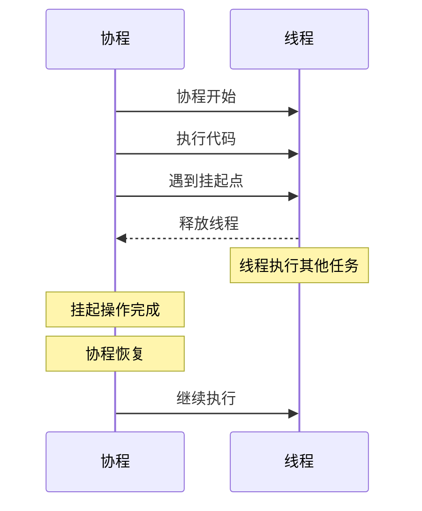

# Android面试题-Kotlin

> `Kotlin` 是谷歌官方推荐的 `Android` 开发语言，以其简洁的语法、空安全特性和与 `Java` 的互操作性受到开发者青睐。`Kotlin` 面试题的考察重点包括基本语法与类型系统、空安全（Null Safety）机制、数据类与密封类、扩展函数、高阶函数与 `Lambda` 表达式、协程（Coroutines）与异步编程、集合操作、面向对象与函数式编程、`DSL` 构建、与 `Java` 的互操作性、以及 `Kotlin` 在 `Android` 开发中的实际应用。通过深入学习 `Kotlin`，你可以高效开发现代化的 `Android` 应用，提升移动开发能力。

## Kotlin 有哪些特点？它和 Java 有什么区别？


`Kotlin` 是一种现代、静态类型的编程语言，设计目标是**与 `Java` 完全互操作，同时提供更简洁、安全和高效的开发体验。**

### **简洁性**

`Kotlin` 语法精简，减少了大量样板代码。例如，支持类型推断、数据类（`data class`）自动生成常用方法，以及更简洁的函数定义。

### **空安全**

通过类型系统在**编译时强制处理空值**，避免常见的空指针异常。变量默认不可为空，需显式标记为可空类型。

|特性|说明|
|---|---|
|类型系统区分可空和不可空（`String` vs `String?`）| 变量默认不可为空，需显式标记为可空类型。|
|安全调用操作符 `?.`| 如果对象为 null，则整个表达式返回 null，避免空指针异常。|
|Elvis 运算符 `?:`| 如果左侧表达式为 null，则返回右侧表达式的值。|
|非空断言 `!!`| 强制将可空类型转换为非空类型，如果值为 null，则抛出 `NullPointerException`。|
|安全转换 `as?`| 尝试将对象转换为指定类型，如果转换失败，则返回 null，避免 `ClassCastException`。|

### **互操作性**

与 `Java` 100% 兼容，可直接调用 `Java` 库和框架，无缝集成现有项目。

### **函数式编程支持**

提供高阶函数、`lambda` 表达式和扩展函数，便于编写声明式代码。

### **协程**

内置轻量级并发机制，简化异步编程，比传统线程更高效。

## Kotlin 中 val 和 var 有什么区别？

`Kotlin` 中的 `val` 和 `var` 是用于声明变量的关键字，它们在可变性上有本质区别，直接影响代码的安全性和设计模式。以下是详细解析：

### `val` 和 `var` 的区别

#### 可变性：

- `val`（value 的缩写）声明只读变量，赋值后不可重新赋值，相当于 `Java` 中的 `final` 变量。
- `var`（variable 的缩写）声明可变变量，允许在生命周期内多次修改值。

#### 语法示例：

- `val name = "Kotlin"`：一旦初始化，name 不能再指向其他对象。
- `var count = 0`：count 可以被重新赋值，如 count = 10。

#### 编译时检查：

- 使用 `val` 时，编译器会确保变量不会被意外修改，提升代码稳定性。
- `var` 则无此限制，但需开发者自行管理状态变化。

## Kotlin 中 when 表达式相比 Java 的 switch 有什么优势？

`Kotlin` 的 `when` 表达式相比 `Java` 的 `switch` 语句在设计上更现代、灵活和安全，主要优势体现在表达式特性、条件匹配能力、代码简洁性和错误预防方面。

### 表达式而非语句

`Kotlin` 的 `when` 可以作为表达式使用，直接返回一个值，例如 `val result = when (x) { ... }`，简化了赋值逻辑。
`Java` 的 `switch` 是语句，不能返回值，需额外定义变量来存储结果，代码更冗余。

### 更强大的条件匹配

`when` 支持多种匹配模式，包括常量、范围（如 in 1..10）、类型检查（如 is String）、甚至任意布尔表达式，适用场景更广。
`Java switch` 仅支持常量值（如整数、枚举或字符串），灵活性较低。

### 无 fall-through 风险

`when` 的每个分支自动终止，无需 `break` 语句，避免了 `Java switch` 中因遗漏 `break` 导致的意外执行多个分支的问题，提升代码安全性。

### 语法简洁易读

`when` 使用 `->` 符号分隔条件与结果，代码结构更清晰紧凑。例如，多条件合并时只需一行，而 `Java` 需重复 `case` 标签。

### 空安全集成

`when` 可自然处理可空类型，例如直接检查 `null` 分支，而 `Java switch` 对 `null` 输入会抛出 `NullPointerException`，需额外防护。

### 模式匹配支持

`Kotlin` 的 `when` 支持解构（如对数据类）和智能转换，便于处理复杂数据；`Java switch` 缺乏此类高级特性。

## Kotlin 有哪些特殊的函数类型？

`Kotlin` 提供了多种特殊函数类型，以支持现代编程范式，如函数式编程和代码复用。以下是常见类型及其示例：

### 扩展函数（Extension Functions）

允许为现有类添加新方法，无需修改源码或继承。
语法：在函数名前指定接收者类型。

```kotlin
// 为 String 类添加扩展函数
fun String.addExclamation(): String = this + "!"

fun main() {
    val text = "Hello"
    println(text.addExclamation()) // 输出: Hello!
}
```

### 高阶函数（Higher-Order Functions）

接受函数作为参数或返回函数，常用于集合操作或回调。
通常结合 `lambda` 表达式使用。

```kotlin
// 高阶函数示例：对列表中的每个元素应用一个函数
fun <T> List<T>.customMap(transform: (T) -> T): List<T> {
    val result = mutableListOf<T>()
    for (item in this) {
        result.add(transform(item))
    }
    return result
}

fun main() {
    val numbers = listOf(1, 2, 3)
    val doubled = numbers.customMap { it * 2 } // 使用 lambda
    println(doubled) // 输出: [2, 4, 6]
}
```

### 中缀函数（Infix Functions）

允许以操作符形式调用函数（如 a to b），需满足单参数且使用 `infix` 修饰。
常用于 `DSL`（领域特定语言）设计。

```kotlin
// 为中缀函数定义自定义操作
infix fun Int.pow(exponent: Int): Int = Math.pow(this.toDouble(), exponent.toDouble()).toInt()

fun main() {
    val result = 2 pow 3 // 中缀调用
    println(result) // 输出: 8
}
```

### Lambda 表达式与匿名函数

作为一等公民，可赋值给变量或直接传递，语法简洁。

```kotlin
// Lambda 示例：定义一个可执行的函数变量
val greet: (String) -> String = { name -> "Hi, $name" }

fun main() {
    println(greet("Alice")) // 输出: Hi, Alice
}
```

### 内联函数（Inline Functions）

使用 `inline` 关键字，在编译时将函数体直接插入调用处，减少高阶函数的运行时开销。
适用于频繁调用的简单函数。

```kotlin
inline fun measureTime(block: () -> Unit) {
    val start = System.currentTimeMillis()
    block()
    println("耗时: ${System.currentTimeMillis() - start} 毫秒")
}

fun main() {
    measureTime { 
        // 模拟耗时操作
        Thread.sleep(1000)
    }
}
```

## Kotlin 的可见性修饰符和 Java 有什么区别？

`Kotlin` 的可见性修饰符与 `Java` 有显著区别，主要体现在默认可见性和修饰符种类上。

| 特性 | Kotlin | Java |
| --- | --- | --- |
| 默认可见性 | public | 包级私有 |
| 模块级可见性 | internal | 无直接对应 |
| protected 范围 | 仅子类 | 子类+同包 |
| 文件级 private | 支持 | 不支持 |
| 接口成员默认 | public | public abstract |

## Kotlin 中如何处理 Java 代码的空安全问题

|步骤|说明|
|---|---|
|理解平台类型的概念| `Java` 代码中的类型在 `Kotlin` 中被视为平台类型，编译器不保证其可空性。|
|合理使用注解来提供类型信息| 使用 `@Nullable` 和 `@NonNull` 注解来向 `Kotlin` 编译器提供类型信息。|
|利用 `Kotlin` 的空安全操作符（`?.`、`?:`、`!!`）| 使用 `?.`、`?:`、`!!` 等操作符来处理可空类型。|
|尽早验证和转换为安全的 `Kotlin` 类型| 在 `Java` 代码和 `Kotlin` 代码的边界处进行空值检查，并转换为安全的 `Kotlin` 类型。|
|创建清晰的边界层隔离 `Java` 和 `Kotlin` 代码| 创建明确的边界层，将 `Java` 代码和 `Kotlin` 代码隔离开，减少空指针异常的风险。|

## Kotlin 中的类、data class、sealed class的介绍

`Kotlin` 使用 `class` 关键字定义类，语法比 `Java` 更简洁。

### class主构造函数和次构造函数区别

|主构造函数|次构造函数|
|---|---|
|每个类只能有一个主构造函数|每个类可以有多个次构造函数|
|主构造函数不能返回任何值|次构造函数可以返回任何值|
|主构造函数不能直接访问类成员|次构造函数可以访问类成员|

### init 代码块的执行顺序

**在主构造函数之后、次构造函数之前执行。多个 `init` 代码块按照在类体中出现的顺序执行**。如果有属性初始化，属性的初始化也会按顺序穿插在 `init` 代码块中。

### data class

`data class`（数据类）是 `Kotlin` 中一种特殊的类，它主要用于存储数据，编译器会自动生成一些常用的方法，如 `equals()`、`hashCode()`、`toString()`、`copy()` 等。

|特性|说明|
|---|---|
|**减少样板代码**|自动生成标准方法|
|**不可变性**|推荐使用 val，保证线程安全|
|**内容比较**|equals() 比较内容而非引用|
|**便捷复制**|copy() 方法轻松创建修改版对象|
|**解构支持**|简化多值返回和赋值|
|**可读性强**|toString() 提供清晰的字符串表示|

### sealed class

`sealed class`（密封类）是 `Kotlin` 中一种特殊的类，它允许你定义一个受限制的类层次结构。


#### 密封类的特性

|特性|说明|
|---|---|
|**类型安全**|编译时检查所有可能的子类|
|**完整覆盖**|`when` 表达式不需要 `else` 分支|
|**智能转换**|自动类型转换，减少代码|
|**受限继承**|所有子类在同一文件中，易于维护|
|**携带数据**|每个子类可以携带不同的数据|
|**可读性强**|清晰的状态定义和处理逻辑|

#### 密封类和枚举类的区别

|特性|密封类|枚举类|
|---|---|---|
|**继承**|支持继承层次|不支持继承|
|**状态存储**|可以存储状态|枚举常量本身不能存储状态|
|**实例数量**|每个子类可以有多个实例|每个枚举常量只有一个实例|
|**适用场景**|需要携带数据的状态|固定的常量集合|

## Kotlin 中的 object 关键字有哪些用法？

|用法|语法|实例数量|使用场景|
|---|---|---|---|
|**对象声明**|`object Name {}`|单例|全局唯一的对象|
|**伴生对象**|`companion object {}`|每个类一个|静态成员、工厂方法|
|**对象表达式**|`object : Interface {}`|每次创建新实例|匿名对象、回调|

## Kotlin 中的伴生对象和 Java 中的静态成员有什么区别？

伴生对象（`companion object`）声明在普通类内部，实质也是单例对象，可通过类名直接访问其成员。

与 `Java` 静态成员的区别：

|特性|Kotlin 伴生对象|Java 静态成员|
|---|---|---|
|**本质差异**|真实的单例对象实例，可实现接口/继承|属于类本身，无实例对象特性|
|**语法灵活**|`companion object` 声明，支持自定义名称、扩展或委托|`static` 关键字，语法固定|
|**测试性**|对象实例易于进行单元测试和 Mock|静态成员受访问修饰符限制，不易 Mock|
|**互操作**|供 Java 调用时底层生成桥接方法，本质仍是一次对象调用|纯类级别的静态方法或属性|

## Kotlin 的类默认是 final 的，为什么这样设计？

`Kotlin` 的类默认是 `final` 的，主要有以下几个原因：

1. **提高代码质量**：默认 `final` 可以防止类被意外继承，从而避免了多重继承可能导致的复杂性问题。同时，`final` 类更容易进行单元测试，因为它们的状态是可预测的，不会受到子类修改的影响。
2. **优化性能**：`final` 类可以进行内联优化，编译器可以更好地预测类的行为，从而生成更高效的代码。此外，`final` 类可以减少方法调用的开销，因为编译器可以直接调用方法，而不需要进行虚函数查找。
3. **简化设计**：`final` 类可以简化代码设计，因为它们不需要考虑继承关系。同时，`final` 类可以减少代码的维护成本，因为它们不需要维护继承层次结构。
4. **提高安全性**：`final` 类可以提高代码的安全性，因为它们可以防止类被恶意修改。同时，`final` 类可以减少代码的漏洞，因为它们可以防止代码被攻击者利用。

## Kotlin 的作用域函数（let、run、with、apply、also）有什么区别？ 

|比较维度|let|run|with|apply|also|
|---|---|---|---|---|---|
|**引用方式**|it（显式）|this（隐式）|this（隐式）|this（隐式）|it（显式）|
|**返回值**|lambda 结果|lambda 结果|lambda 结果|对象本身|对象本身|
|**调用方式**|扩展函数|扩展函数|非扩展函数|扩展函数|扩展函数|
|**适用场景**|空安全或转换|需要混合操作和计算优先|需要混合操作和计算|对象配置且需返回自身|执行副作用且保留对象引用|

## Kotlin 的泛型和 Java 泛型有什么区别？型变是什么？

|特性|Kotlin 泛型|Java 泛型|
|---|---|---|
|**类型擦除**|部分类型擦除，保留部分类型信息|完全类型擦除，运行时类型信息丢失|
|**泛型约束**|支持 `where` 子句，更灵活|仅支持单上界约束|
|**型变**|支持协变（`out`）和逆变（`in`）|仅支持逆变（`? super`）和通配符（`? extends`）|
|**泛型实化**|支持 `inline` 函数的 `reified` 关键字|不支持，需通过反射获取类型信息|

## Kotlin 的协程和 Java 的多线程有什么区别？

`Kotlin` 的协程是基于 `Java` 的多线程实现的，但是它提供了一种更轻量级的并发编程方式。用来处理异步任务。协程可以让你用同步的方式写异步代码，避免回调地狱，让代码更简洁、更易读。



### 与Java的区别

|特性|Kotlin 协程|Java 多线程|
|---|---|---|
|**资源消耗**|轻量级，创建开销小|重量级，创建开销大|
|**并发能力**|支持数百万个协程并发执行|支持的线程数量有限，受限于系统资源|
|**切换开销**|极低，仅需保存少量状态|较高，需要保存完整的线程上下文|
|**结构化并发**|支持，易于管理和取消|不支持，需手动管理线程生命周期|
|**取消机制**|支持取消和异常传播|不支持，需手动管理线程生命周期|
|**适用场景**|异步编程、并发任务、UI 更新|需要并行执行任务、后台处理|

### 挂起函数 suspend

挂起函数是用 `suspend` 关键字修饰的函数，它可以被挂起（暂停执行）而不阻塞线程。挂起函数只能在协程或其他挂起函数中调用。**并不是所有标记 `suspend` 的函数都会真正挂起**。如果函数内部没有挂起点，它就像普通函数一样执行。`suspend` 关键字更像是一个标记。


### 协程的构建器

|构建器|说明|适用场景|
|---|---|---|
|**launch**|创建协程，不返回结果|异步任务、后台处理|
|**async**|创建协程，返回结果|异步任务、并发任务|
|**runBlocking**|创建协程，阻塞当前线程|测试、主线程|

### 协程的调度器 Dispatcher

协程的调度器（Dispatcher）是协程的“引擎”，它决定了协程在哪个线程上执行。协程的调度器可以通过 `withContext()` 函数来切换。

### 协程的生命周期 

|状态|说明|
|---|---|
|**创建**|协程被创建，但尚未开始执行|
|**运行**|协程正在执行|
|**挂起**|协程暂停执行，释放线程资源|
|**恢复**|协程从挂起状态恢复执行|
|**取消**|协程被取消，不再执行|
|**完成**|协程执行完成，不再执行|

### 协程的异常处理

在 `Kotlin` 协程中，由于**结构化并发**特性，默认情况下一个协程抛出的异常会产生“连带效应”：

1. 子协程抛出未捕获异常时，会将异常向上传递给**父协程**。
2. 父协程收到异常后，会**取消它自己**，并**自动取消它的所有其他子协程**。
3. 该异常将继续沿着协程树向上层传递，直到根协程，最终导致应用崩溃。

为了阻断这种“**连带崩溃**”并正确处理异常，常用的机制如下：

|机制/工具|适用场景与说明|
|---|---|
|**`try-catch`**|适用于捕获和处理**同步代码块**或**等待挂起函数返回结果时**（例如对 `async` 启动的协程执行 `.await()` 时）抛出的一般性异常。通常用在协程内部的特定方法调用上。|
|**`CoroutineExceptionHandler`**|作为上下文元素附加在**根协程**（通常通过 `launch` 启动）上。它作为协程的“最后防线”，用于捕获未被拦截的全局异常，阻止崩溃，常用于记录崩溃日志。注意：它不能拦截 `async` 抛出的异常。|
|**`SupervisorJob` / `supervisorScope`**|**切断异常的向上传播链**。如果你有多个并发执行的独立认为（如：同时请求用户信息和广告数据），应该使用 `supervisorScope`。在此作用域下，**某个子协程的失败不会影响父协程和它的兄弟子协程**。|
|**`Job.cancelAndJoin()`**|取消协程并等待其完成。|
|**`Job.join()`**|等待协程完成。|

### 协程的作用域 CoroutineScope

协程的作用域（CoroutineScope）是协程的“容器”，它决定了协程的生命周期。协程的作用域可以通过 `CoroutineScope()` 函数来创建。

|作用域类型|创建方式|生命周期管理|适用场景|
|---|---|---|---|
|**`CoroutineScope`**|`CoroutineScope()`|手动管理|需要自定义协程生命周期|
|**`ViewModelScope`**|`viewModelScope`|随 ViewModel 生命周期自动管理|ViewModel 中的协程|
|**`LifecycleScope`**|`lifecycleScope`|随 Activity/Fragment 生命周期自动管理|Activity/Fragment 中的协程|
|**`GlobalScope`**|`GlobalScope`|随应用生命周期自动管理|全局协程|

### 协程的取消

协程的取消是协作式的，而不是强制性的。这意味着协程在被取消时，并不会立即停止执行，而是会暂停执行，等待被取消。协程的取消可以通过 `cancel()` 函数来实现。

## Kotlin 的 Flow 是什么？

`Flow` 是 `Kotlin` 提供的异步数据流，它可以用来处理异步数据。

### Flow 的特点

|特性|说明|
|---|---|
|**异步数据流**|`Flow` 是异步数据流，它可以用来处理异步数据。|
|**冷流**|`Flow` 是冷流，只有在被收集时才会开始执行。|
|**协作式**|`Flow` 是协作式的，只有在被收集时才会开始执行。|
|**结构化并发**|`Flow` 是结构化的，易于管理和取消。|
|**异常处理**|`Flow` 支持异常处理，可以防止应用崩溃。|

### 冷流和热流

`Flow` 默认是冷流（Cold Stream），只有被收集时才会执行，每个收集者都会独立执行生产逻辑。`StateFlow` 和 `SharedFlow` 是热流（Hot Stream），无论是否有收集者都会执行，多个收集者共享同一个数据流。

|区别|StateFlow|SharedFlow|
|---|---|---|
|**是否需要初始值**|需要|不需要|
|**是否会重发**|会重发最后一个值|不会重发|
|**是否会缓存**|会缓存最后一个值|不会缓存|
|**是否会并发**|不会并发|会并发|
|**是否会取消**|会取消|会取消|

### Flow 的操作符

`Flow` 提供了丰富的操作符，类似 `RxJava` 但更简洁。

|操作符类型|操作符|
|---|---|
|**转换操作符**|`map`、`filter`、`flatMapConcat`、`flatMapMerge`、`flatMapLatest`|
|**生命周期操作符**|`onEach`、`onStart`、`onCompletion`|
|**组合操作符**|`combine`、`zip`|
|**异常处理**|`catch`|
|**调度器切换**|`flowOn`|

### Flow 和 LiveData 的区别

`LiveData` 是 `Android Jetpack` 的组件，生命周期感知，但功能有限。`Flow` 更灵活，操作符更丰富，但不是生命周期感知的(需要手动管理生命周期，比如`LifecycleScope`)。在实际开发中，通常在 `ViewModel` 中用 `Flow` 处理数据流，然后转换成 `StateFlow` 供 `UI` 观察。也可以用 `asLiveData()` 把 `Flow` 转成 `LiveData`。
